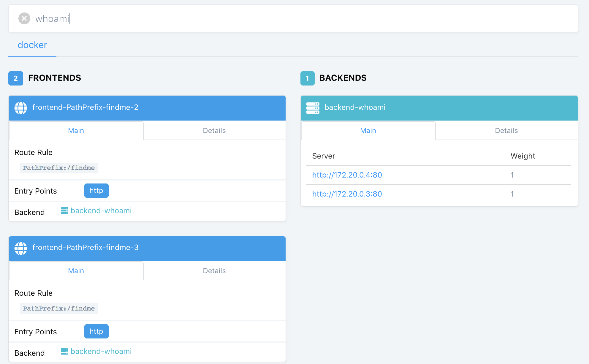

I have been setting up a new cloud based infrastructure for an application lately. As part of it, we had some requirements regarding load balancing, SSL and so on. As part of that I had the opportunity to evaluate [Traefik](https://traefik.io/). This a pretty cool tool that works as a Reverse Proxy (and more).

Now, this sounds just like using [nginx](https://www.nginx.com/), right? There is nothing new here. However, _Traefik_ is built with [Docker](https://www.docker.com/) and the Cloud in mind, and it is quite lightweight and worth exploring.

<!--more-->

## Putting it together

I have set up a [repository in Github](https://github.com/sirech/traefik-test) with a simple, practical demonstration. If you are using [docker-compose](https://docs.docker.com/compose/) to bind a bunch of containers together, it is basically ready to go!

With this minimal setup you get:

- Load balancing between different containers
- SSL Termination
- Automated discovery
- Routing
- And even mTLS if you need it

It really packs a punch with a fairly small configuration effort.

## Comparing it with nginx

If you check the [configuration file](https://github.com/sirech/traefik-test/blob/master/traefik/traefik.toml), you see the basic setup to serve apps. For comparison, here is a config file to serve a static app in _nginx_ over https:

```
server {
    listen 80;
    server_name ${HOST};
    return 301 https://$host$request_uri;
}

server {
    listen 443 ssl http2;
    listen [::]:443 ssl http2;

    server_name ${HOST} www.${HOST};

    root /srv/main;

    ssl_certificate           /cert/live/${HOST}/fullchain.pem;
    ssl_certificate_key       /cert/live/${HOST}/privkey.pem;
    ssl_trusted_certificate   /cert/live/${HOST}/chain.pem;

    location / {
        rewrite ^([^.\?]*[^/])$ $1/ permanent;
        try_files $uri $uri/ $uri/index.html =404;

        gzip_static on;
        expires off;
        add_header Cache-Control "no-store";
    }

    location ^~ /static/  {
        gzip_static on;
        expires max;
        add_header Cache-Control public;
    }
}
```

Now something to note is that _nginx_ is a proper webserver while `traefik` is not. So this example actually serves assets. Even then, you can argue that the set up is quite similar, so why not stay with what is already there? There are two features that I really like from `traefik`.

### The dashboard

`traefik` gives you a really nice dashboard where you can see the actual connections between your services. Here is a screenshot:

<figure class="figure">
  
</figure>

It is a small detail, but I really like having a visual overview of the state of my routes. This can be extremely helpful in the beginning, when you are still setting up services. I always found _nginx_ particularly obscure to debug when I had problems.

But there is a bigger benefit than that...

### Discovery

If you checked the configuration, you might have noticed that there are no services configured there. This is in my opinion the killer feature of `traefik`. It can connect to the provider that you specify, in this case [docker](https://docs.traefik.io/configuration/backends/docker/), and automatically fetch all the running containers for you, dynamically. Say goodbye to painfully creating a new configuration and adding it to your _nginx_ configuration, plus the required restart afterwards.

The only need you need to do is adding some configuration every time you spin up a new service, to let `traefik` now how you want it to be reached. It really does not get much easier:

```
labels:
  - "traefik.backend=echo"
  - "traefik.frontend.entryPoints=https"
  - "traefik.frontend.rule=Host:echo.testing.com;Path:/standard"
```

With this simple snippet, we are making `traefik` aware of our new service, and setting up an entrypoint and the routing to reach it. That's it. You do not need to do anything else. The simplicity is really refreshing. For most cases I feel you will not need much more than this.

## Pending ideas

There are more things to check, actually. `traefik` has a lot of routing posibilities, albeit less comprehensive than other reverse proxies. We have been considering doing some fancy header checks to route to different test systems that share the same url, which I might talk about in more detail when I actually have something more concrete.

The other feature I am really keen to try out is [automated certificate configuration](https://docs.traefik.io/configuration/acme/) through [LetsEncrypt](https://letsencrypt.org/). _LetsEncrypt_ alone is a life saver, it is extremely convenient to set up https for your domains. I use it for my website already through some custom scripts that call the [certbot docker container](https://hub.docker.com/r/certbot/certbot/). However `traefik` takes this one step further by taking the task out of your hands altogether. I want to jump on this the moment I got a free moment.

## Where to start?

I can only encourage reading [the starter guide](https://docs.traefik.io/) first, to get everything running. Then I would read about the [basics](https://docs.traefik.io/basics/), to understand the terminology and how everything is bound together. After that you can really start playing and experimenting. The [repository](https://github.com/sirech/traefik-test) I posted can help you bootstrapping a bit the process.


