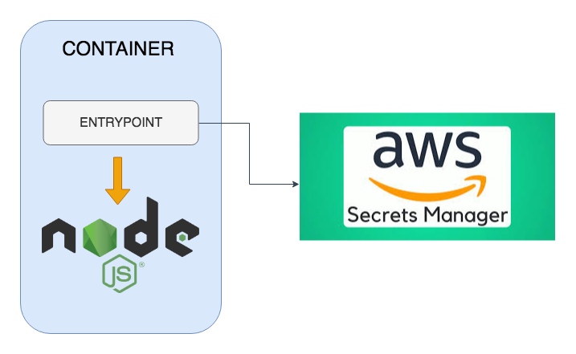

<figure class="figure figure--right">
  
</figure>

I recently spoke at a meetup where I talked about [TDD for containers](https://github.com/sirech/talks/blob/master/2019-01-tw-tdd_containers.pdf) using [ServerSpec](https://serverspec.org).

There I showed an example based on my current project. We have some containerized applications that are fetching secrets from [AWS Secrets Manager](https://aws.amazon.com/secrets-manager/). Testing that is tricky because of the dependency to _ASM_. Thanks to [localstack](https://github.com/localstack/localstack), you can write meaningful tests by mocking those dependencies. If you just want the code it can be found [here](https://github.com/sirech/example-serverspec-aws). If you can spare me some minutes I'll go over it in more detail.

<!--more-->

## The initial image

Let's say you have an existing _Node.js_ application that is being packaged. Following a _TDD_ approach, you could arrive at tests like this:

```ruby
require_relative 'spec_helper'

describe 'Application Container' do
  describe file('/etc/alpine-release') do
    its(:content) { is_expected.to match(/3.8.2/) }
  end

  describe 'node' do
    describe command('node --version') do
      its(:stdout) { is_expected.to match(/11.6/) }
    end

    describe process('node') do
      it { is_expected.to be_running }
      its(:args) { is_expected.to contain('app.js') }
      its(:user) { is_expected.to eq('runner') }
    end

    describe 'listens to correct port' do
      it { wait_for(port(3000)).to be_listening.with('tcp') }
    end
  end


  describe file('app.js') do
    it { is_expected.to be_file }
  end
end
```

which is implemented by the following `Dockerfile`:

```docker
FROM node:11.6-alpine

WORKDIR /app

# hadolint ignore=DL3018,DL3013
RUN apk update --no-cache && \
  apk add --no-cache bash jq && \
  rm -rf /var/cache/apk/*

COPY package.json .
RUN yarn

COPY app.js .

RUN adduser -D runner

USER runner
SHELL ["/bin/bash", "-o", "pipefail", "-c"]
CMD ["node", "app.js"]
```

What if we get extra requirements? Our application is going to make use of some secrets. Namely:

- there will be a secret named `SECRET` with the value `localstack_secret`
- our `GET /secret` route will output `The super secret value is ${SECRET}` (this app trusts its callers a bit too much!)

This changes everything! Our app needs some dependencies, and that influences the tests as well. Let's see how.

## Injecting secrets into the container

We are going to be injecting the secrets at runtime. You can find the pitfalls of writing them at build time in [plenty of other posts](https://medium.com/@mccode/dont-embed-configuration-or-secrets-in-docker-images-7b2e0f916fdd), so let's 👋 that.

A second requirement is that we want to make the secret handling transparent to our existing app. The app will get the secrets injected as environment variables. We'll achieve this by adding an `ENTRYPOINT` to our image that takes care of fetching the secrets.

We'll be storing our secrets in _ASM_. This is how the architecture looks like:

<figure class="figure">
  
</figure>

### Extending the app

Given that we are fully TDD compliant, let's define the test that proves that our app is successfully returning the secret:

```ruby
describe 'fetches a secret from ASM' do
  it { wait_for(secret).to match(/localstack_secret/) }
end

private

def secret
  command('curl localhost:3000/secret').stdout
end
```

this is how the route is implemented in the app:

```javascript
app.get('/secret', (req, res) => res.send(`The super secret value is ${process.env.SECRET}`))
```

this test will fail because we do not, in fact, provide the secret to the app. But we will!

### Providing the secret

So as I said, there will be an _entrypoint_ for this. We start with the test:

```ruby
describe file('/usr/sbin/entrypoint.sh') do
  it { is_expected.to be_file }
end
```

the _entrypoint_ itself will use the [awscli](https://aws.amazon.com/cli/) to fetch the secrets. It looks like this:

```bash
#!/usr/bin/env bash

set -e

secret=$(aws --endpoint-url=http://localstack:4584 --region "${AWS_REGION}" secretsmanager get-secret-value --secret-id "${SECRET_KEY}" | jq -r .SecretString)
export SECRET="$secret"

exec "$@"
```

Note that for a production image, you might be better served using something like [pstore](https://github.com/glassechidna/pstore) instead. 

Regardless, we need to modify our `Dockerfile` bit to integrate this. There are some things to do. We need to add `awscli` as a dependency and we need to add our _entrypoint_ and make sure it runs:

```docker
# hadolint ignore=DL3018,DL3013
RUN apk update --no-cache && \
  apk add --no-cache bash jq python py-pip curl && \
  pip --no-cache-dir install --upgrade pip awscli && \
  apk -v --purge del py-pip && \
  rm -rf /var/cache/apk/*
```

```docker
COPY entrypoint.sh /usr/sbin/entrypoint.sh
```

```docker
ENTRYPOINT ["/usr/sbin/entrypoint.sh"]
```

So everything should be ready! Now we can just run the tests and see that ... they all fail. Including the old ones that were perfectly green before.

## Introducing dependencies

Our container does not work anymore because it is trying to access _ASM_ at runtime and failing. The dreaded dependencies are sabotaging our tests once again. A solution like logging into _AWS_ and fetching the real secret feels unsatisfactory. What else to do?

Enter _localstack_.

Thanks to this [awesome project](https://www.thoughtworks.com/radar/tools/localstack) we can mock _AWS_ dependencies and keep our tests running (almost) transparently. First, we need to orchestrate our app so that:

- _localstack_ gets started and serves a replica of _ASM_ in port 4584
- an init container gets executed to inject a secret into _ASM_
- our application is booted with _localstack_ as a dependency, so that fetching secrets works

we do this by using [Docker Compose](https://docs.docker.com/compose/). The full includes the three elements, gracefully orchestrated together:


```yaml
version: '3'
services:
  localstack:
    container_name: localstack
    image: localstack/localstack

    ports:
      - "4584:4584"

    environment:
      - DEFAULT_REGION=eu-central-1
      - SERVICES=secretsmanager

  init:
    container_name: init
    build: ./init

    env_file: .env

    depends_on:
      - localstack

    links:
      - localstack

  app:
    container_name: app
    build: ./app

    ports:
      - "3000:3000"

    env_file: .env

    depends_on:
      - init

    links:
      - localstack
```

The `init` container is just ruby alpine executing this script:

```ruby
asm = Aws::SecretsManager::Client.new(region: ENV['AWS_REGION'], endpoint: 'http://localstack:4584')
asm.create_secret(name: ENV['SECRET_KEY'], secret_string: 'localstack_secret')
```

the _entrypoint_  from the beginning needs to account for the url, so we change it to `aws --endpoint-url=http://localstack:4584`. We can pick the URL based on the environment for a full example.

With this we are almost done. We just need to tell `ServerSpec` to use `docker-compose` to start up our container setup, which can be done in the `rails_helper.rb`:

```ruby
require 'serverspec'
require 'docker'
require 'docker/compose'
require 'rspec/wait'

set :backend, :docker
set :docker_container, 'app'

RSpec.configure do |config|
  config.wait_timeout = 15 # seconds

  compose = Docker::Compose.new

  config.before(:all) do
    compose.up(detached: true, build: true)
  end

  config.after(:all) do
    compose.kill
    compose.rm(force: true)
  end
end
```

And that is basically it! Now our tests run perfectly fine. We have containers that are interacting with a secret store that have a good test suite to make sure everything runs correctly. It does not get much more _TDD'ish_.

## What's next?

There is a but (isn't always one?). As of today, _localstack_ can only store one secret in its implementation, so if your container relies on fetching more than one secret it won't be able to find them all. This has been recently patched in [moto](https://github.com/spulec/moto/pull/1898), the library underneath, and it is just waiting for the next release of _localstack_ to be available. After that, no secret will be safe from mocking.

