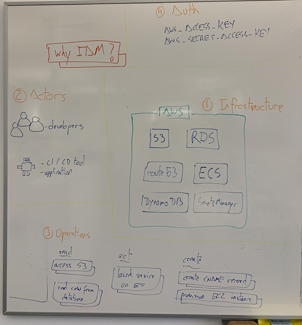
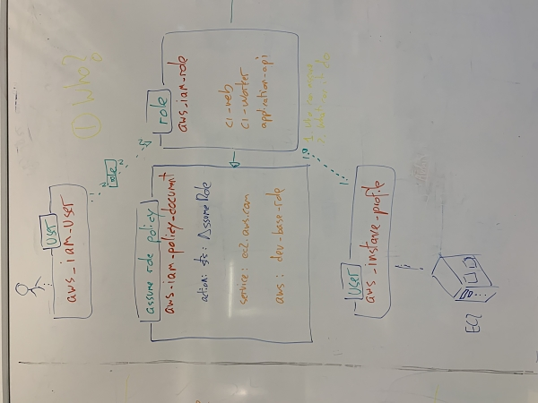
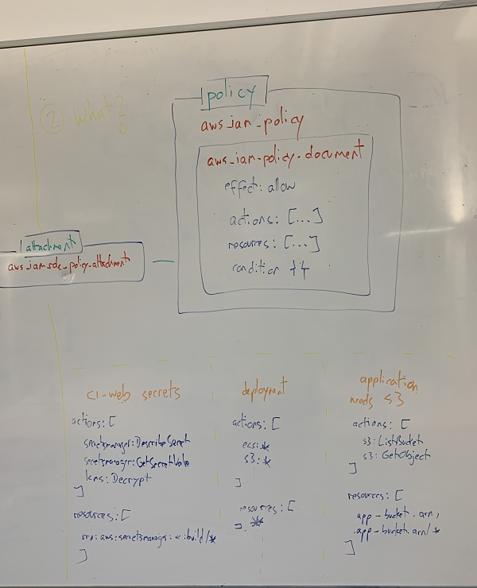

If you use [AWS](https://aws.amazon.com/), you should make sure you have [the right account structure in place](https://www.thoughtworks.com/insights/blog/using-aws-security-first-class-citizen). If you just go ahead and use a root account, you might just lose your [whole business](https://threatpost.com/hacker-puts-hosting-service-code-spaces-out-of-business/106761/).

Now that I have your attention (and that you are rightfully scared of the bad people out there) I wanted to talk about the tools that _AWS_ offers to manage permissions for its resources, also called [IAM](https://docs.aws.amazon.com/IAM/latest/UserGuide/introduction.html).

<!--more-->

_IAM_ is extremely powerful, but the sheer amount of things that they throw at you can be scary at first. Just check how big their [FAQ](https://aws.amazon.com/iam/faqs/) is. I have been using it extensively in my project to manage access to our resources, but I realized recently that we did not have a very sound understanding of the basic pieces, so I drew all of that on a whiteboard to make it easier to understand.

## Core principles

All our policies are [represented in code](https://en.wikipedia.org/wiki/Infrastructure_as_code). We use [Terraform](https://www.terraform.io/) for that. Having the policies represented in code is crucial if you want to maintain them properly over time.

The roles that we provision should have as [little rights](https://en.wikipedia.org/wiki/Principle_of_least_privilege) as possible. The fewer permissions that you grant the better. That protects you against attacks, but also against bugs.

## Our starting point

This picture should give you an idea of where we are:

<figure class="figure">
  
</figure>

- We have our infrastructure that we want to operate. There are a ton of services that you might be using from _AWS_, from places to put data such as `S3` or `RDS`, to something like `ECS` to run your containerized applications, but also everything that surrounds it, like networks, security groups, DNS and whatnot.
- Then there are the actors interacting with the infrastructure. They can be human actors, such as the developers building and operating the platform. They can also be machine actors, like the CI/CD tool that you might use to provision your infrastructure, or the applications that you run themselves.
- These actors will want to perform certain operations. We might want to get data out of our stores, launch services or create new resources.
- And you need authorization to perform those operations. At the end, you will need to log in into _AWS_ and use the credentials, one way or the other.

At this point you could say fuck it, I'm just going to pass these credentials around. But there are a ton of things that can go wrong. What happens if those credentials are leaked, for instance? Thankfully, _AWS_ offers a way to deal with this. We will be using [roles](https://docs.aws.amazon.com/IAM/latest/UserGuide/id_roles.html) to group the permissions that we want to create.

## Role

What is a role? Quoting the official documentation:

> An IAM role is an IAM identity that you can create in your account that has specific permissions.

<figure class="figure">
  
</figure>

This means that we are going to create different roles that will be assumed by some of our actors (`ci-web` for example, or a specific role for each application that we want to deploy). They are defined using [aws\_iam\_role](https://www.terraform.io/docs/providers/aws/r/iam_role.html). It looks like this:

```hcl
resource "aws_iam_role" "ci-web" {
  name               = "ci-web"
  assume_role_policy = "${data.aws_iam_policy_document.assume_role_policy_ec2.json}"
}
```

If this _role_ is going to be assumed, we need to grant permissions for that as well. In this case, we want an [EC2](https://aws.amazon.com/ec2/) instance to be able to assume it, as our _CI_ will be running there. We can do that with a [aws\_iam\_policy\_document](https://www.terraform.io/docs/providers/aws/d/iam_policy_document.html).

```hcl
data "aws_iam_policy_document" "assume_role_policy_ec2" {
  statement {
    effect  = "Allow"
    actions = ["sts:AssumeRole"]

    principals {
      type        = "Service"
      identifiers = ["ec2.amazonaws.com"]
    }
  }
}
```

The last part of the puzzle is defining an [aws\_iam\_instance\_profile](https://www.terraform.io/docs/providers/aws/r/iam_instance_profile.html), and using it in the [aws\_launch\_configuration](https://www.terraform.io/docs/providers/aws/r/launch_configuration.html) of said instance.

```hcl
resource "aws_iam_instance_profile" "ci-web" {
  name = "${aws_iam_role.ci-web.name}"
  role = "${aws_iam_role.ci-web.name}"
}

resource "aws_launch_configuration" "web" {
  iam_instance_profile = "ci-web"
}
```

## Defining policies

Thus far, we have set up our roles, but those roles are not actually allowed to do anything, yet. We need to create some policies that allow access to the resources we want to use, through [aws\_iam\_policy](https://www.terraform.io/docs/providers/aws/r/iam_policy.html):

<figure class="figure">
  
</figure>

I already wrote about how to use these policies to grant [access to the _AWS Secrets Manager_ from Concourse](../using-asm-in-concourse/). In the end, we always follow a similar structure. Each _policy_ contains a of _statements_ that define the access we want to give. Don't forget to use a [aws\_iam\_role\_policy\_attachment](https://www.terraform.io/docs/providers/aws/r/iam_role_policy_attachment.html) to bind the policies to the role.

### Making a statement

Statements are quite flexible and have a bunch of configuration options. I am going to focus on three of their arguments, `effect`, `actions` and `resources`.

`effect` can be either _Allow_ or _Deny_. We actually always set them to `Allow`. Why? As mentioned, we want to give the least possible amount of privileges, so our policies should only be granting what a role absolutely needs. That means there should never be necessary to revoke a particular permission in a different part of the code.

`actions` are what we want to be able to do in _AWS_. They basically map to single API calls, and they are really granular. What you should really avoid is giving blanket permissions such as:

```hcl
  statement {
    effect = "Allow"

    actions = [
      "ec2:*",
    ]
  }
```

This not only goes against the principle of least privilege, but it also will create a maintainability mess, as you will have a very hard time afterwards reducing permissions without something breaking. Trust me on this one, invest the time upfront and make sure you only give permissions that are needed. There is an excellent [reference guide](https://iam.cloudonaut.io/) that I find extremely useful when giving permissions incrementally.

Lastly, `resources` are the [ARN's](https://docs.aws.amazon.com/general/latest/gr/aws-arns-and-namespaces.html) that this statement applies to. As with the `actions`, it is a very good idea to avoid using wildcards.

There are more things you can do, such as using `principals` or `conditions`, which are out of the scope of this article. However, you can get a lot of mileage out of just `actions` and `resources`.

## Wrapping it up

This is it, you don't really need anything else to build a solid and secure foundation in which to run your applications. Using different roles and giving them the access they need through policies step by step is all there is to it, really.

Testing this still remains a challenge, as _IAM_ failures tend to manifest only when you actually try to run the whole thing in your environment. Don't succumb to the temptation to take the easy route, though. Fixing a bad permission setup is hard, and you will regret it.


