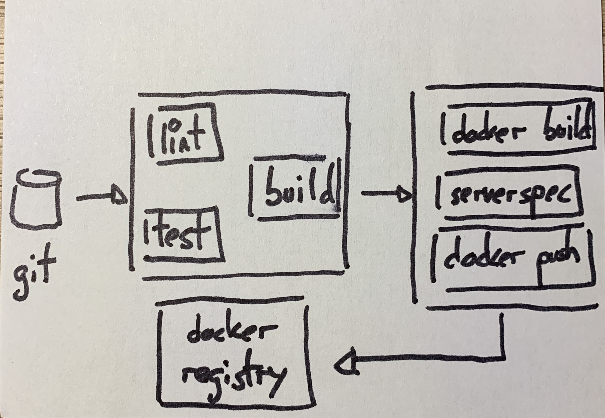
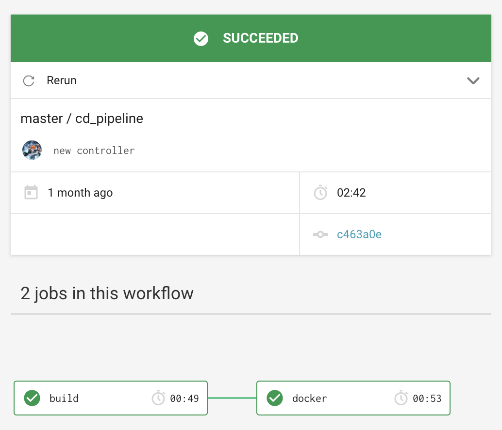
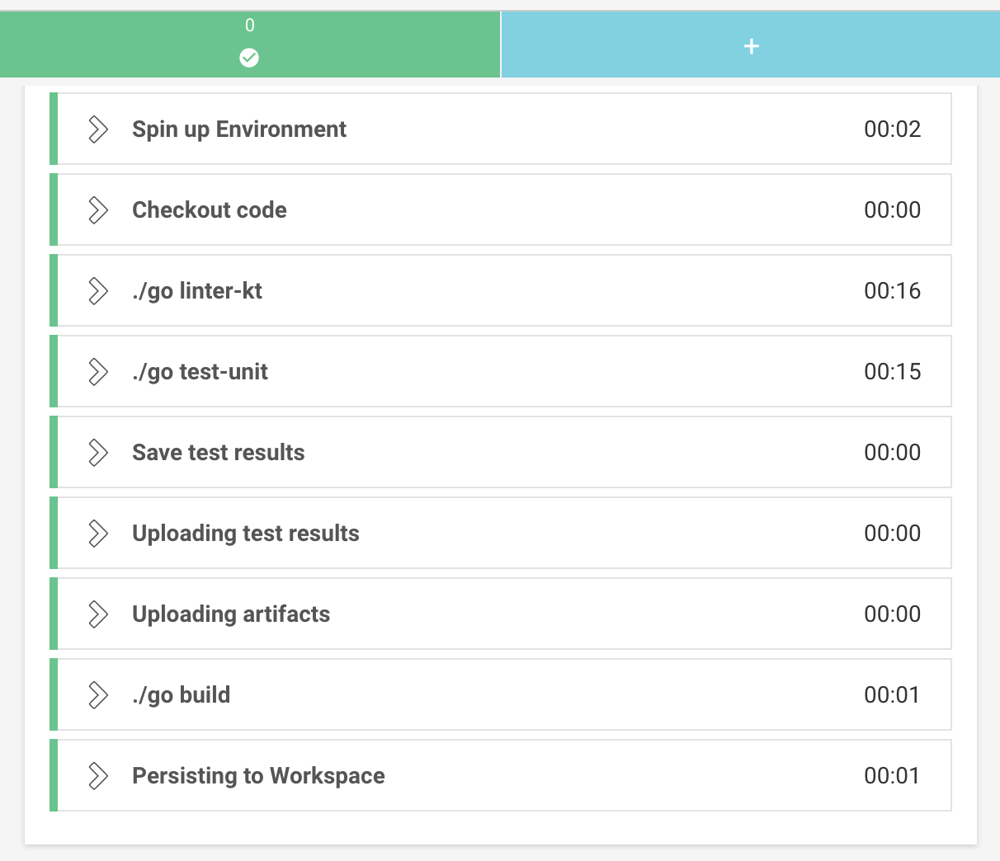

I had been using [Travis](https://travis-ci.org/) for a long time for my personal projects, until the news of massive layoffs scared me into checking alternatives. I had heard good things about [CircleCI](https://circleci.com/), so I decided to give it a try. Concretely, I wanted to build a pipeline that did the following:

- Package a [SpringBoot](https://spring.io/) application written in [Kotlin](https://kotlinlang.org/) as a `jar`, running linters and tests before, saving the tests results.
- Build a [Docker](https://www.docker.com/) image to run the app, with [ServerSpec](https://serverspec.org/) running first, and push it to a _Docker_ registry.

Following [my own thoughts about pipelines](https://github.com/sirech/talks/raw/master/2019-04-tw-build_pipelines.pdf), I wanted it to be fast, visual, easy to maintain and reliable build my toy app. Did it work? More after the break!

<!--more-->

## Running in circles

_CircleCI_ has a [free plan](https://circleci.com/pricing/usage/) that works really well for experimentation, with a seamless integration with [Github](https://github.com/), which makes getting started a breeze.

The basics are covered in depth in [their own website](https://circleci.com/docs/2.0/getting-started/), so I will skip that. Let's jump straight into the details. This is the sketch of the pipeline to implement:

<figure class="figure">
  
</figure>

I'm going to talk about some details that I found interesting, plus the code to implement parts of the pipeline. TLDR: [This is the full pipeline](https://github.com/sirech/echo/blob/master/.circleci/config.yml).

## Using workflows

Workflows are _CircleCI_'s way of organizing dependencies between jobs. In my case that's just a fancy way of saying that one job should execute after the other, like this screenshot shows:

<figure class="figure">
  
</figure>

Looks simple, right? However, the picture does not show the whole truth. I am using a filter to restrict the `docker` job to the `master` branch. The workflow definition looks like this:

```yaml
workflows:
  version: 2
  pipeline:
    jobs:
      - build
      - docker:
          filters:
            branches:
              only: master
          requires:
            - build
```

Why the restriction? Well, I'm using [Dependabot](https://dependabot.com/) to automatically check for new versions of dependencies, and I want the PRs generated by the tool to run my tests, but not to generate new docker images.

## The build step

I always run my jobs inside some _Docker_ image. For the build I use the _OpenJDK_ image provided by _CircleCI_, which is one among [the many images that they maintain](https://circleci.com/docs/2.0/circleci-images/). These are the steps.

```yaml
build:
  docker:
    - image: circleci/openjdk:8-jdk

  steps:
    - checkout
    - run: ./gradlew detekt
    - run: ./gradlew clean test
    - run: ./gradlew assemble
```

[detekt](https://github.com/arturbosch/detekt) is [basically a linter](https://www.thoughtworks.com/radar/tools/detekt) that can run self-contained inside the pipeline. Apart from that, the unit tests are executed and if everything works, a `jar` is built.

### Persistence

Unlike [Concourse](https://concourse-ci.org/), _CircleCI_ allows you to persist artifacts between jobs, which is pretty damn convenient. In this case, I need the `jar` file that we just generated later, when I build the _Docker_ image. In order to persist it, you add an extra directive to the list of steps in the `build` job:

```yaml
- persist_to_workspace:
    root: build/libs
    paths:
      - echo.jar
```

### You've got to save the tests

Another nifty feature that I found is [storing test results](https://circleci.com/docs/2.0/collect-test-data/), which appear in the dashboard and make it easier to understand what your job is doing.

Both the test results, as well as the execution summary are stored as artifacts. For that there are some additional steps to add:

```yaml
- run:
    name: Save test results
    command: |
      mkdir -p ~/junit/
      find . -type f -regex ".*/build/test-results/.*xml" -exec cp {} ~/junit/ \;
    when: always

- store_test_results:
    path: ~/junit
- store_artifacts:
    path: ~/junit
```

All in all the build has a bunch of steps, as can be seen in this screenshot.

<figure class="figure">
  
</figure>

## Docker step

### The image itself

So if I want to dockerize our app I *kind* of need a _Dockerfile_ (duh!). This image runs the `jar` that was built on the previous job:

```Dockerfile
FROM openjdk:8-jre-alpine3.9

WORKDIR /app
EXPOSE 4000

RUN apk add --update --no-cache dumb-init \
  && rm -rf /var/cache/apk/*

COPY build/libs/echo.jar .

RUN adduser -D runner

USER runner
ENTRYPOINT ["/usr/bin/dumb-init", "--"]
CMD ["java", "-jar", "echo.jar"]
```

Nothing out of the ordinary. [Here is a recent post](https://blog.docker.com/2019/07/intro-guide-to-dockerfile-best-practices/) about improving the quality of your _Docker_ images.

### Running ServerSpec

I am a big fan of testing containers with [ServerSpec](https://serverspec.org/), as [I've written before](../testing-containers-serverspec-and-localstack/) and spoken about [multiple times](https://github.com/sirech/talks/blob/master/2019-01-tw-tdd_containers.pdf).

Running these tests in a CI tends to be painful because of the infamous [docker in docker](https://jpetazzo.github.io/2015/09/03/do-not-use-docker-in-docker-for-ci/) problem. I was expecting yet another round of pain when trying to set them up for _CircleCI_.

Not so much! Surprisingly, it went quite swiftly. Maybe I'm just used to it by now, who knows. How to do it, though?

I've set up a new job for this. I created and uploaded my own [dind with ruby image](https://hub.docker.com/r/sirech/dind-ruby/tags) so that I have access to newer `ruby` versions. A simplified version of it looks like this:

```yaml

docker:

  docker:
    - image: sirech/dind-ruby:2.6.3

  steps:

    - checkout
    - attach_workspace:
        at: build/libs
    - setup_remote_docker
    - run: docker build . -t echo
    - run:
        name: ServerSpec Tests
        command: |
          bundle install
          bundle exec rspec spec
```

Thanks to the [setup\_remote\_docker](https://circleci.com/docs/2.0/building-docker-images/) directive, regular `docker` commands are available for this job. After installing the dependencies, the [tests](https://github.com/sirech/echo/blob/master/spec/container_spec.rb) can run inside the pipeline.

The `jar` that was generated in the previous job is available by using the `attach_workspace` directive.

### Building the image

Once the container tests have passed, it's time to build the image and publish it to some registry. That will be our final artifact that can be used for deployment. Deployment can happen in the same pipeline or in a separate one, it doesn't really matter.

Starting from the same job as before, it's time to log in to whatever registry we should hold the image. Then we build the image with the right tag, and push it:

```yaml
- run:
    name: Publish docker image
    command: |
      echo $DOCKER_PASSWORD | docker login -u $DOCKER_USER $DOCKER_REGISTRY --password-stdin
      docker build . --tag $DOCKER_REGISTRY/echo
      docker push $DOCKER_REGISTRY/echo
```

You see that I'm not versioning the image. Don't do this for a serious application. You can attach the `git` commit by using the `CIRCLE_SHA1` variable, which is one of the many [built-in](https://circleci.com/docs/2.0/env-vars/#built-in-environment-variables) variables that are available out of the box.

## Caching

Isolation is great at keeping our builds reliable. It is often at odds with performance, though. I don't want to cache the whole workspace like in the old, dark _Jenkins_ days, but avoiding downloading the dependencies every time is quite convenient and keeps the pipeline fast, just the way I like it.

In _CircleCI_, you do that by saving a particular folder based on a key. For instance, if I want to cache the `ruby` dependencies that I use for the container tests, I use a block like this:

```yaml
- restore_cache:
    key: bundle-2-{{ checksum "Gemfile.lock" }}
- run: bundle check || bundle install --without ops development
- save_cache:
    key: bundle-2-{{ checksum "Gemfile.lock" }}
    paths:
      - vendor/bundle
```

All the steps inside the same job after this will have them available, and they will be cached until there is a change to the `Gemfile.lock` file.

## Defining variables

I have been using variables throughout my pipeline to encode certain values, like my _Docker_ credentials. [They are managed through the UI](https://circleci.com/docs/2.0/env-vars/), which frankly is not ideal. I would prefer a more programmatic solution, to be honest. Needless to say, putting secrets in the `config.yml` directly is out of the question, so this will have to do.

If you want to manage a set of variables for multiple projects, one option could be [using contexts](https://circleci.com/docs/2.0/contexts/).

## How does it all look together?

That wasn't that bad after all. I find _CircleCI_ quite intuitive, and for hobby projects their standard account is more than enough. In fact, the pipelines run very quickly. In the beginning I was waiting a bit to check on them, and they had been finished for a while by the time I had a look.

The whole pipeline is in [github](https://github.com/sirech/echo/blob/master/.circleci/config.yml). That should be a good start to build your own app. In fact, the pipeline does not stop at the _Docker_ stage, but has a deployment step based on a custom script.
