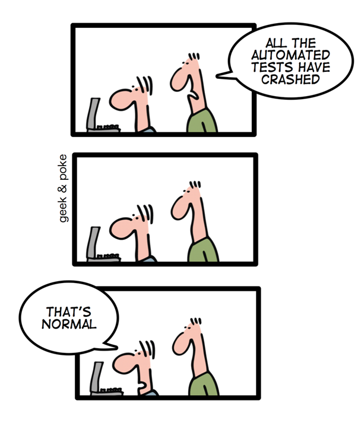

[Postman](https://learning.getpostman.com/) is a great tool to explore REST APIs. You can build requests and try them out to get quick feedback. Then you can persist them as collections to make sure that the knowledge doesn't get lost. 

[Newman](https://github.com/postmanlabs/newman), the CLI version of Postman, allows you to take it to the next level and transform a collection into a suite of automated end-to-end tests. This suite will run then in your CI tool of choice. In this article I will explore the benefits of doing so and show you how to set it up.

<figure class="figure">
  
</figure>

<!--more-->

## What is an End-to-End test in the context of an API?

Testing nomenclature is a tricky thing. Keeping the [testing pyramid in mind](https://martinfowler.com/bliki/TestPyramid.html), we can picture them as very high level tests. These tests confirm that a particular REST API works as intended, treating the internals as a black box. We don't involve any UI in the process, which helps reduce the flakiness.

<figure class="figure">
  
  <figcaption class="figure__caption">
    <small class="figure__attribution">
      <span class="figure__attribution-link">
        by geek & poke / <a href="https://creativecommons.org/licenses/by/3.0/">CC BY</a>
      </span>
    </small>
  </figcaption>
</figure>

Flaky tests are extremely annoying, as every developer has experienced at some point. Instead of banging our head against the wall trying to fix the unfixable, we can mitigate the problem by using lower level tests.

## Why should I have these tests?

There are two different scenarios I'd like to cover:

The first is testing your own REST APIs. These tests add an extra layer of confidence. Surely, you are using a healthy mix of different tests (unit, integration, functional, …). End-to-end tests can be the final confirmation that everything looks fine.

The second case is testing APIs that you don't control. In my last projects most of the data we consumed came from APIs served by other teams. More than once I spent half a day debugging an error in my app, only to notice that a downstream API was borked all along. Automated tests cover that integration, and help isolate issues.

### Living documentation

A collection of tests that are being regularly executed serve as the best documentation for an API. Have you searched for something in any corporate wiki lately? If you find anything at all you should be happy. It will be probably incomplete. Or just flat out wrong. Fun times.

### Monitoring

In both cases, these tests can morph from a gateway in the building process to an active monitoring tool. By constantly running them, you make sure that the API is still behaving as you expect. Otherwise, the right alarms will be raised. You don't want to realize something is wrong just when a customer complains.

### Why not use consumer driven contract tests instead?

Great question, if I may say so myself. [CDCs](https://www.thoughtworks.com/de/radar/techniques/consumer-driven-contract-testing) are an excellent way to ensure that an API conforms to what a client expects from it. If you can set them up properly, they will replace end-to-end tests almost completely. Remember, keep pushing the tests to a lower level whenever you can.

They don't work in every situation, though. If you don't control both the provider and the consumer, you have to rely on another party. If they don't fulfill their part of the contract the tests will be useless. Some teams are just not in the position of continuously running tests against a contract. Running your own tests could be your best bet.

Anyways, having laid out the rationale, it's time for some **code**.

## Creating a Postman collection

### The collection

We are defining a number of calls that will be executed sequentially inside our CI. Each call executes a request against the API. Then it runs some tests to check that the request was successful, checking the status code and the body as well.

In order to create the collection, I tend to use the Postman app. I like to extract things like URLs and parameters to an [environment](https://learning.getpostman.com/docs/postman/environments_and_globals/manage_environments/). Then configuring it becomes easier, and you don't have any sensitive information in the collection itself. Your history is a [convenient place to start building this collection](https://learning.getpostman.com/docs/postman/collections/creating_collections/#saving-to-a-collection-from-history).

Once you are satisfied with the collection, you can export it as a JSON file. That file can be committed in source control to serve as a base for the pipeline that will run the tests. There is a Pro and Enterprise version that helps managing collections, which I haven't really tried. Still, a good ol' `git` repository is more than enough to get rolling.

<figure class="figure">
  
</figure>

### Running the collection

Until now we have been using regular Postman and nothing else. Now it's the time for newman to shine. What am I talking about, anyways? I'll quote the [official docs](https://learning.getpostman.com/docs/postman/collection_runs/command_line_integration_with_newman/) directly:

> Newman is a command line Collection Runner for Postman. It allows you to run and test a Postman Collection directly from the command line.

Good that we clarified that! It is installed as a npm package, which can result in a `package.json` as simple as this:

```json
{
  "name": "postman-utils",
  "version": "0.0.1",
  "private": true,
  "description": "Postman utilities",
  "scripts": {
    "newman": "node_modules/.bin/newman run"
  },
  "dependencies": {
    "newman": "^4.4.1"
  }
}
```

as mentioned before, you don't want to hardcode variables like URLs, parameters or, God forbid, passwords in that collection. It's not flexible, and it's not safe. Instead, I like to use a configuration file which includes all these values. But if we want to commit that file, we still need to figure out a way to avoid putting secrets in there. I use it as a template and replace values at runtime with envsubst. The configuration file looks like this

```
{
	"id": "425cf4df-d994-4d91-9efb-41eba1ead456",
	"name": "echo",
	"values": [
		{
			"key": "host",
			"value": "${HOST}",
			"enabled": true
		}
	]
}
```

You can orchestrate this with a simple bash script. The script injects the variables into the template, runs newman, and deletes the files to avoid leaks. It goes very well with [gopass](https://hceris.com/storing-passwords-with-gopass/), where you can safely store your secrets and fetch them through the script.

```shell
setup-newman() {
  settings=/tmp/settings.json.$$
  result=/tmp/variables.json.$$

  # shellcheck disable=SC2064
  trap "rm -f \"$settings\" \"$result\"" EXIT
}

run-newman() {
  local service=${1?You need to provide the service to check}

  envsubst < "$service.environment.json.template" > "$settings"

  npx newman run "$service.json" \
      -e "${settings}" \
      --export-environment "${result}"
}
```

that helper can be called with the collection that you want to test. Exported variables will be picked by `envsubst`. [npx](https://www.npmjs.com/package/npx) gives us a little bit more of flexibility finding the `newman` binary, in case you don't want to use a `package.json` but have it globally installed.

```shell
goal_check-service() {
  setup

  export SERVICE_PASSWORD=${SERVICE_PASSWORD:-$(gopass store/service/password)}

  run_newman service
}
```

### Tests

Doing a request is but the first step. Remember, we aim to build a test suite. We have a convenient test tab in Postman that we can use to write our tests.

<figure class="figure">
  
</figure>

Our tests are written in _JavaScript_, using [Chai](https://www.chaijs.com/api/bdd/). Let's say I want to test that my call delivered a list of results, I could do it like this:

```javascript
var getResults = function() {
    var jsonData = pm.response.json();
    return jsonData['results'];
};

pm.test("Request was successful", function () {
    pm.response.to.have.status(200);
});

pm.test("There are results", function () {
    pm.expect(getResults().length).to.be.above(0);
});
```

More details can be found [here](https://blog.getpostman.com/2017/10/25/writing-tests-in-postman/)

### Building flows

All the calls in a collection get executed sequentially. This offers us the opportunity to test whole flows instead of just single calls. One such a flow for a `/posts` resource is:

- Get a list of all `posts`
- Fetch the first `post` in the list
- Update the `post`

We'll build a suite of parametrized tests that will continue to work over time, not just the first time that you ran it. An important part of this is modifying the environment in a request. That is our way of transmitting parameters between requests. Let's say our first request was successful, as corroborated by our tests. Then we store the id on a variable that will be used to fetch a particular entity.

```javascript
// First result in the list
var post = getResults()[0];

// Pass variables to other stages
pm.environment.set("id", post.id)
```

The next request can use that parameter as any that we set manually.

#### Ignoring calls based on a condition

Flows might need also need some logic to skip certain requests. Let's say you have a request that is creating a new entity through a `POST`. You want to have that request, but you may not want to run it on every commit. Maybe you just want do it once per day. In that case, we'll skip the test based on a certain variable.

```javascript
// Do not run create request in sequence, unless executeCreate is set to true
if(!pm.environment.get("executeCreate")) {
    postman.setNextRequest('Get other posts')
}
```

The variable goes into the configuration file, and is set to a environment variable that gets injected through our script, as I showed above.

## Time for some continuous integration

At this point you should have a collection that runs locally. Running this once is fine, but why not run it for every commit? Or maybe every hour, if you want to check an API that you don't control? 

Your CI pipeline is a perfect place to do this. I'm going to use [CircleCI](https://circleci.com) for my example, but any CI will do. I run the tests inside a [docker image](https://cloud.docker.com/repository/docker/sirech/newman-executor) that I built which includes all the required dependencies. There is an official Docker image provided by Postman already. However, it does not contain `envsubst` and it uses an older _NodeJS_ version.

The helper script that we built in the step before will work without any changes inside CircleCI. We just have to provide the required secrets [as variables](https://circleci.com/docs/2.0/env-vars/). This is the job:

```yaml
  healthcheck:

    docker:
      - image: sirech/newman-executor:12.6

    steps:
      - checkout
      - run: ./go test-e2e
```
    
which will produce a report similar to this:

<figure class="figure">
  
</figure>

### What about the alternatives?

Many frameworks provide their own way of running tests against a running API. In [Spring Boot](https://spring.io/projects/spring-boot), for instance, you can use [MockMvc](https://docs.spring.io/spring-framework/docs/current/javadoc-api/org/springframework/test/web/servlet/MockMvc.html) to test controllers. You can use both, in my view. First the native tests, so to speak, and then layer Postman Tests on top.

And let's not forget about good ol' [curl](https://curl.haxx.se). I had a huge collection of curl commands with which I tested an API that was needed for my last project. However, managing that becomes more and more tedious over time. If you want to use send complex requests, like certificates or cookies, Postman is way more convenient to use. Moreover, you can use JavaScript instead of bash, which can make things a bit easier to read and maintain.

## What else?

This is already quite a lot and it's just the beginning. Anything that you do with an API you can also automate. For instance, in my previous project we had a collection that ran an [OAuth Flow](https://auth0.com/docs/api-auth/which-oauth-flow-to-use). That got us a token that we could use to make requests against an authorized endpoint.

## A repo to use as an example

[Here](https://github.com/sirech/echo/blob/master/echo.json) is a repository for a Kotlin application that runs a Postman collection as an e2e test. It can serve as a starter kit to get going with high quality End-to-End API Tests.
