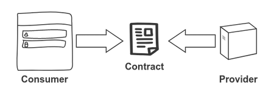
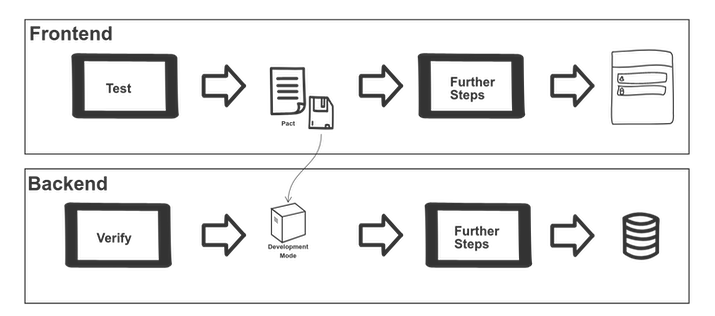

[Consumer driven contract testing](https://www.thoughtworks.com/de/radar/techniques/consumer-driven-contract-testing) is a great way to improve the reliability of interconnected systems. Integration testing becomes way easier and more self contained. It opens the door for independent deployments. It leads to faster iterations and more granular feedback. Unlike your insurance, they don't have any fine print. This article is about setting them up in a delivery pipeline, in the context of doing [continuous delivery](https://continuousdelivery.com/).

I want to show how _Contract Tests_ help splitting the deployment of the front end and the back end of a small application. I have a React client and a Spring Boot backend written in Kotlin.

<!--more-->

## What is a Contract Test?

I am not talking about [smart contracts](https://en.wikipedia.org/wiki/Smart_contract). There is no blockchain whatsoever in this article. Sorry for that (Contract Tests for Smart Contracts sounds like a conference talk that the world badly needs, though!).

In a nutshell, a Contract Test is a specification of the interactions between a consumer and a provider. In our case, the communication happens using REST. The consumer defines the actions sent to the provider and the responses that will be returned. In our case, the frontend is the consumer and the backend is the provider. A *contract* is generated. Both sides test against this contract.

It is not really about any particular technology. There are a bunch of different frameworks, but some simple scripts could do the trick.

<figure class="figure">
  
</figure>

### Why have it as part of the delivery pipeline?

First of all, running these tests continuously ensures that they keep working at all times. The big benefit, however, is that we can separate the deployment of frontend and backend. If both sides are fulfilling the contract, it is likely that they work together correctly. Thus, we can consider avoiding expensive integrated tests. They tend to work pretty badly anyways.

## Setting up some contracts

There are two sides to set up, consumer and provider. The tests will run in the pipelines that build the frontend and the backend, respectively. We are going to use the [Pact framework](https://docs.pact.io/) for our examples, which is the tool that I am most familiar with. Because of that, I tend to use pact and contract interchangeably. Our pipelines are written for [CircleCI](https://circleci.com/), but they should be fairly easy to port to other CI Tools.

### The consumer side

As mentioned, the consumer leads the creation of the contract. Having the client driving this might sound counterintuitive. Often, APIs are created before the clients that will use them. Flipping it around is a nice habit to get into. It forces you to really think in terms of what the client will actually do, instead of bikeshedding a super generic API that will never need most of its features. You should give it a try!

The pact is defined through interactions specified in unit tests. We specify what we expect to be sent to the backend, and then use the client code to trigger requests. Why? We can compare expectations against actual requests, and fail the tests if they don't match. Let's have a look at an example. We are using [Jest](https://jestjs.io/) to run the tests. We'll start with some initialization code:

```typescript
import path from 'path'
import Pact from 'pact'

const provider = () =>
  Pact({
    port: 8990,
    log: path.resolve(process.cwd(), 'logs', 'pact.log'),
    dir: path.resolve(process.cwd(), 'pacts'),
    spec: 2,
    consumer: 'frontend',
    provider: 'backend'
  })

export default provider
```

Then we have the code for an actual test. The test consists of two parts. First we define the expected interaction. This is not very different from mocking an http library, with something like [axios](https://github.com/ctimmerm/axios-mock-adapter). It specifies the request that we will send (URL, headers, body and so forth), and the response that we will get.

```typescript
const interaction: InteractionObject = {
  state: 'i have a list of recipes',
  uponReceiving: 'a request to get recipes',
  withRequest: {
    method: 'GET',
    path: '/rest/recipes',
    headers: {
      Accept: 'application/json',
      'X-Requested-With': 'XMLHttpRequest'
    }
  },
  willRespondWith: {
    status: 200,
    headers: { 'Content-Type': 'application/json; charset=utf-8' },
    body: [
      {
        id: 1,
        name: 'pasta carbonara',
        servings: 4,
        duration: 35
      }
    ]
  }
}
```

Then we have the test itself, where we call the actual client code that will trigger the request. I like to encapsulate these requests in services that convert the raw response into the domain model that will be used by the rest of the app. Through some assertions, we make sure that the data that we are delivering from the service is exactly what we expect.

```typescript
it('works', async () => {
  const response = await recipeList()

  expect(response.data.length).toBeGreaterThan(0)
  expect(response.data[0]).toEqual({
    id: 1,
    name: 'pasta carbonara',
    servings: 4,
    duration: 35
  })
})
```

Note that even if `recipeList` is properly typed with `TypeScript`, that won't help us here. Types disappear at runtime, so if the method is returning an invalid `Recipe` we won't realize it, unless we explicitly test for it.

Finally we need to define some extra methods that will ensure that the interactions are verified. If there are interactions missing, or they don't look like they should, the test will fail here. After that, all that remains is writing the pact to disk.

```typescript
beforeAll(() => provider.setup())
afterEach(() => provider.verify())
afterAll(() => provider.finalize())
```

In the end, the pact gets generated as a JSON file, reflecting all the interactions that we have defined throughout all our tests.

#### Flexible matching

Our pact thus far is specifying the exact values that it will get from the backend. That won't be maintainable in the long run. Certain things are inherently harder to pin down to exact values (for example, dates). A pact that breaks constantly will lead to frustration. We are going through this whole process to make our life easier, not harder. We'll avoid that by using [matchers](https://docs.pact.io/getting_started/matching). We can be more flexible and define how things will look like, without having to provide exact values. Let's rewrite our previous body:

```typescript
willRespondWith: {
  status: 200,
  headers: { 'Content-Type': 'application/json; charset=utf-8' },
  body: Matchers.eachLike({
    id: Matchers.somethingLike(1),
    name: Matchers.somethingLike('pasta carbonara'),
    servings: Matchers.somethingLike(4),
    duration: Matchers.somethingLike(35)
  })
}
```

You can be more specific. You can set the expected length of a list, use regexes and a bunch of other things.

#### Integrating it in the pipeline

The pact tests rely on an external process, and having multiple tests hitting it can lead to non deterministic behavior. One solution is to run all the tests sequentially:

```bash
npm test --coverage --runInBand
```

If you want to run the pact tests independently, we can build our own task to run them separately:

```json
"scripts": {
  "pact": "jest --transform '{\"^.+\\\\.ts$\": \"ts-jest\"}' --testRegex '.test.pact.ts$' --runInBand"
}
```

Which will become an extra step in our pipeline:

```yaml
jobs:
  check:
    working_directory: ~/app

    docker:
      - image: circleci/node:12.4

    steps:
      - checkout
      - run: npm
      - run: npm run linter:js
      - run: npm test --coverage --runInBand
      - run: npm pact
```

#### Storing the pact

Our pact is a json file that we are going to commit directly in the frontend repository, after running the tests locally. I've found that this tends to work well enough. Making the pipeline itself commit the pact to `git` does not seem to be necessary.
We'll get to extending the pact and in a second.

### The provider side

At this point we have a working pact, that is being verified by the consumer. But that is only half of the equation. Without a verification from the provider side, we haven't accomplished anything. Maybe even less than that, because we might get a false sense of security!

To do this, we are going to start the backend as a development server and run the pact against it. There is a `gradle` provider that takes care of this. We need to configure it and provide a way of finding the pact (which is stored in the frontend repository). You can fetch the pact from the internet, or from a local file, whichever is more convenient.

```groovy
buildscript {
    dependencies {
        classpath 'au.com.dius:pact-jvm-provider-gradle_2.12:3.6.14'
    }
}

apply plugin: 'au.com.dius.pact'

pact {
    serviceProviders {
        api {
            port = 4003

            hasPactWith('frontend') {
                pactSource = url('https://path-to-the-pact/frontend-backend.json')
                stateChangeUrl = url("http://localhost:$port/pact")
            }
        }
    }
}
```

What remains is starting the server and running the pact against it, which we do with a small script:

```bash
goal_test-pact() {
  trap "stop_server" EXIT

  goal_build
  start_server

  ./gradlew pactVerify
}

start_server() {
  artifact=app.jar
  port=4003

  if lsof -i -P -n | grep LISTEN | grep :$port > /dev/null ; then
    echo "Port[${port}] is busy. Server won't be able to start"
    exit 1
  fi

  nohup java -Dspring.profiles.active=pact -jar ./build/libs/${artifact} >/dev/null 2>&1 &

  # Wait for server to answer requests
  until curl --output /dev/null --silent --fail http://localhost:$port/actuator/health; do
    printf '.'
    sleep 3
  done
}

stop_server() {
  pkill -f 'java -Dspring.profiles.active=pact -jar'
}
```

#### Fixtures

If you are running your backend in development mode, it will have to deliver some data, so that the contract is fulfilled. Even if we are not using exact matching, we have to return something, otherwise it won't be possible to verify it.

You can use mocks, but I've found that avoiding them as much as possible leads to more trustworthy results. Your app is closer to what will happen in production. So what other options are there? Remember that when we were defining interactions, we had a `state`. That's the cue for the provider. One way of using it is the `stateChangeUrl`. We can provide a special controller to initialize our backend based on the `state`:

```kotlin
private const val PATH = "/pact"

data class Pact(val state: String)

@RestController
@RequestMapping(PATH, consumes = [MediaType.APPLICATION_JSON_VALUE])
@ConditionalOnExpression("\${pact.enabled:true}")
class PactController(val repository: RecipeRepository) {
    @PostMapping
    fun setup(@RequestBody body: Pact): ResponseEntity<Map<String,String>> {
        when(body.state) {
            "i have a list of recipes" -> initialRecipes()
            else -> doNothing()
        }

        return ResponseEntity.ok(mapOf())
    }
}
```

Note that this controller is only active for a specific profile, and won't exist outside of it.

#### Integrating it in the pipeline

As with the provider, we will run the check as part of our pipeline

```yaml
version: 2
jobs:
  build:

    working_directory: ~/app

    docker:
      - image: circleci/openjdk:8-jdk

    steps:

      - checkout
      - run: ./go linter-kt
      - run: ./go test-unit
      - run: ./go test-pact
```

There is a slight difference, though. Our contract gets generated by the consumer. That means that a change in the frontend could lead to a pact that does not verify properly anymore, even though no code was changed in the backend. So ideally, a change in the pact should trigger the backend pipeline as well. I haven't found a way to represent this elegantly in _CircleCI_, unlike say [ConcourseCI](https://concourse-ci.org/).

## How the contract influences the relationship between frontend and backend

It's nice that we got this set up. [Never touch a running system](https://en.wiktionary.org/wiki/never_change_a_running_system), right? Well, we might! After all, quick change is why we invest in all this tooling. How would you introduce a change that requires extending the API?

1. We start with the client. We want to define what the client will get that is not there yet. As we learned, we do that through a test in the frontend that defines the expectation for the new route, or the new fields. That will create a new version of the pact.
2. Note that at this point the backend *does not* fulfill the pact. A new deployment of the backend will fail. But also, the *existing* backend does not fulfill the pact either right now. The change you introduced has to be backwards compatible. The frontend should not be relying on the changes, either.
3. Now it's time to fulfill the new pact from the backend side. If this takes a long time, you will block your deployment process, which is not good. Consider doing smaller increments in that case. Anyways, you've got to implement the new functionality. The pact test will verify that your change is what's actually expected.
4. Now that the backend is providing the new functionality, you can freely integrate it in your frontend.

This flow can get a bit awkward in the beginning. It is really important to work with the smallest quantum of functionality. You don't want to block your deployment process. 

## Next steps

For the integration between your own frontend and backend I have found this setup to be sufficient in practice. However, as complexity grows, versioning will become important. You'll want to help multiple teams collaborate more easily. For that, we can use a [broker](https://docs.pact.io/pact_broker). This is a lot harder to implement, so you should ask yourself if you really need it. Don't fix problems that you don't have yet.

## Conclusion

To summarize, this is the setup we arrived at:

<figure class="figure">
  
</figure>

Think about all the time you have spent writing tests to check that your backend is sending the right data. That is a lot more convenient to do with a contract. Moreover, releasing frontend and backend independently means being faster, releasing smaller pieces of functionality. It might feel scary at first, but you will realize that you actually are much more aware of what's going out that way.

Once you have adopted this for one service, there is no reason not to do it for all of them. I really don't miss running costly end to end test suites just to verify that my backend is working. Here is the code that I used in the examples for the [frontend](https://github.com/sirech/cookery2-frontend) and the [backend](https://github.com/sirech/cookery2-backend). It is a full running (albeit small) application. Good luck with your contracts!
