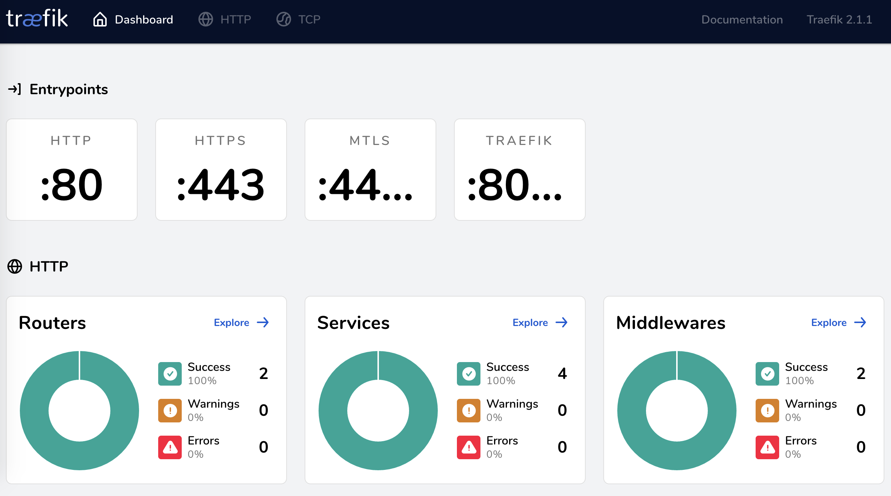

<figure class="figure figure--left">
  
</figure>

One year ago I experimented with [Traefik](https://traefik.io/) and wrote [about the experience](../setting-up-traefik/). We ended up using it as a reverse proxy in my project at the time. It was remarkably unremarkable, in that it didn't give us much trouble. That is a good thing! I kind of forgot about it, other than the occasional update. 

Anyways, in my current project we need a reverse proxy with automatic discovery again. Thus, *Traefik* is back on the menu. Version 2 has been released since I last touched it. It brings quite a few changes. I decided to adapt my sample setup and compare both.

I took the old repository and made a [new one using version 2](https://github.com/sirech/traefik2-test). Let's see how things have changed.

<!--more-->

## Plumbing

### TOML vs YAML

Right of the bat, [TOML](https://github.com/toml-lang/toml) is no longer the only supported configuration mechanism. [YAML](https://yaml.org/) support has been added. I don't have a strong opinion on the matter, though _YAML_ seems to be more of a standard these days.

### New concepts

Core notions have [changed significantly](https://docs.traefik.io/migration/v1-to-v2/). Before, we had _entrypoint_, _frontend_ and _backend_. Now we've got _entrypoint_, _router_ and _service_. Modifications of the request happen through _middleware_.

In terms of functionality, not a lot has changed. The format is not compatible, so you'll have to migrate quite a few things.

The configuration for entrypoints and providers goes in a static configuration file. The rest is dynamic, which can be extra YAML/TOML files, or directly as labels for the containers.

## Service Discovery and Load Balancing

Mostly works the same. Support for ECS is gone, [pending to be re-added](https://github.com/containous/traefik/issues/4674).

As for load balancing, I had an example with two separate services in _docker-compose_ [running the same container in version 1](https://github.com/sirech/traefik-test/blob/master/docker-compose.app1.yml). It was solved by using the same backend. Now you'll want to define the same service for both, which couldn't be done directly, as far as I could tell. I went around this by defining a healthcheck:

```yaml
labels:
  - "traefik.http.services.web.loadBalancer.healthCheck.path=/"
```

[Feels a bit hacky](https://github.com/sirech/traefik2-test/blob/master/docker-compose.app1.yml), but production services will have a healthcheck anyways, so it's not too bad.

## Routing

Routing goes from _frontend_ to _routers_. The syntax is slightly different. Other than that it remains unchanged.

## TLS

Setting TLS was a lot harder than expected. In the past, you would [associate your certificates with the entrypoint](https://github.com/sirech/traefik-test/blob/master/traefik/traefik.toml#L17-L22). That would work automatically for a frontend using the entrypoint.

Now the certificates are defined as part of a store, which can look like this:

```yaml
tls:
  stores:
    default:
      defaultCertificate:
        certFile: /certs/cert.crt
        keyFile: /certs/cert.key
```

Then, we activate `tls` for a route with labels (full compose file [here](https://github.com/sirech/traefik2-test/blob/master/docker-compose.app2.yml)):

```yaml
labels:
  - "traefik.http.routers.web-secure.entrypoints=https"
  - "traefik.http.routers.web-secure.tls=true"
  - "traefik.http.routers.web-secure.rule=Host(`echo.testing.com`) && Path(`/standard`)"
```

In theory you can use multiple stores, but I only managed to get my certificate delivered by making it the default one.

I found the whole thing quite confusing. I was getting errors about self-signed certificates in the logs all the time. I was thinking that self-signed certificates were not supported. But then they did. Confusing logs have been a theme during this whole ordeal.

## Mutual TLS

This was a hard requirement I had when I first tried _Traefik_. In order to get _mTLS_, you have to add a configuration block that is applied to the _TLS_ connection:

```yaml
tls:
  options:
    enforceClientCert:
      clientAuth:
        caFiles:
          - /certs/client.crt
        clientAuthType: RequireAndVerifyClientCert
```

I think this has to be dynamic configuration, although I'm not sure. Then it's a matter of activating that configuration for your router (full compose file [here](https://github.com/sirech/traefik2-test/blob/master/docker-compose.app3.yml#L4-L12)):

```yaml
labels:
  - "traefik.http.routers.web-secure-mtls.entrypoints=mTLS"
  - "traefik.http.routers.web-secure-mtls.tls.options=enforceClientCert@file"
```

Somehow my https router from the previous example stopped working without client certificates. I only managed to separate them by using two entrypoints running two different ports, much like in old _Traefik_. My understanding from the documentation is that this shouldn't be the case, but I couldn't make it work otherwise.

## Middleware

The biggest change I've seen so far is that _Traefik_ supports manipulating requests before sending them to a service and before returning them to the caller. It is called [middleware](https://docs.traefik.io/middlewares/overview/).

Operations on the path of the request, like stripping parts or adding a prefix, are now expressed as middleware. Authentication has become middleware as well. I thought for a second this was new functionality. It turns out you could do most of it before, although it is a lot more consistent and organized now.

I like the idea. It is potentially pretty powerful, specially if custom middleware becomes a thing.

## The dashboard

The dashboard has gotten quite a facelift. This is how it looks like now:

<figure class="figure">
  
</figure>

Fancy! I found the dashboard really useful in the beginning, although I didn't check it as much once _Traefik_ was up and running. Setting basic auth for it [was surprisingly tricky](https://github.com/sirech/traefik2-test/blob/master/docker-compose.base.yml#L18-L22).

## Conclusion

It is a mixed bag for me, to be honest. I'm not sure if I just got used to the old stuff, but I've struggled wrapping my head around how things work now. Where does the config go? In a dynamic file? In labels? Who knows. The debug output could be a lot more helpful with that.

Maybe doing a direct translation of an existing setup is not the way to go? From my short experience, you have to dig deep into the documentation, and assume that what you knew before no longer applies.

My favorite new part is the middleware. For the rest, it feels a bit of a lateral move.
