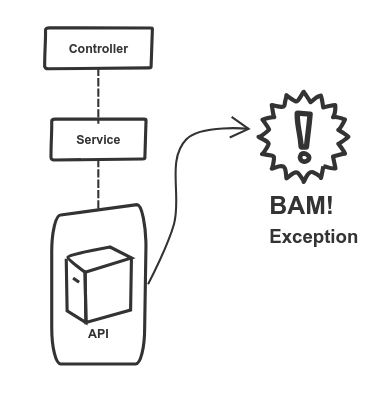
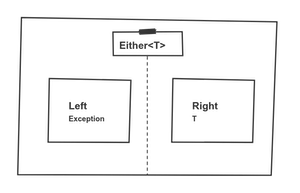

Many of the REST APIs I’ve built lately follow the same pattern. A dumb controller calls a service, which in turn calls a 3rd party API. Simple, well tested, and tidy. Everybody is happy. And then, you start dealing with error conditions.

<figure class="figure">
  
</figure>

If we don't handle the exception, it will bubble up until our API returns a 500 to the caller. As a state-of-the-art backend, we can't afford this. We have to *do* something.

## Handling failure

A typical pattern in the [SpringBoot](https://spring.io/projects/spring-boot) ecosystem is using an exception handler. You put this method in the controller, and it catches automagically exceptions that happen in the chain. Our caller then gets the error formatted the way we want.

```kotlin
@ExceptionHandler(JWTVerificationException::class)
fun handleException(exception: JWTVerificationException): ResponseEntity<ErrorMessage> {
    return ResponseEntity
      .status(HttpStatus.BAD_GATEWAY)
      .body(ErrorMessage.fromException(exception))
}
```

### Do not want

I don't like this way of dealing with error conditions. Error conditions are not something to hide. They happen all the time. They are part of the code. This exception business makes the code difficult to understand. Half of the flow is happening in a way that is partially hidden and easy to miss. It makes the code harder to read.

Instead, I want to show how to make errors explicit by using _Either Types_.

---

## An example based on JWT

Let's say that our `Service` from the diagram above is going to verify [JSON Web Tokens](https://jwt.io/). The idea is simple. We are getting a _JWT_ as a string, and we want to know if it is a valid token. If so, we want to get certain properties that we will wrap in a `TokenAuthentication`. This interface defines it:

```kotlin
interface Verifier {
    /**
     * @param jwt a jwt token
     * @return authentication credentials
     */
    fun verify(jwt: String): TokenAuthentication
}
```

### Forged signatures

I am using [auth0's library to verify tokens](https://github.com/auth0/java-jwt). It has a `JWTVerifier` class, which receives the encoded token and returns a `DecodedJWT`. If something goes wrong, it throws a `JWTVerificationException`. There are different reasons for that, such as an expired token, or an invalid signature.

_Kotlin_ does not have [checked exceptions](https://kotlinlang.org/docs/reference/exceptions.html#checked-exceptions) for a good reason. As a consequence, however, the signature is lying to us! This method might throw an exception. Only looking at the implementation will reveal the treachery. As I mentioned, the code becomes harder to read. More context is needed to understand how the app behaves.

### The explicit approach

There are two things I want to change in the `Verifier` implementation.

1. The `verify` method should not throw an exception.
2. The signature of the method should reflect that an error might happen.

A naive approach would be to use a [nullable type](https://kotlinlang.org/docs/reference/null-safety.html#nullable-types-and-non-null-types). `verify` would return `TokenAuthentication?`. But it has a fatal flaw: We are losing all the context about what actually went wrong. If there are different causes for the error, we want to keep that information. 
Enter `Either` (dum dum dum...).

## The Either datatype

<figure class="figure figure--right">
  
</figure>

Originating from the [functional community](http://hackage.haskell.org/package/base-4.12.0.0/docs/Data-Either.html), `Either` is a class whose value can be of two different types, called left and right. By convention, `Right` is for the success case and `Left` for the error one.

It is essentially an option type that keeps the information about the error in it. Just what we need! You can implement it yourself, but I'm going to use the excellent [arrow library](https://arrow-kt.io/docs/apidocs/arrow-core-data/arrow.core/-either/), which includes an `Either` type, among many other functional goodies.

With that being said, let's rewrite our code to make use of `Either`.

### Adapting the interface

The `Verifier` class returns an `Either` type to indicate that the computation might fail.

```kotlin
interface Verifier {
    /**
     * @param jwt a jwt token
     * @return authentication credentials, or an error if the validation fails
     */
    fun verify(jwt: String): Either<JWTVerificationException, TokenAuthentication>
}
```

Note that we are still using the exception to signal an error, but we are not _throwing_ it anymore.

### Wrapping the code that throws

Inside our implementation of `Verifier`, we are wrapping the problematic code from the library that we use with an extension method called `unsafeVerify`:

```kotlin
private fun JWTVerifier.unsafeVerify(jwt: String) = try {
    verify(jwt).right()
} catch (e: JWTVerificationException) {
    e.left()
}
```

_Arrow_ provides a ton of convenience methods to make it simpler to use. Thanks to the `left` and `right` extension methods, this code is quite tight.

### Using it as a client

Implementation is done. How do we use this in our code? Whenever you want to operate on the underlying type, ignoring the error case, you can use `map`. That allows you to chain calls without having to check whether the value is valid or not. There is an equivalent `mapLeft` for the error side.

```
verifier
 .unsafeVerify(jwt)
 .map { it.asToken() }
```

Ultimately, you want to convert the `Left` and `Right` branches into one value. One option is to use the functional [fold](https://wiki.haskell.org/Fold) method.

```kotlin
val result = verifier.verify(jwt)
result.fold(
    ifLeft = { ResponseEntity.badRequest().build() },
    ifRight = { ResponseEntity.ok("Worked!") }
)
```

Or we can use a `when` expression because `Left` and `Right` happen to be [sealed classes](https://kotlinlang.org/docs/reference/sealed-classes.html).

```kotlin
val result = verifier.verify(jwt)
when (result) {
    is Either.Left -> ResponseEntity.badRequest().build()
    is Either.Right -> ResponseEntity.ok("Worked!")
}
```

So that's pretty much it. The `Verifier` doesn't throw exceptions anymore. Instead, an `Either` wrapping the token is returned, with additional information about the error in case something goes wrong. We can manipulate the result throughout our application. When we are ready to unwrap the value, we use one of the two methods above to convert it to one value. In our case, the success case returns a 200, and the error a 502. To see the full implementation, check [this](https://github.com/sirech/cookery2-backend/blob/master/src/main/kotlin/com/hceris/cookery2/auth/RemoteVerifier.kt).

---

## Appendix: A built-in solution

Since _Kotlin_ 1.3, there is a built-in way of dealing with computations that can fail. It is the `Result` class, which is typically used in a `runCatching` block:

```kotlin
runCatching {
    methodThatMightThrow()
}.getOrElse { ex ->
    dealWithTheException(ex)
}
```

This class can't be used as a return type yet, so we can't use it for our interface. Moreover, `Either` integrates with all the other _arrow_ library. I plan to write in more detail about other things that you can do with it, such as converting it to an `Option` or chaining multiple calls in more complex examples.

## Conclusion

`Either` is a great way to make the error handling in your code more explicit. I've been trying to make all my services return it if there are failure conditions. The [controller](https://github.com/sirech/cookery2-backend/blob/master/src/main/kotlin/com/hceris/cookery2/recipes/RecipesController.kt#L65-L67) is then responsible for branching based on success/error and deciding what to do.

I think that the code is a lot clearer this way, and worth trying. It's one step towards more functional code. I'll follow up with others, including other parts of _arrow_, which I like quite a bit.
