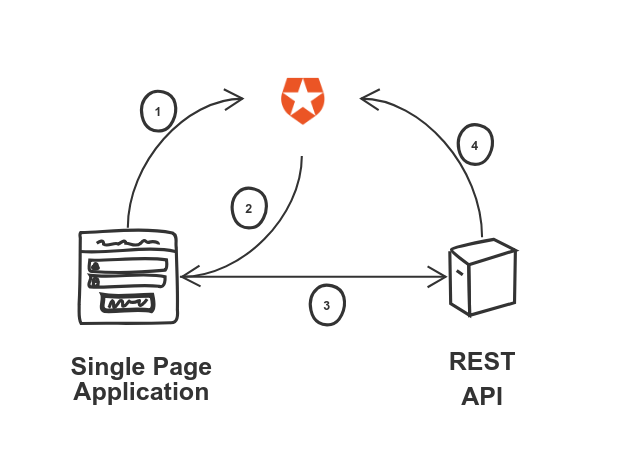
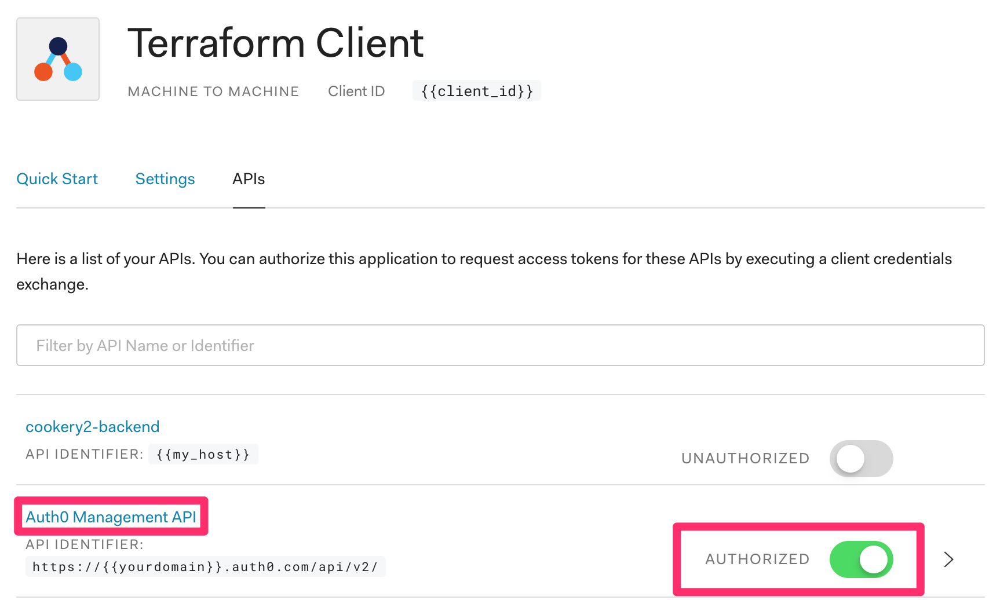
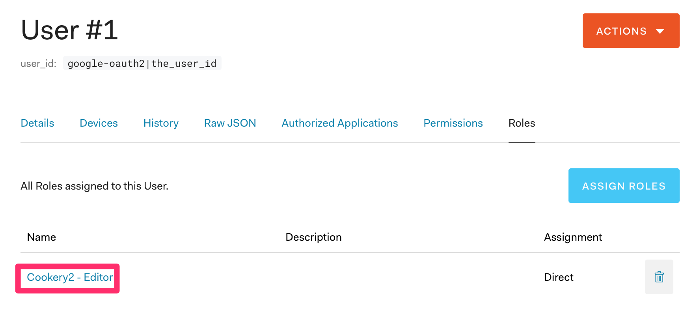
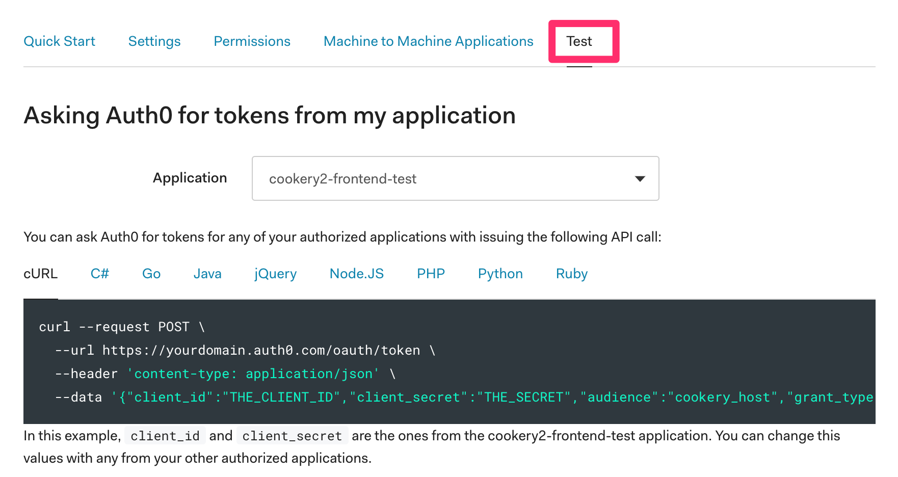

Let's imagine you have an application divided into two components, a frontend, and a backend. The frontend is a Single Page Application written in _React_, and the backend is a REST API written in, say, _Kotlin_. You want to implement some functionality that requires authorization. You naturally gravitate toward [OAuth](https://oauth.net/2/). But then you realize that implementing it by yourself implies much effort. And you still need to manage users. Maybe use an [OAuth provider](https://en.wikipedia.org/wiki/List_of_OAuth_providers)? It all seems kind of overkill for protecting your homemade recipes manager.

That's where an _Identity Platform_ like [Auth0](https://auth0.com/) comes in. Why reinvent the wheel when you can use an existing solution?

## The authorization flow

There is so much material about [authorization/authentication](https://auth0.com/docs/flows) already out there, what else can be said at this point? Maybe we can have a look at a simple diagram that shows the position of _Auth0_ between my frontend and backend:

<figure class="figure">
  
</figure>

Until now, everything might sound familiar. Fetch a token in the frontend using a flow, include it in the request to the API with a header. Then verify the token in the backend to ensure its validity. Got it. 

## Setting up Auth0

You still need to set up the whole thing in _Auth0_ itself, however. Most guides you'll find on the internet show you how to do that by clicking through the UI. Which works, more or less. But what about the second time you want to do it? You'll start from scratch, assuming you still remember how to do it, of course.

The whole point of this article is that you are much better off using [Infrastructure as Code](https://www.thoughtworks.com/de/insights/blog/infrastructure-code-reason-smile) instead. I am going to show you how to deal with the previously mentioned setup by using [Terraform](https://www.terraform.io/), a tool to provision infrastructure declaratively. It is definitely worth [learning](https://www.terraform.io/intro/index.html).

### Auth0 + Terraform

There is an excellent [terraform provider](https://www.terraform.io/docs/providers/auth0/index.html) for _Auth0_, which will make our life massively easier. We'll declare our stuff, provision it, and store the code in `git`. That way, you can quickly check what you did, and adapt it for further applications without much effort. Or even write a blog post about it.

Let's assume we already have an account served under a domain (`auth0_domain`). If we want to work with _Auth0_ programmatically, we need to create an application with access to the _Auth0 Management API_. We have to do this step manually, [following these steps](https://auth0.com/docs/api/management/v2/create-m2m-app). After this, we'll have a `client_id` and a `client_secret` that we can use throughout the rest of the process. On to the code.

<figure class="figure">
  
</figure>

### The provider

The first thing we need to do is set up the provider.

```hcl
provider "auth0" {
  domain        = var.auth0_domain
  client_id     = var.auth0_client_id
  client_secret = var.auth0_client_secret
}
```

This provider requires the credentials we manually obtained in the step before. Store them securely in something like [gopass](../storing-passwords-with-gopass/). You can export these credentials as environment variables, and they will be picked up by `terraform` automatically. You only need to follow this specific syntax:

```shell
export TF_VAR_auth0_domain=$(gopass auth0/domain)
export TF_VAR_auth0_client_id=$(gopass auth0/client_id)
export TF_VAR_auth0_client_secret=$(gopass auth0/client_secret)
export TF_VAR_auth0_my_host=$(gopass auth0/my_host)
```

## Let's set up our application 

### The identity provider

We can provision our users, but what about using an existing solution like Google? Then we don't need to do any account management. For that, we need to define a connection.

```hcl
resource "auth0_connection" "google" {
  name     = "google"
  strategy = "google-oauth2"

  enabled_clients = [
    auth0_client.cookery2-frontend.id,
    auth0_client.shelf2-frontend.id
  ]
}
```

This connection means that anybody with a Google account can log in. We'll get to defining permissions in a bit.

### The application

For our frontend, we need to define an [application](https://auth0.com/docs/dashboard/reference/settings-application). We'll use this application to get an access token to connect to our API.

```hcl
resource "auth0_client" "cookery2-frontend" {
  name        = "cookery2-frontend"
  description = "Cookery2 Application - Terraform generated"
  app_type    = "spa"
  callbacks   = ["http://localhost:3003/callback", "https://${local.cookery2_host}/callback"]

  oidc_conformant = true

  jwt_configuration {
    alg = "RS256"
  }
}
```

I am using the [implicit flow](https://oauth.net/2/grant-types/implicit/), which is not recommended anymore from a security standpoint. That is a topic for a future article. My list of recipes doesn't have strong security requirements, so I can live with it!


I'm enabling two callbacks, the actual domain, and localhost so that we can test things locally as well.

### The API

Our application is now able to fetch a token. But it still needs to access something. That something is the API, which is conveniently called an [API](https://auth0.com/docs/dashboard/reference/settings-api) in _Auth0_.

```hcl
resource "auth0_resource_server" "cookery2-backend" {
  name             = "cookery2-backend"
  identifier       = local.cookery2_host
  signing_alg      = "RS256"
  enforce_policies = true

  token_lifetime         = 86400
  token_lifetime_for_web = 7200

  skip_consent_for_verifiable_first_party_clients = true

  scopes {
    value       = "create:recipes"
    description = "Can create a recipe"
  }
}
```

The `enforce_policies` flag activates the [Role-Based Access Control](https://auth0.com/docs/authorization/concepts/rbac) that is required to enforce anything. We are defining a scope (`create:recipes`), which is the only operation that we want to restrict.

## RBAC

There are two ways of implementing _RBAC_ in _Auth0_, [Authorization Core](https://auth0.com/docs/authorization/guides/how-to), and [Authorization Extension](https://auth0.com/docs/extensions/authorization-extension). We are going to use the Core one, which is a bit newer and more integrated into _Auth0_.

The idea is to create a role with a permission associated with it for a concrete API. In our case, the `create:recipes` scope we provisioned before.

```hcl
resource "auth0_role" "cookery2-editor" {
  name = "Cookery2 - Editor"

  permissions {
    name                       = "create:recipes"
    resource_server_identifier = auth0_resource_server.cookery2-backend.identifier
  }
}
```

When we authenticate with our client, we include a list of requested scopes, let's say `profile create:recipes`. _Auth0_ checks our user, and if that user is assigned the `cookery2-editor` role, then the scope is included in the `access_token` that gets returned. The API then knows that the user is allowed to create recipes.

### Assigning the role to a user

The way to assign roles to users at scale is by associating [metadata](https://auth0.com/docs/users/concepts/overview-user-metadata) to them with a [rule](https://auth0.com/docs/rules). A rule is a _JavaScript_ snippet where you can apply your business logic. This is an example taken directly from the official documentation:

```javascript
function(user, context, callback){
  user.app_metadata = user.app_metadata || {};
  // update the app_metadata that will be part of the response
  user.app_metadata.roles = user.app_metadata.roles || [];
  user.app_metadata.roles.push('administrator');

  // persist the app_metadata update
  auth0.users.updateAppMetadata(user.user_id, user.app_metadata)
    .then(function(){
      callback(null, user, context);
    })
    .catch(function(err){
      callback(err);
    });
}
```

For my tiny little app, I'm assigning the role to my user manually, in the UI.

<figure class="figure">
  
</figure>

## A test application

Lastly, we want an extra application for testing purposes. If we want to test that the connection to the API works, we can create one that uses machine-to-machine authentication, which makes obtaining a token easier.

```hcl
resource "auth0_client" "cookery2-frontend-test" {
  name        = "cookery2-frontend-test"
  description = "Cookery2 Application (Test) - Terraform generated"
  app_type    = "non_interactive"

  token_endpoint_auth_method = "client_secret_post"
}

resource "auth0_client_grant" "cookery2-frontend-test" {
  client_id = auth0_client.cookery2-frontend-test.id
  audience  = auth0_resource_server.cookery2-backend.identifier
  scope     = []
}
```

There is a tab on the API page that has the code to generate a token for it using the test app we just created.

<figure class="figure">
  
</figure>

## Storing the state

_Terraform_ creates a [state](https://www.terraform.io/docs/state/index.html) when run to know what things are there and in which state. Storing it in your laptop is risky, as it could get lost or even leaked. In our case, the most convenient option is to store it directly in [HashiCorp's own service](https://app.terraform.io/).

```hcl
terraform {
  backend "remote" {
    organization = "our-organization"

    workspaces {
      name = "our-workspace"
    }
  }
}
```

There are multiple [alternatives](https://www.terraform.io/docs/state/remote.html) to store the state remotely.

## Summary

That's all you need to do. Thanks to `Terraform`, we can provision applications and APIs using code that we can execute repeatedly. We know exactly what we have configured. We can add new use cases with little effort. You won't need to reverse engineer what you did six months ago or write a note not to forget setting a parameter correctly. It is truly a new world.


