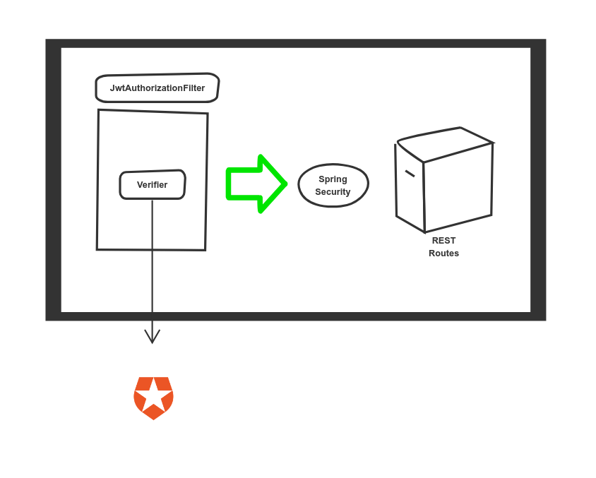
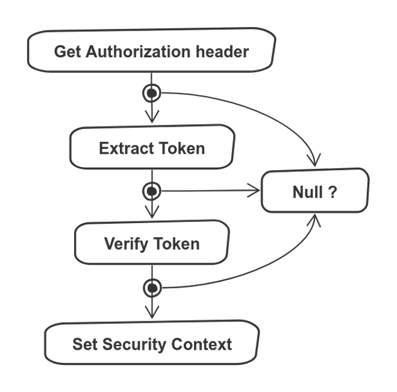

In my previous article, I wrote about [setting up Auth0 using Terraform](../setting-up-auth0-with-terraform/). In this article, I want to put that setup to work to authorize requests to a backend API written in _Kotlin_, using [SpringBoot](https://spring.io/).

This API is used  to upload recipes. It is consumed through a frontend application. Login is optional for viewing them. I want to authorize requests to create new ones, however. That's what we'll be doing now, thanks to [JSON Web Tokens](https://en.wikipedia.org/wiki/JSON_Web_Token).

<figure class="figure">
  
</figure>

## JSON Web Tokens

I'm delegating the user management to _Auth0_. Our frontend communicates with it using [OAuth](https://auth0.com/docs/api-auth/which-oauth-flow-to-use) to obtain a [bearer token](https://tools.ietf.org/html/rfc6750), but that is outside the purpose of this article. We'll assume that this step happened already and that the requests to our backend come with an _Authorization_ header.

The token is encoded in base64, which can be conveniently decoded using [jwt.io](https://jwt.io/). Once decoded, we can have a look at the payload, which is just a JSON object:

```json
{
  "iss": "https://{{auth0_tenant}}.eu.auth0.com/",
  "sub": "google-oauth2|{{user_id}}",
  "aud": [
    "{{our_domain}}",
    "https://{{auth0_tenant}}.eu.auth0.com/userinfo"
  ],
  "iat": 1584296421,
  "exp": 1584303621,
  "scope": "openid profile create:recipes"
}
```

So we have an Issuer (`iss`), an Audience (`aud`), an Expiration Time (`exp`), and the scopes granted (`scope`). All those are fields that we can verify. How will that work? Here's a diagram:

<figure class="figure">
  
</figure>

In order to authorize requests, we need three components:

- A _Verifier_ that checks if the token is valid, and extract information from it if so
- A _JwtAuthorizationFilter_ that runs before every request to the backend, and run the _Verifier_
- A connection to _Spring Security_, which rejects the request if it is invalid

Let's have a look at each separately.

## Verifying the token

So, our backend has received a request that includes a _JWT_, what do we do now? We can picture it as two distinct steps. Checking the signature and verifying the token itself. We combine both steps into an interface (`Verifier`), which defines one method:

```kotlin
interface Verifier {
    /**
     * @param jwt a jwt token
     * @return whether the token is valid or not
     */
    fun verify(jwt: String): Either<JWTVerificationException, TokenAuthentication>
}
```

I'm using an `Either` type for the return type. I wrote [about them](../kotlin-either-types-instead-of-exceptions/) recently. Essentially, we'll get a `TokenAuthentication` if `verify` succeeds and an instance of `JWTVerificationException` if not.

### The signature

The token is signed by the issuer (in our case _Auth0_). The signature ensures that the token comes from the issuer, and that hasn't been tampered with.

To avoid having to share a secret key, we prefer to use a public/private key combination. That's where `JWKS` comes in. _Auth0_ publishes the key for your tenant under https://{{auth0_tenant}}.eu.auth0.com/.well-known/jwks.json. I am injecting that key into our `RemoteVerifier`, which implements the interface I defined above. We provide it as a `Bean`:

```kotlin
@Configuration
class JWTConfiguration {
    @Value("\${auth.jwks}")
    lateinit var jwks: String

    @ConditionalOnProperty(value = ["auth.enabled"], havingValue = "true")
    @Bean
    fun verifier(): Verifier {
        val keySet = JWKSet.load(URL(jwks))
        return RemoteVerifier(keySet)
    }
}
```

The `Bean` is conditional so that we can provide an alternate implementation for our tests, thus avoiding network requests.

### Setting up the verifier

For the verification itself, we are going to use [auth0's own library](https://github.com/auth0/java-jwt). First, we initialize a `JWTVerifier`:

```kotlin
class RemoteVerifier(private val keySet: JWKSet, private val leeway: Long = 10) : Verifier {
    companion object {
        private fun key(keySet: JWKSet) = keySet.keys.first() as RSAKey
        private fun algorithm(key: RSAKey) = Algorithm.RSA256(key.toRSAPublicKey(), null)
        private fun verifier(algorithm: Algorithm, leeway: Long) = JWT
                .require(algorithm)
                .acceptExpiresAt(leeway)
                .build()

    }

    private fun verifier(): JWTVerifier {
        val key = key(keySet)
        val algorithm = algorithm(key)
        return verifier(algorithm, leeway)
    }
}
```

You can see we include the key we got before, plus a leeway limit for the expiration time of the token. If you want to test for the issuer and the audience explicitly, you can use the `withIssuer` and `withAudience` methods, before calling `build()`. In my case,  checking that my tenant signs the token feels safe enough.

We trigger the actual verification by calling the `verify` method of the `JWTVerifier` we just created, wrapping it so that it does not throw exceptions into the wild.

```kotlin
override fun verify(jwt: String): Either<JWTVerificationException, TokenAuthentication> {
    return verifier()
            .unsafeVerify(jwt)
            .map { it.asToken() }
}
```

Wait, what is that `asToken` method doing there? As I mentioned, we want to extract information from the token. We need the list of scopes in the token for later, which we fetch and include in our `TokenAuthentication`

```kotlin
private fun DecodedJWT.asToken() =
        TokenAuthentication(token, User(subject, scopes()))

private fun DecodedJWT.scopes() = getClaim("scope")
        .asString()
        .split(" ")
```

## The authorization filter

The verifier runs inside a filter, which inherits from `OncePerRequestFilter`. As you probably guessed, it runs before every request, but only once. Let's call it `JwtAuthorizationFilter`. It does the following steps:

<figure class="figure">
  
</figure>

We covered the _Verify Token_ step in the previous section. Before that, we have to extract the token from the header. If the verification succeeds, we set the `SecurityContext`, which is relevant for _Spring Security_. The code looks like this:

```kotlin
@Component
class JwtAuthorizationFilter(val verifier: Verifier) : OncePerRequestFilter() {
    companion object {
        private fun String.extractToken() = startsWith("Bearer ")
                .maybe { split(" ").last() }
    }

    override fun doFilterInternal(
            request: HttpServletRequest,
            response: HttpServletResponse,
            filterChain: FilterChain) {

        val token = Option.fx {
            val (header) = request.getHeader(Headers.AUTHORIZATION).toOption()
            val (jwt) = header.extractToken()
            val (token) = verifier.verify(jwt).toOption()
            SecurityContextHolder.getContext().authentication = token
        }

        filterChain.doFilter(request, response)
    }
}
```

It is fairly straightforward ... wait, what is that `Option.fx` thing? And the parentheses? Also, according to the diagram, ever step could have an empty answer, where are we handling that?

The long explanation is an article on its own. The short version is that thanks to _Arrow_, we can use [monad comprehensions](https://arrow-kt.io/docs/patterns/monad_comprehensions/) to flatten our code and make a collection of operations on an `Option` look like a regular block of code.

## Binding Spring Security

I am using [Spring Security](https://spring.io/projects/spring-security) to integrate my filter into my application. The easiest way to get started is to use this dependency:

```groovy
implementation 'org.springframework.boot:spring-boot-starter-security'
```

In the configuration, I'm specifying the following:

- My `JwtAuthorizationFilter` will run before every request
- `GET` requests don't need authorization
- For mutating requests (such as a `POST`), we expect the `create:recipes` scope there. Remember that we mapped that into our `TokenAuthentication` as part of the verification.

There is a fluent interface to configure this in code, which looks like this:

```kotlin
@EnableWebSecurity
@EnableGlobalMethodSecurity(securedEnabled = true)
class SecurityConfiguration : WebSecurityConfigurerAdapter() {
    @Autowired
    lateinit var filter: JwtAuthorizationFilter

    override fun configure(http: HttpSecurity?) {
        http?.let {
            it.cors().and()
                    .csrf().disable()
                    .authorizeRequests()
                    .antMatchers(HttpMethod.GET).permitAll()
                    .anyRequest().hasAuthority("create:recipes")
                    .and()
                    .addFilterBefore(filter, BasicAuthenticationFilter::class.java)
                    .sessionManagement()
                    .sessionCreationPolicy(SessionCreationPolicy.STATELESS);
        }
    }
}
```

So now all three parts are finally connected. We defined which requests we want to authorize. The filter parses and verifies the token. If that token fulfills all our requirements, the request goes through. Otherwise, it fails with an unauthorized response.

## Summary

Building authorization into your API is something you **need** to do if you want to make sure that your backend is properly ensuring only the right parties are allowed to do certain things. I rolled a custom solution for a project that I worked on, but if you use standard tools and libraries, it is a lot more convenient and a lot easier for other people to understand.
