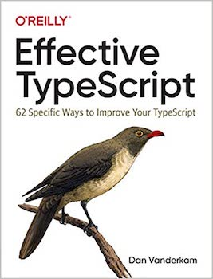

<figure class="figure figure--right">
  
</figure>

Maybe it's just my experience, but I used to think of [TypeScript](https://www.typescriptlang.org/) as the programming language without a fanbase. Too formal for the _JavaScript_ crowd, with all those types getting in the way. Yet too lax for the _Java_ folks, used to structure and order.

I didn't spend much time learning the language when I started using it. I remember my confusion when I discovered that due to structural typing, you can assign the same object to two classes with the same shape. What the hell is that? 

Then at some point, I read [Effective TypeScript](https://www.oreilly.com/library/view/effective-typescript/9781492053736/). After that, I felt like when I discovered as a kid that scissors are way easier to use with your right hand (I'm left-handed). I wasn't stupid after all. I was just misusing the tool!

## Should **you** read it?

Yes! Fittingly, it follows a similar structure to [Effective Java](https://www.oreilly.com/library/view/effective-java-3rd/9780134686097/) (the best book about a programming language, IMO). It's not a book to learn _TypeScript_. It is a book about learning how to use _TypeScript_ **effectively**.

There are 62 items across its roughly 240 pages. Each item offers actionable advice on how to write better _TypeScript_ code, providing examples and explaining some of the misunderstood or little known features that _TypeScript_ throws at you.

Given that _TypeScript_ is mostly about enhancing _JavaScript_ with types, this book is mostly about using types to make your code more self-descriptive and catch errors. If you have come in contact with one of these awful codebases where people gave up in the middle and littered the code with `any` annotations, you'll understand exactly what I mean. 

Just as an appetizer, let's have a look at some actual items.

## Item 37: Consider brands for nominal typing

Structural typing can lead to unexpected results. This object:

```typescript
{
  id: 3
}
```

can be assigned to this two classes.

```typescript
class UserId {
  id: string
}

class VehicleId {
  id: string
}
```

While technically correct, you probably didn't mean this! In a project, we had a production bug because of this. So what do you do? Well, you brand your classes:

```typescript
class UserId {
  _brand: 'user-id'
  id: string
}
```

## Item 28: Prefer types that always represent valid states

Union types are a way of dealing with objects being possibly in different states. Let's say you are loading a user, and you have to wait for it to load before accessing any property. You can use a ton of optional fields, or you can use a tagged union:

```typescript
interface LoadingUser {
  type: 'loading';
}

interface LoadedUser {
  type: 'user';
  firstName: string;
}

type User = LoadingUser | LoadedUser;
```

Thanks to type narrowing (_Item 22_), your code will be a lot tighter and typesafe this way. Once you get used to this style, you'll notice that many libraries don't follow this pattern, making things a lot more brittle than they should be.

## Verdict

Compact, informative, even eye-opening. _Effective TypeScript_ is a clear ⭐⭐⭐⭐⭐. Now that both _Angular_ and _React_ seem to use _TypeScript_ as their default, you can't afford to miss this one. 
