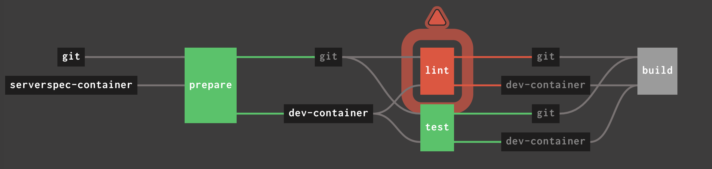
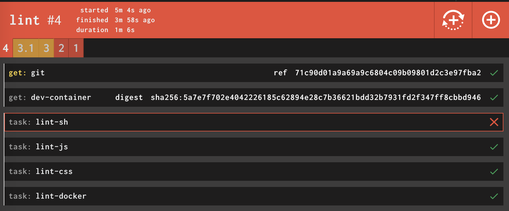
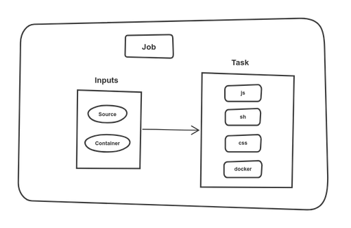

<div class="guide clearfix">

### Generating pipelines for Concourse using jsonnet

- [**Part 1 - Introduction**](../templating-concourse-pipelines-with-jsonnet/)
- [Part 2 - Follow-up](../templating-concourse-pipelines-with-jsonnet-follow-up/)

</div>

<figure class="figure figure--right">
  
</figure>

If you talk about [templating in YAML](https://www.thoughtworks.com/radar/techniques/templating-in-yaml), it's bound to raise some eyebrows. It's the perfect storm. A whitespace-aware templating language combined with some shitty annotations means you're in for a world of pain. I recently tried to abuse [gomplate](https://docs.gomplate.ca/) to generate some _YAML_ files, and it was just gross.

Let's agree not to do it. It's just not built for that. Nevertheless, at some point, _YAML_ documents get really difficult to handle. Like when you are defining pipelines in [Concourse](https://concourse-ci.org/).

That's why I want to talk about *templating that generates YAML* instead. I've been using [Jsonnet](https://jsonnet.org/) for that, and I'm quite happy with the results thus far. The code is [here](https://github.com/sirech/example-concourse-pipeline) if you want to jump straight to it.

## What's the point of templating, anyways?

In a nutshell, _YAML_ is **very** verbose. It also happens to be the format of choice for most CI/CD tools. That means it's pretty likely that you'll be defining delivery pipelines using _YAML_ sooner or later. I've written in [depth](https://www.thoughtworks.com/insights/blog/modernizing-your-build-pipelines) about high-quality pipelines. I'm all about pipelines that tell me exactly what's wrong, without having to examine tons of log output. Let's say a job in my pipeline failed:

<figure class="figure">
  
</figure>

I know the linting failed. Which part exactly? If the job is nicely split into tasks, I can spot the problem at a glance:

<figure class="figure">
  
</figure>

I have a granular breakdown, including every task, and I can directly go to the error without an archeological investigation. The downside, though? A lot of markup. Like really, a lot. This is how this innocent linter task looks like:

<!-- linter-task -->
```yaml
- name: lint
  serial: true
  plan:
  - in_parallel:
    - get: git
      passed: [prepare]
      trigger: true
    - get: dev-container
      passed: [prepare]
  - in_parallel:
    - task: lint-sh
      image: dev-container
      params:
        <<: *common-params
        TARGET: sh
      file: git/pipeline/tasks/linter/task.yml
    - task: lint-js
      image: dev-container
      params:
        <<: *common-params
        TARGET: js
      file: git/pipeline/tasks/linter/task.yml
    - task: lint-css
      image: dev-container
      params:
        <<: *common-params
        TARGET: css
      file: git/pipeline/tasks/linter/task.yml
    - task: lint-docker
      image: dev-container
      params:
        <<: *common-params
        TARGET: docker
      file: git/pipeline/tasks/linter/task.yml
```

This task definition is using anchors and a parametrized task to reduce duplication, which is about the most you can do in _Concourse_. Still, this is way too much code. And it just gets bigger and bigger as the pipeline grows in functionality. _YAML_ doesn't really give us a way to fight duplication.

## Jsonnet to the rescue

_Jsonnet_ is a data templating language. You define your data, and it creates one or more _JSON_ documents for you. The crucial part is that it gives you functions, conditionals, variables, and other tools to build more powerful abstractions. Just what I need! After a quick `brew install jsonnet`, we can get going.

As you surely know, _YAML_ is a superset of _JSON_. If this tool is outputting _JSON_, we can convert it to _YAML_ without loss. We are going to build a pipeline that will be lean and maintainable without any ugly hacks.

### A small library of utility functions

_Concourse_ has a bunch of basic abstractions. You have [resources](https://concourse-ci.org/resources.html), [jobs](https://concourse-ci.org/jobs.html), and [tasks](https://concourse-ci.org/tasks.html), among others. Each of those is represented by an object with some attributes. We can instantiate one by using functions that receive a configuration and emit a valid object. Here are some examples:

<!-- basic-resources -->
```javascript
{
  DockerResource(name, repository, tag = 'latest', allow_insecure = false):: {
    name: name,
    type: 'docker-image',
    source: {
      repository: repository,
      tag: tag
    } + (
      if allow_insecure then { insecure_registries: [std.split(repository, '/')[0]]} else {}
    ),
  },


  Parallel(tasks):: {
    in_parallel: tasks
  },

  Job(name, serial = true, plan = []):: std.prune({
    name: name,
    serial: serial,
    plan: plan
  })
}
```

You can use them as regular functions inside a `.jsonnet` file after importing the library.

<!-- git-resource -->
```python
local concourse = import 'concourse.libsonnet';
concourse.GitResource(source, 'https://github.com/sirech/example-concourse-pipeline.git')
```

The syntax somehow resembles both _JavaScript_ and _Python_. It's not quite a programming language, but you have some more toys to play with. Additionally, there is a big [standard library](https://jsonnet.org/ref/stdlib.html) to use. I've packaged these building blocks as a [small library](https://github.com/sirech/concourse-jsonnet-utils) that can be reused by just pulling the code.

### Less YAML, more Jsonnet

Let's say we are defining our `resources`. I have a sample project where it looks like this:

<!-- resources -->
```yaml
resources:
- name: git
  type: git
  source:
    uri: https://github.com/sirech/example-concourse-pipeline.git
    branch: master

- name: dev-container
  type: docker-image
  source:
    repository: registry:5000/dev-container
    insecure_registries:
      - registry:5000

- name: serverspec-container
  type: docker-image
  source:
    repository: sirech/dind-ruby
    tag: 2.6.3
```

It's not a lot of code, but you can feel that the structure is pretty repetitive. With the help of our previously defined helpers, we can do better.

<!-- jsonnet-resources -->
```python
local source = 'git';
local container = 'dev-container';

local resources = [
  concourse.GitResource(source, 'https://github.com/sirech/example-concourse-pipeline.git'),
  concourse.DockerResource(container, 'registry:5000/dev-container', allow_insecure = true),
  concourse.DockerResource('serverspec-container', 'sirech/dind-ruby', tag = '2.6.3'),
];
```

By using the `GitResource` and `DockerResource`, we got something much more compact without losing readability.

### Building your own DSL

Every pipeline is different, which means a generic abstraction is hard to find. But within a pipeline, you tend to see certain patterns emerging. We create them to make the _YAML_ overdose easier to swallow, even if we are still relying on copy-paste.

What if you build a small DSL to express these patterns? I mostly pass the same inputs to every job, so I have a function to fetch them in parallel:

<!-- get-resource -->
```python
local Inputs(dependencies = []) = concourse.Parallel([
  concourse.Get(s, dependencies = dependencies) for s in [source, container]
]);
```

You see that through variables, I keep this in sync with the resources I defined above. You can use [list comprehensions](https://www.pythonforbeginners.com/basics/list-comprehensions-in-python) to make the code more expressive.

My [tasks definitions](https://concourse-ci.org/tasks.html) follow a defined structure, as well. They are stored in the `source`, in a defined folder. We set some baseline parameters. All that context goes into a pipeline specific way of creating tasks.

<!-- task -->
```python
local Task(name, file = name, image = container, params = {}) = {
  task: name,
  image: image,
  params: { CI: true } + params,
  file: '%s/pipeline/tasks/%s/task.yml' % [source, file]
};
```

Step by step, we have a tailor-made set of functions that produce a smaller pipeline. It is more consistent and easier to change.

### Back to the huge linter job that we started with

That _linter_ job has a ton of repetition. It's time to compose all these smaller blocks into one job definition. The structure looks like this:

<figure class="figure">
  
</figure>

We have a `Job`, `Inputs`, and some `Tasks`. Let's use all the functions that we defined:

<!-- full-job -->
```python
concourse.Job('lint', plan = [
  Inputs('prepare'),
  concourse.Parallel(
    [Task('lint-%s' % lang, 'linter', params = { TARGET: lang }) for lang in ['sh', 'js', 'css', 'docker']]
  )
]),
```

I really like this one! Is it too smart for its own good? I think not! You see a clear structure. If you need to change or add something, you do it once, not multiple times. We have gone from around 30 lines of pure repetition to a tight block that still communicates clearly what it does.

## How to generate a pipeline from this

I like to convert the `json` output to _YAML_, and use `fly set-pipeline` with the generated file. This is the script:

<!-- generating-pipeline -->
```shell
json2yaml() {
  python3 -c 'import sys, yaml, json; print(yaml.dump(json.loads(sys.stdin.read())))'
}

goal_generate-pipeline() {
  FILES=$(jsonnet pipeline.jsonnet -J ../concourse-jsonnet-utils -m .)

  for file in $FILES; do
    json2yaml < "$file" > "${file%.json}.yml"
    rm "$file"
  done
}
```

## Conclusion

I had some reservations when I started with _Jsonnet_, but I'm really impressed. You can truly reduce the amount of duplication. Check [this pipeline](https://github.com/sirech/example-concourse-pipeline/blob/master/pipeline.jsonnet) to get a first taste. I'll try to get a bigger example for a future post, where we were dealing with a huge 500+ line infrastructure pipeline that we beat into shape.
