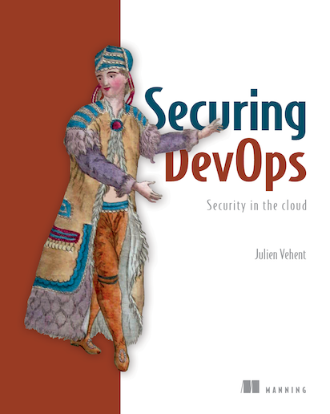

<figure class="figure figure--right">
  
</figure>

Security is becoming more and more of a priority for every organization that develops software. Some seek to implement security through heavy process and control, filling out extensive checklists that get forgotten the second after they are completed. Others try to incorporate security in their daily life, leveraging automation, and aiming to implement [Security as Code](https://www.oreilly.com/library/view/devopssec/9781491971413/ch04.html). This book is for the latter group.

This book is structured like a tutorial, starting slow and easy and gradually increasing difficulty as you progress. It has some theory, but it is fairly light. There are high-level explanations for things like [TLS](https://en.wikipedia.org/wiki/Transport_Layer_Security), [OpenID Connect](https://openid.net/connect/), or the [ACME](https://en.wikipedia.org/wiki/Automated_Certificate_Management_Environment) protocol. Nothing too overwhelming, though. It is more about practices, tools, and checks to take a typical setup on the cloud and make it more resilient against bad actors. Which, for many, is a big step forward.

## Practical advice

Throughout the book, you can find many actionable suggestions to bring improvements, one little step at a time. The focus is on cloud infrastructure, concretely on AWS. Unlike other resources I've seen, whenever the author is talking about hardening systems, he uses the CLI to set up things, and not the UI. That's a very welcome change. If you want to create a reproducible setup, you need to use code to provision it. I would have liked it even more if it were using _Terraform_, but the CLI is a good compromise to make it more accessible.

While reading it, you keep finding nice little tools that you can add to your delivery pipeline, like [ZAP](https://www.zaproxy.org/docs/docker/about/). I adapted my ssh client configuration based on its [guidelines](https://github.com/sirech/shell/blob/master/ssh/config#L1-L9). In general, the book is full of *security nuggets* worth checking. Maybe you already know all of them! Then it will be mostly a reminder not to forget them.

## Food for thought

The last part is a bit less concrete. It talks about setting up logging and intrusion detection, among other things. It is harder to show specific examples, so you can take it more as an appetizer, and seek additional sources if you want more depth. I guess those parts might be less likely to be relevant for non-security specialists, but it's good to know about them. Threat modeling makes an appearance, although I think the way to learn about that is with [practical exercises](https://martinfowler.com/articles/agile-threat-modelling.html).

## Verdict

If you are looking for a deep treaty in algorithms, this is the wrong book. It is more of a handbook of useful recipes that can help you get started in some areas and refresh what you are already doing in others. It's not too long, and pretty easy to digest. Let's give it ⭐⭐⭐⭐ stars.
