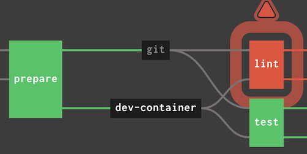

<div class="guide">

### Generating pipelines for Concourse using jsonnet

- [Part 1 - Introduction](../templating-concourse-pipelines-with-jsonnet/)
- [**Part 2 - Follow-up**](../templating-concourse-pipelines-with-jsonnet-follow-up/)

</div>

<figure class="figure figure--right">
  
</figure>

Around a month ago, I began experimenting with [jsonnet](https://jsonnet.org/) to generate pipelines for [Concourse](https://concourse-ci.org/) programmatically. Since then, I've used it to build [infrastructure pipelines](https://www.thoughtworks.com/radar/techniques/pipelines-for-infrastructure-as-code). We provision infrastructure in AWS using [Terraform](https://www.terraform.io/). Before, the process was mostly manual. As we added more and more teams to our platform, that approach was becoming untenable. I want to expand on that first article and talk about what I've learned in the process.

## Project-specific resources

I wrote a small [library of generic helper functions](https://github.com/sirech/concourse-jsonnet-utils) while developing our pipelines. We have built custom resources on top of them that are specific to our use case. Thanks to the `+:` operator, we can override what we need while benefitting from sane defaults. 

We have `git` and `docker` resources adapted to include credentials:

<!-- basic-resources-extended -->
```javascript
{
  GitResource(name, repository, paths=[]):: concourse.GitResource(name, '%s/%s.git' % [git, repository]) {
    source+: std.prune({
      private_key: '((%s-deploy-key-%s))' % [product, repository],
      paths: paths,
    }),
  },

  DockerResource(name, repository, tag):: concourse.DockerResource(name, repository, tag=tag) {
    source+: {
      aws_access_key_id: '((aws-access-key-id))',
      aws_secret_access_key: '((aws-secret-access-key))',
    },
  },
```

We realized that all of our jobs were declaring the same inputs, so we built a resource for that as well.

<!-- basic-resources-extended-inputs -->
```javascript
{
  Inputs(dependencies, trigger):: [
    concourse.Get('source-code', dependencies=dependencies, trigger=trigger),
  ] + [concourse.Get(source, trigger=false) for source in ['dev-tools', 'terraform-tools', 'container']],
}
```

## Helper functions

Whenever you try to reuse code with plain YAML, you end up hitting a wall. Even if you use [anchors](https://confluence.atlassian.com/bitbucket/yaml-anchors-960154027.html), they cannot be parameterized easily.

With `jsonnet`, we can address that limitation by building simple functions to check conditions based on the environment.

<!-- helper-functions -->
```javascript
local config = std.extVar('CONFIG');
{
  environments: [env for env in std.objectFields(config.clusters)],

  isProdEnvironment(env):: config.accounts[env] == 'product-prod',
  isNonProdEnvironment(env):: !self.isProdEnvironment(env),

  nonProdEnvironments: std.filter(self.isNonProdEnvironment, self.environments),
  prodEnvironments: std.filter(self.isProdEnvironment, self.environments),
}
```

You see that there is a `config` object that we receive from the outside, which brings me to my next point, configuring different pipelines that share the same structure.

## Configuring the pipelines

Our pipelines are deploying the same infrastructure for different teams. There are some differences like the product name, the number of environments to deploy, the regions, and things like that.

We have found out that this configuration is easier to keep in a separate `product.yaml` file. That way, changes in the domain are seen more clearly, and new products are quick to spin up. It looks like this:

<!-- product-yaml -->
```yaml
product_name: new-product
version: master

clusters:
  test:
    eu-west-1:
  prod:
    eu-west-1:
    us-east-1:

accounts:
  test: "product"
  prod: "product-prod"
```

`jsonnet` can receive external configuration (`local config = std.extVar('CONFIG')`), although you have to convert this file to `json` first.

## Combining everything

By using all these helpers and abstractions, our actual pipeline definition is about 80 lines long. Here is a simplified version of the function that provisions a complete environment:

<!-- pipeline-definition -->
```python
local EnvironmentJobs(env) =
  local regions = std.objectFields(config.clusters[env]);
  local params = { ENV: env };

  local modules = [
    Job('cluster-services-%s' % [env], 'cluster-global-dns', tasks=[TaskPerRegion(module, regions, params) for module in ['system-services', 'monitoring', 'logging']]),
    Job('ingress-%s' % [env], 'cluster-services-%s' % [env], tasks=[TaskPerRegion(module, regions, params) for module in ['private-ingress-app', 'private-ingress-dispatcher']]),
    Job('egress-%s' % [env], 'cluster-services-%s' % [env], tasks=TaskPerRegion('private-egress', regions, params)),
  ];

  modules + [
    Job('smoketest-%s' % [env], ['%s' % [module] for module in [job.name for job in modules]], tasks=[
      TaskPerRegion('smoketest', regions, params),
    ]),
  ]
;
```

There is no denying that this code gets pretty complex! That is hard to avoid, as the dependencies between different jobs are complex themselves. Trying to represent all these dependencies in YAML would be orders of magnitude more verbose.

## The end result

Just to give you an idea, here is the graphical representation of the full pipeline for one of the products that we provision:

<figure class="figure">
  
</figure>

Yeah, you probably can't even read the names of the jobs. That thing is huge! The actual YAML file has 2781 linesn if you are wondering. Why is it so large, you might ask. It is provisioning four different environments across different regions, for starters. We have tried to divide the infrastructure in smaller modules so that they are simpler to manage.

The result is a lot easier to visualize that one big job. Smaller modules are a lot easier to apply and maintain, as well. Thanks to `jsonnet`, the complexity of managing the pipeline is greatly reduced. We tried for a bit to create this by hand, and it didn't work at all.

## Is it worth it?

If your pipelines share a similar structure and only some parameters differ, it is a clear yes. You are going to have a much easier time doing this.

Even if there is no common structure to abstract, you can spare yourself a massive amount of YAML duplication, and reduce the accidental complexity. I would recommend exploring this option, although one has to be careful not to build something that becomes unmaintainable.
