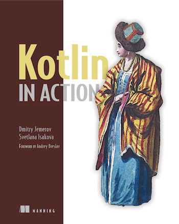

<figure class="figure figure--right">
  
</figure>

_Kotlin_ has been an obsession of mine for the last two years. I remember advocating for immutable data and using streams in a project I was on, where we were stuck with _Java_. Switching to _Kotlin_ was such a breath of fresh air. This is the book that helped me during that period.

I would say the ideal target audience is folks who are already familiar with _Java_ and want to learn _Kotlin_. You'll get started faster, and you'll be able to appreciate how much more concise and usable _Kotlin_ is. That seems to be a common origin for most people learning _Kotlin_, but in any case, you should be able to pick it up regardless of your background, as long as you do have some experience programming.

## Learning Kotlin

This book focuses on introducing you to _Kotlin_, from its syntax to features like nullable types, collections, or operators. The later chapters are dedicated to some more advanced concepts, like reflection or building DSLs. Interestingly, [coroutines](https://kotlinlang.org/docs/reference/coroutines/coroutines-guide.html) don't make an appearance.

As usual with learning a new programming language, a healthy combination of reading and practicing is advisable. Given that there are no exercises to practice in the book, I recommend [exercism](https://exercism.io/tracks/kotlin) to get started and the [Kotlin Tapas](https://github.com/sirech/kotlintapas) I shared some time ago.

The book doesn't make assumptions about your target environment. Whether you want to do backend development or mobile, it is the right place to get acquainted with the basic constructs of the language. It is written by two members of the core development team of _Kotlin_, who are knowledgeable about the language and present it in a clear and approachable way.

## Next steps

As I mentioned, this book functions as an introduction to the language. If you want to explore it further, I liked [The joy of Kotlin](https://www.manning.com/books/the-joy-of-kotlin), which is definitely not an introduction book. I've heard good things about [Effective Kotlin](https://leanpub.com/effectivekotlin), although I haven't read that one myself.

## Verdict

An excellent way of getting started with _Kotlin_. It doesn't go too much into idiomatic _Kotlin_, however. Nevertheless, it's worth ⭐⭐⭐⭐ stars for me.
