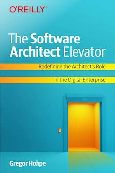

<figure class="figure figure--right">
  
</figure>

If you follow [Gregor Hohpe's](https://www.enterpriseintegrationpatterns.com/) blog, you will know his views on software architecture and its role in the enterprise. What I like is that he combines technical topics and how they apply to the business side, which is an extremely important conversation that we sometimes forget as technologists.

So now he has another book about architecture out. What should a software architect do? How to be effective at communicating with different sorts of people? How do you get closer to what he calls a digital company? All those questions are answered with a lot of actionable advice and some dry humor.

Moving fast and quality are not mutually exclusive. Properly defined boundaries help teams. Communicating effectively is extremely important. That's pretty generic, though. What kind of documentation should an architect produce? How to make a more effective presentation? And how to use diagrams to convey your message better? That is actually something that you can apply right now.

## Bad Agile

One pet peeve of mine is _claiming to do agile while doing the opposite_. You know, saying that you do agile just because you do a standup where nothing useful is said. Or writing stories that have no provable value to the business. There are many examples.

Another one is claiming that if you do agile, you don't need any documentation. Instead, you better explain the same thing over and over, until eternity. That is nonsense, and we get here a few ideas on how to write documentation that will actually be *read*.

## The power of automation

One prominent theme in the book is that the only way to truly achieve speed and minimize errors is to automate manual tasks. An automated task is going to be faster, less error-prone, repeatable, and trackable. Yet you often hear folks trying to skimp on automation to save a little bit of time. Seriously, don't do that.

## Verdict

You might think that if you are a developer, you don't need to care about architecture in your organization, but that's just not true. Everybody can influence the shape of the systems that they work with. Moreover, communicating effectively about it is of paramount importance to have any impact. That's why this book is very useful and is worthy of ⭐⭐⭐⭐⭐ stars.
