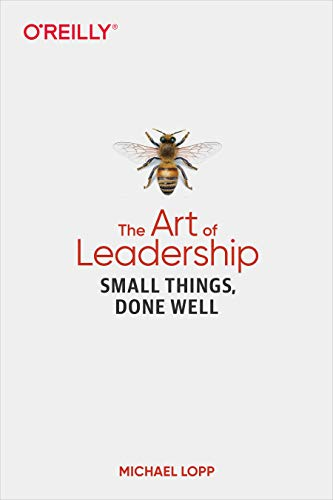

<figure class="figure figure--right">
  
</figure>

If you have read [Rands in Repose](https://randsinrepose.com/) long enough, this book will ring familiar. _Rands_ has a very particular way of writing about managing humans, as he likes to say. I find it kind of soothing. It's his third book after [Managing humans](https://www.amazon.com/Managing-Humans-Humorous-Software-Engineering/dp/1430243147) and [Being Geek](https://www.amazon.com/Being-Geek-Software-Developers-Handbook/dp/0596155409). Thematically it is much closer to the first one.

This time around, he's focused on giving actionable advice, with plenty of items about how to improve communication, run 1on1's, or make meetings more effective. I'd say that's the most valuable part of this book. Picking one or two things, and applying them in your regular day-to-day. You don't need to be a manager for that, just like you don't need to be a *Lead* to practice leadership.

How do you actually run a 1on1? Like, in practice. There are plenty of useless generalities out there, such as "you just have to listen". But what do you do, how do you prepare? I remember when I first started doing regular 1on1s with everybody in my team. I didn't really know how I was supposed to guide the conversations and, you know, *manage things*. There is a lot of good advice to follow here.

The problem with books that touch on managing or guiding people is that most situations require a lot of context to say something that truly applies to them. _Rands_ has written so much about these topics through the last twenty years that you see the patterns emerging, making it easier to digest.

Which brings me to what I liked the least. _Rands_ has been on many of the most relevant SV companies. In this book, Netscape, Apple, and Slack are specifically mentioned. I bet there are plenty of interesting stories to share, situations that can make all this advice a lot more relatable. But he, as a matter of policy, never speaks about concrete people. So that's out of the question. It's understandable but a pity nonetheless. I think the book would benefit a lot from that.

## Verdict

If you have been reading _Rands_ through the years, this book probably won't tell you anything terribly new. I liked the _How to rands_ section a lot, that's something that I want to copy.

I only give it ⭐⭐⭐ stars because I feel like I've read most of it before. For new readers, I imagine it'll be a lot more useful. 
