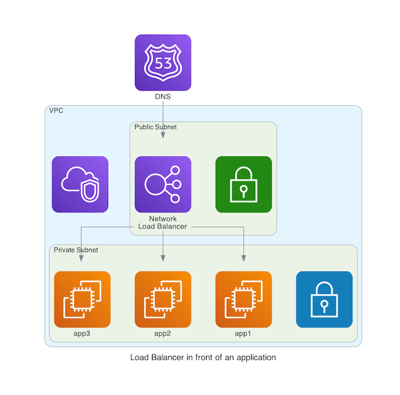

<figure class="figure figure--left">
  
</figure>

Are you using some form of load balancing in your application? Don't answer. It's a rhetorical question. _You bet I am_, you scream defiantly. How else am I going to ensure that traffic is evenly distributed?

Load Balancers come in all shapes and sizes. In the past, it used to be a concern for the operations folks. As an application developer, you could spend years without having to think about them. That's not always the case in the cloud. Luckily, AWS makes it [easy](https://aws.amazon.com/elasticloadbalancing/) for us to create such resources. More so if you use [Infrastructure as Code](https://www.hashicorp.com/resources/what-is-infrastructure-as-code) (which I'm sure you are). I'm going to use [Terraform](https://www.terraform.io/) in this article to provision _Network Load Balancer_ instances.

## It's AWS. Of course, there are multiple competing options

There are three different types of load balancers in AWS.

- [Classic](https://docs.aws.amazon.com/elasticloadbalancing/latest/classic/introduction.html)
- [Network Load Balancer (NLB)](https://docs.aws.amazon.com/elasticloadbalancing/latest/network/introduction.html)
- [Application Load Balancer (ALB)](https://docs.aws.amazon.com/elasticloadbalancing/latest/application/introduction.html)

Classic load balancers are becoming a relic of the past. Usually, your choice is between an _NLB_ (Layer 4) and an _ALB_ (Layer 7). If you are worried about [the number of features](https://aws.amazon.com/elasticloadbalancing/features/), they got you covered. All three are managed infrastructure. AWS handles the availability and scaling transparently for you.

Let's talk about NLBs. Being a Layer 4 means that you don't know about the application protocol used. Even so, most of your load balancing needs in life can be covered with an NLB. Unless you want routing based on an HTTP path, for instance. In that case, you need an ALB, which I'll cover in a future post.

## Setting up a basic load balancer

Setting up a load balancer requires provisioning three types of resources.

- The **load balancer** itself
- The **listeners** that will forward the traffic
- The **target groups** that ensure that the traffic reaches its destination

The most typical setup is a Virtual Private Cloud (VPC) with a public and a private subnet. The load balancer goes in the public subnet. The instances live in the private subnet. To protect ourselves against outages, we deploy everything to multiple Availability Zones (AZ).

<figure class="figure">
  
</figure>

Assuming that we have an existing VPC (identified by `vpc_id`), this snippet creates the load balancer.

<!-- lb -->
```hcl
data "aws_subnet_ids" "this" {
  vpc_id = var.vpc_id

  tags = {
    Tier = "Public"
  }
}

resource "aws_lb" "this" {
  name               = "basic-load-balancer"
  load_balancer_type = "network"
  subnets            = data.aws_subnet_ids.this.ids

  enable_cross_zone_load_balancing = true
}
```

The `aws_lb` resource is confusing because it represents both NLBs and ALBs, depending on the `load_balancer_type` argument. Some arguments only apply to one type, so you've got to read the documentation carefully.

`enable_cross_zone_load_balancing` is an [interesting parameter](https://aws.amazon.com/about-aws/whats-new/2018/02/network-load-balancer-now-supports-cross-zone-load-balancing/). It'll help prevent downtimes by sending traffic to other AZs in case of problems. Cross-AZ traffic ain't free, so make that an exception!

### Listeners

Our load balancer is not being a _good listener_ right now. We've got to fix that. Through the `aws_lb_listener` resource, we specify the ports we want to handle and what to do with them. We want to listen to both port 80 and 443, so we'll set up two different resources using `for_each`. Let's have a look at the code.

<!-- listener -->
```hcl
variable "ports" {
  type    = map(number)
  default = {
    http  = 80
    https = 443
  }
}

resource "aws_lb_listener" "this" {
  for_each = var.ports

  load_balancer_arn = aws_lb.this.arn

  protocol          = "TCP"
  port              = each.value

  default_action {
    type             = "forward"
    target_group_arn = aws_lb_target_group.this[each.key].arn
  }
}
```

You see the ports defined in the `ports` variable. Next is the `protocol`. If we only want to forward the request, we use TCP or UDP. We can also choose to [terminate the TLS connection](https://aws.amazon.com/about-aws/whats-new/2019/01/network-load-balancer-now-supports-tls-termination/) by using TLS as a protocol. For that, we'd need to set up a certificate, though.

After port and protocol are there, we need the action to perform. The most common action is to forward it to our receiver target group. Additionally, we can do redirects, fixed results, or even authentication. By the way, I showed how to do authentication in [this article](../concourse-fly-behind-alb-oidc/).

### Target Groups

The last step is defining the target group(s) so that the load balancer knows who will receive the requests. We do that with the `aws_lb_target_group` resource. Here we branch again, as there are different possibilities.

#### Instance-based

The target group can point to specific instances. That's the default `target_type`. You don't want to explicitly specify instances (What if they go down?), but rather create an [Autoscaling Group (ASG)](https://docs.aws.amazon.com/autoscaling/ec2/userguide/AutoScalingGroup.html). We assume an existing ASG in the code.

<!-- target-group-instance -->
```hcl
resource "aws_lb_target_group" "this" {
  for_each = var.ports

  port        = each.value
  protocol    = "TCP"
  vpc_id      = var.vpc_id

  stickiness = []

  depends_on = [
    aws_lb.this
  ]

  lifecycle {
    create_before_destroy = true
  }
}

resource "aws_autoscaling_attachment" "target" {
  for_each = var.ports

  autoscaling_group_name = var.autoscaling_group_name
  alb_target_group_arn   = aws_lb_target_group.this[each.value].arn
}
```

We add a `depends_on` block containing the lb resource so that the dependencies are properly modeled. Otherwise, destroying the resource might not work correctly.

#### IP-based

We use the `target_type` `ip` when using IPs instead of instance ids. We assume that these IPs are available and readable through a `data` resource. They are connected to the target group through a `aws_lb_target_group_attachment`.

<!-- target-group-ip -->
```hcl
resource "aws_lb_target_group" "this" {
  for_each = var.ports

  port        = each.value
  protocol    = "TCP"
  vpc_id      = var.vpc_id
  target_type = "ip"

  depends_on = [
    aws_lb.this
  ]

  lifecycle {
    create_before_destroy = true
  }
}

resource "aws_lb_target_group_attachment" "this" {
  for_each = local.ports_ips_product

  target_group_arn  = aws_lb_target_group.this[each.value.port].arn
  target_id         = each.value.ip
  availability_zone = "all"
  port              = each.value
}

locals {
  ports_ips_product = flatten(
    [
      for port in values(var.ports): [
        for eni in keys(data.aws_network_interface.this): {
          port = port
          ip   = data.aws_network_interface.this[eni].private_ip
        }
      ]
    ]
  )
}

data "aws_network_interfaces" "this" {
  filter {
    name   = "description"
    values = ["ENI for target"]
  }
}

data "aws_network_interface" "this" {
  for_each = toset(data.aws_network_interfaces.this.ids)
  id       = each.key
}
```

The connections to the [ENIs](https://docs.aws.amazon.com/AWSEC2/latest/UserGuide/using-eni.html) are expressed as a list of [port, ip] pairs. That requires some ungainly terraform loops to define everything properly.

These are two typical examples, but it's not the only way of doing it. [ECS](https://aws.amazon.com/ecs/) supports adding target groups to reach services directly. If you are working with [Lambda](https://aws.amazon.com/lambda/), that needs an ALB.

I've left a bunch of details out to avoid writing a 10k words article. You can customize the health check (`health_check`) associated with each target group, the algorithm used (`load_balancing_algorithm_type`), and a host of other things. The flexibility can be overwhelming. I recommend starting small.

### Security Groups

Oh yes, security groups. Every so often, running `curl` against your shiny, new infrastructure results in timeouts. Inevitably, you forgot the [security groups](https://docs.aws.amazon.com/vpc/latest/userguide/VPC_SecurityGroups.html).

Network load balancers don't have associated security groups per se. For both instance and IP based target groups, you add a rule that allows traffic from the load balancer to the target IP.

<!-- security-groups -->
```hcl
resource "aws_security_group" "this" {
  description = "Allow connection between NLB and target"
  vpc_id      = var.vpc_id
}

resource "aws_security_group_rule" "ingress" {
  for_each = var.ports

  security_group_id = aws_security_group.this.id
  from_port         = each.value
  to_port           = each.value
  protocol          = "tcp"
  type              = "ingress"
  cidr_blocks       = ["0.0.0.0/0"]
}
```

## Getting to our load balancer

That's about it. With all these resources, we've got ourselves a working load balancer!

All load balancers are reachable through their automatically assigned DNS entry. We can programmatically find it thanks to the [AWS CLI](https://aws.amazon.com/cli/).

<!-- curl -->
```shell
export LB_NAME="basic-load-balancer"
dns=$(aws elb describe-load-balancers --load-balancer-name $LB_NAME | jq -r '.LoadBalancerDescriptions[0].DNSName')
nslookup $dns
```

Provided there is a registered target, we can query it using the content of `dns` and see that our setup, in fact, works.

### Internal Load Balancers

A load balancer doesn't always have to be publicly available. Let's say you use [VPC endpoints](../understanding-vpc-endpoints/) to keep your traffic inside AWS's network. We don't want to expose our load balancer to the public if it's going to sit behind a VPC endpoint service. Instead, you set the `internal` parameter to `true`. The LB can live in a private subnet.

## Operations

__Operations__ is a bit of a strong word. There is not _a lot_ to operate here. Not for us, at least. Still, let's finish with some thoughts about that.

Out of the box, a lot of [CloudWatch](https://aws.amazon.com/cloudwatch/) metrics are exported for your convenience. The AWS Console has some nice charts to look at. You could use another monitoring tool if you wish.

<figure class="figure">
  
  <figcaption class="figure__caption">
  Pretty lines make everything better
  </figcaption>
</figure>

What about costs? As you can see on the [pricing page](https://aws.amazon.com/elasticloadbalancing/pricing/), an NLB has a fixed price, plus a fairly arcane operating cost based on _Load Balancer Capacity Units (LCU)_. Honestly, the easiest way to monitor expenditures is by looking at previous months in the Cost Explorer.

Lastly, performance. An NLB _scales_ like there is no tomorrow. Each unique target IP can support 55000 simultaneous connections, and the whole thing should be merrily passing along requests long after your applications have collapsed into a smoking pile of ashes. The word _managed_ is genuinely appropriate because you'll rarely have to do anything past the provisioning.

## Conclusion

Load balancers are an integral part of every cloud setup. It's a vast topic as well, and thus I could only scratch the surface. However, this is enough to get started with a rock-solid foundation.

