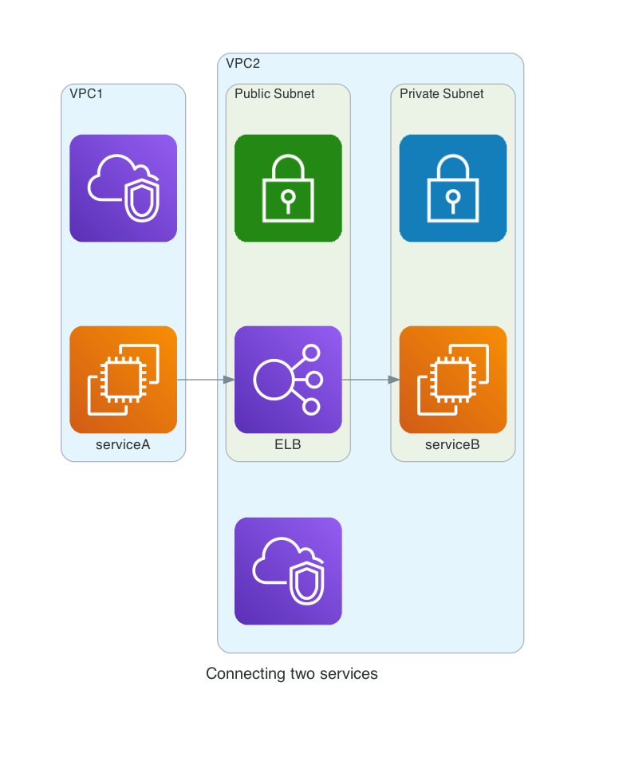

<figure class="figure figure--left">
  
</figure>

If you are going to do one thing with your network traffic, it should be using https. But you already do that, don't you? Once you have that in place, why not use [VPC endpoints](https://docs.aws.amazon.com/vpc/latest/userguide/vpc-endpoints.html) to make your data flow through private channels?

With VPC endpoints, you can connect to most AWS services without ever leaving Amazon's network. Not only that, but you can connect two of your services in different VPCs, even across accounts. It doesn't replace the need for [End-to-End Encryption](https://searchsecurity.techtarget.com/definition/end-to-end-encryption-E2EE), but it adds an extra layer of security. Maybe keeping the traffic private can help convince some cloud skeptics along the way.

You'll find many guides using the _AWS Management Console_. Don't do that. Let's use [Terraform](https://www.terraform.io/) to provision them instead. Code is easier to follow than screenshots.

## Accessing AWS services

A typical setup is having instances in a private subnet and go through a [NAT gateway](https://docs.aws.amazon.com/vpc/latest/userguide/vpc-nat-gateway.html) to reach AWS services (i.e., S3).

<figure class="figure">
  
</figure>

We'll replace the NAT gateway with a VPC endpoint so that we can reach S3 (or any other AWS service) without connectivity to the outside. There are two types of endpoints, `Gateway` and `Interface`.

### [Gateway endpoint](https://docs.aws.amazon.com/vpc/latest/userguide/vpce-gateway.html)

This type can be used for S3 and DynamoDB (don't ask me why). I'm assuming that there is an existing VPC.

<!-- vpc-endpoint-gateway -->
```hcl
data "aws_route_table" "this" {
  vpc_id = var.vpc_id
}

resource "aws_vpc_endpoint" "s3" {
  vpc_id            = var.vpc_id
  vpc_endpoint_type = "Gateway"

  service_name      = "com.amazonaws.${var.region}.s3"

  route_table_ids = [data.aws_route_table.this.id]
}
```

There are a bunch of arguments that we can pass. Let's have a look at the ones that are relevant for us:

- `vpc_id`: We always associate an endpoint with a [VPC](https://aws.amazon.om/vpc/).
- `type`: In this case, `Gateway`.
- `service_name`: The URL associated with the service. I found [this list](https://docs.aws.amazon.com/general/latest/gr/aws-general.pdf#aws-service-information) as a reference.
- `route_table_ids`: For this type of endpoint, you have to specify a routing table, which will get an entry to route to the service. In our case, the routing table of the VPC.

And that's it. S3 is now accessible from our private subnet without needing a NAT gateway. This kind of endpoint is free, by the way. Useful if you need to pull Docker images, for instance.

### [Interface endpoint](https://docs.aws.amazon.com/vpc/latest/userguide/vpce-interface.html)

For other AWS services, we use the `Interface` type. Let's take accessing CloudWatch as an example. We define our endpoint like this:

<!-- vpc-endpoint-interface -->
```hcl
data "aws_subnet_ids" "this" {
  vpc_id = var.vpc_id
  filter {
    name   = "tag:Name"
    values = var.subnet_names
  }
}

resource "aws_vpc_endpoint" "log" {
  vpc_id              = var.vpc_id
  vpc_endpoint_type   = "Interface"

  service_name        = "com.amazonaws.${var.region}.logs"

  subnet_ids = data.aws_subnet_ids.this.ids
  security_group_ids = [
    aws_security_group.this.id,
  ]
}
```

Both `vpc_id` and `service_name` work as before. `type` is `Interface` this time. Some new arguments are coming  to the party:

- `subnet_ids`: Instead of a route table, we need the subnets accessing the endpoint. These are the private subnets where we put our instances.
- `security_group_ids`: We need an existing security group as well.

By default, we can reach the AWS service that we're connecting through its DNS hostname. It can be disabled with `private_dns_enabled`.

### Using policies to limit permissions

There is an extra argument, `policy`, where you can pass an IAM policy to restrict the permissions allowed by the endpoint. If you need a refresher on IAM, check [this article I wrote](../aws-iam-an-overview/).

## Accessing our own services

We have covered one aspect of endpoints, accessing AWS itself. But we can use it for our infrastructure as well. Consider this:

<figure class="figure">
  
</figure>

We have two services. Service A wants to reach Service B, which is exposed through an [ELB](https://aws.amazon.com/elasticloadbalancing/). Both services reside in different networks and might even be in different accounts.

One solution is to make the load balancer publicly reachable. Then, our Service A can use a NAT gateway, as I described before.

Or we can use endpoints again. To do so, we need a new toy, a [VPC endpoint service](https://docs.aws.amazon.com/vpc/latest/userguide/endpoint-service.html).

### Endpoint service

An endpoint service allows us to expose Service B. Once created, it gets assigned a `service_name`, that we can reference as an attribute.

<!-- vpc-endpoint-service -->
```hcl
data "aws_subnet_ids" "this" {
  vpc_id = var.vpc_id
  filter {
    name   = "tag:Name"
    values = var.subnet_names
  }
}

resource "aws_lb" "this" {
  name               = "internal-lb"
  load_balancer_type = "network"
  subnets            = data.aws_subnet_ids.this.ids
  internal           = true
}

resource "aws_vpc_endpoint_service" "this" {
  network_load_balancer_arns = [aws_lb.this.arn]

  allowed_principals = var.vpce_allowed_principals
  acceptance_required = false
}
```

We configure it as follows:

- `network_load_balancer_arn`: The service has to be attached to an existing (internal) network load balancer. That load balancer determines the VPC and subnets.
- `allowed_principals`: The list of actors that can connect to the service, like a list of AWS Accounts.
- `acceptance_required`: You can force the connections to be manually accepted. For automation reasons, it's preferable to use `allowed_principals` to restrict access instead.

### Connecting to the endpoint Service

We use an _Interface endpoint_ to connect to the service that we just created:

<!-- vpc-endpoint-interface-own-service -->
```hcl
resource "aws_vpc_endpoint" "this" {
  vpc_id            = var.vpc_id
  vpc_endpoint_type = "Interface"
  service_name      = aws_vpc_endpoint_service.this.service_name

  subnet_ids         = var.subnet_ids
  security_group_ids = [aws_security_group.this.id]
}

output "dns_entry" {
  value = aws_vpc_endpoint.this.dns_entry[0].dns_name
}
```

The configuration is similar to what we did before. We get the `service_name` from the endpoint service directly.

And now, the connection between the two is complete. Our Service A can reach Service B through the endpoint. That endpoint exports a `dns_entry` attribute so that we know what to use as a URL.

### A note about availability zones

You need to remember one thing. A VPC endpoint can only can only connect to a VPC endpoint service in the same [Availability Zone](https://docs.aws.amazon.com/AWSEC2/latest/UserGuide/using-regions-availability-zones.html#concepts-availability-zones). That's more relevant for a zone like `us-east-1`, which has six AZs.

For the names to be consistent across accounts, you need to identify them with [Availability Zone IDs](https://docs.aws.amazon.com/ram/latest/userguide/working-with-az-ids.html).

## The end(point) justifies the means

I wasn't a massive fan of endpoints when I started using them in my project, to be honest. But they have grown on me over time.

Don't use them to recreate an old-school on-premise setup. This idea of a huge private network where all the connections flow unimpeded doesn't need to be recreated in the cloud.
