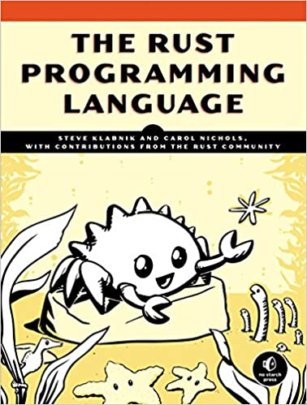

<figure class="figure figure--right">
  
</figure>

_Rust_ is not a new language by any means, but it's getting plenty of [attention](https://www.thoughtworks.com/de/radar/languages-and-frameworks/rust) [lately](https://thenewstack.io/microsoft-rust-is-the-industrys-best-chance-at-safe-systems-programming/). As you might've heard, it's a relatively low-level systems programming language. Similar to [golang](https://golang.org/) in a sense, with a completely different approach to memory management.

Apart from the classical use cases, I really like using _Rust_ to make fast, super-portable CLI tools that are easy to package in a container. A compiled binary is a lot easier to handle than something like a _Python_-based tool with a ton of dependencies.

For a systems programming language, _Rust_ is surprisingly rich in features. Pattern matching, `Option`, and `Result` types, who knew? This power comes at the cost of complexity. _Rust_ is definitely **not** a simple language, which is why this book clocks at 500 pages. The borrow checker is very different from anything you've seen before, and you'll have to re-read that chapter over and over until you start making sense of the concept. Lifetimes are pretty tricky as well. By the time things like multi-threading came around, I was pretty overwhelmed.

Luckily, this book is an excellent reference to navigate all these ideas. And it covers the ecosystem as well, which is a nice plus. You'll learn about [cargo](https://crates.io/), its build system, and package manager. Testing makes an appearance, which is great news for all the TDD lovers.

All in all, if you want to get started understanding _Rust_, this book is an excellent starting point. It won't be the last one you read if you're going to get a deeper understanding of the whole thing.

## Verdict

This is a comprehensive book, not only introducing the language but the ecosystem as well. The only thing I missed was going a bit more into the community's best practices and established conventions. Although to be fair, it's already a pretty long book as it's. It gets ⭐⭐⭐⭐ stars from me.
