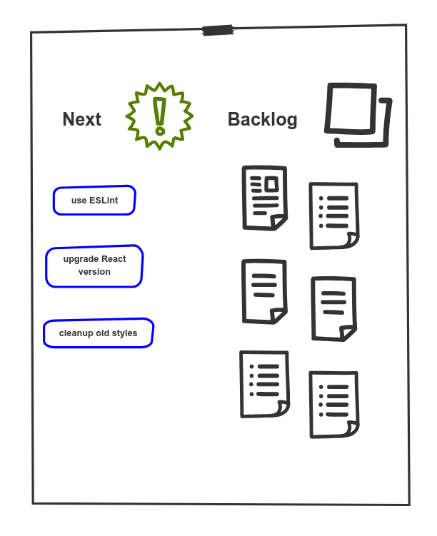

<figure class="figure figure--left">
  
</figure>

How do you ensure that the developers in a team are aligned on the technical direction? That's a difficult question! Every team has its own idiosyncrasies. As a [tech lead](https://www.patkua.com/blog/the-definition-of-a-tech-lead/), I've thought a lot about it and ended up with vague ideas like _empowerment_ or _shared goals_. Not very actionable!

However, one ritual has worked really well in the teams I’ve been part of. I want to talk about the _dev huddle_.

## Dev huddle?

<figure class="figure figure--right">
  
  <figcaption class="figure__caption">
  Developers aligning expectations
  </figcaption>
</figure>

There are many names: Dev Huddle, Tech Huddle, Dev Meeting. Whatever the name, it's a recurring meeting intended for the developers in a team. It's a forum to discuss technical topics and make decisions regarding architecture, conventions, or any other technology stack aspect.

Wow, that's _so_ innovative! You might sneer. Yes, it's nothing groundbreaking. The devil is in the details, though. Running one effectively is tricky. Nothing will frustrate a group of developers more than having yet another useless meeting. If you're taking their time, you better make it count.

## Why should I do it?

Before focusing on the _How_, let's stop at the _Why_ first. What do we expect to accomplish?

- **Create Alignment**: Developers might work closely together (sometimes _too_ literally), yet build software as if they never met before. Do they agree on the coding conventions? What's the preferred library to parse _JSON_? There are tons of small decisions to make. Over time those form a cohesive understanding of building software that is crucial for any high-performing team.
- **Foster Innovation**: You won't rewrite your application every six months with the trendiest technology, but you want to encourage experiments. [Continuous improvements](https://www.creativesafetysupply.com/articles/continuous-improvement/) compound over time. I've been part of teams that looked hopeless in the beginning. After a year of many small improvements, we're doing [continuous deployment](https://www.atlassian.com/continuous-delivery/continuous-deployment#:~:text=Continuous%20Deployment%20(CD)%20is%20a,cycle%20has%20evolved%20over%20time). That will rarely happen in one big push, though.
- **Encourage Debate**: Some teams practice what I call _discussion by tenure_, where the most senior people in the team make the technology decisions, and the rest, well, follow them. If they are lucky to find out about those decisions. Your senior folks have the experience and the instincts, but everybody else can contribute as well. 

## Preparation

I like to structure huddles around a backlog of ideas. Something as simple as a piece of paper on the wall and stickies. Or a list of issues in Github. Each one can be just a simple headline. They are there to start a conversation. Some examples:

- Let's try out [strikt](https://strikt.io/), a new assertions library
- Refactor our API calls to use [React hooks](https://reactjs.org/docs/hooks-intro.html)
- Missing documentation for our newest microservice

<figure class="figure figure">
  
</figure>

Who adds new topics? Everybody! You found a candidate for refactoring while pairing. You read that [dev.to](https://dev.to/) article about that new library. Just add it to the wall.

In the beginning, you'll be the only one posting ideas. Over time, the rest of the team will feel more comfortable and chip in. We'll see how to choose what to talk about in a minute.

### Finding a time

Some might say: _Let's just get together whenever needed. We are agile!_. That doesn't work in practice, in my experience. There is always something urgent. Somebody doesn't have time right now.

My advice? Pick a fixed slot: same day and hour, every week. Ideally, whenever you interrupt the least. After the daily, just after lunch. Doesn't really matter. People will get used to it and take it into account in their schedule.

Half an hour should be enough to have meaningful conversations. The flow of the board is a good indicator. If you're collecting more and more topics that you'll never talk about, maybe it's time to stay a bit longer. If you're running out of stuff, perhaps you can finish early, or even switch to bi-weekly?

## How to run a dev huddle

Running a dev huddle consists of going through the list of topics, discussing them, reaching a conclusion, and documenting it. Sounds easy, right?

<figure class="figure figure--right">
  
  <figcaption class="figure__caption">
  Moderation happening
  </figcaption>
</figure>

Not so fast. First of all, there **has** to be a facilitator. Keeping the total time, making sure that no single topic consumes the whole timeslot. Giving everybody a chance to speak. Without this role, you might end up having a pub discussion, without the beer.

I used to run all the huddles in a previous team. I only realized much later what a mistake it was. The meeting ends up becoming yours when it should belong to the whole team. Besides, it's tough to facilitate and be an active participant at the same time. Rotate the facilitation instead. Everybody gets practice moderating, and you get to have some of the fun as well!

If you have too many topics, you have to pick which ones to tackle. You can take them in order of creation, or [dot vote](https://en.wikipedia.org/wiki/Dot-voting) just before starting. Some people will bring more points than others. Try to keep it balanced. A big architectural change requires more than a few minutes, so maybe a follow-up meeting is in order.

And then ... _discussion ensues_. A huddle won't fix a broken culture, but it's a good litmus test. Are you stating opinions or facts? Are you fighting to get a word in? If so, a huddle is the least of your problems. Here is a sample checklist to help less experienced moderators:

    - Are there open points from last time?
    - Choose the topics for today
    * For every topic
        
        The owner presents the issue so that everybody is on the same page
        Talk about it (Keep a timebox!)
        Resolution
            What did we decide?
            Assign an owner to take care of the follow-up
      
    - Have we made decisions that need to be reflected in ADRs?
    - Finish on time, unless there is something that absolutely can't wait

## The outcome

Getting the team to talk to each other is already _something_. If there is no outcome, though, it's not really a meeting but a social gathering. So let's write down our findings. Typically, it'll be about things you want to do or things you'll do from now.

### Technical Stories / Slack items

Don't listen to the [pointy-haired micromanagers](https://en.wikipedia.org/wiki/Pointy-haired_Boss) who want to record every action ever taken, no matter how inconsequential. For small stuff, keep the accounting to a minimum and rely on [slack time](https://www.solutionsiq.com/resource/blog-post/the-importance-of-slack-in-achieving-speed-and-quality/).

For bigger things, write technical stories and make sure to integrate them into your regular backlog. There is a lot that can be said [about this](https://www.thoughtworks.com/insights/blog/treat-devops-stories-user-stories). TLDR: Hold a technical story to the same standards as user stories.

### Keeping track of decisions

<figure class="figure figure--left">
  
  <figcaption class="figure__caption">
  Archiving decisions
  </figcaption>
</figure>

Everybody was fired up for the huddle. It got intense, but you've reached an agreement on whether to use semicolons or not. _Shit is getting done_. Until nobody wrote it down, and you had to start from scratch next week. Infuriating. 

Can I interest you in some [lightweight Architecture Decision Records](https://www.thoughtworks.com/radar/techniques/lightweight-architecture-decision-records)? It may sound formal and un-agile, but it's really not. You just have a place where you keep track of the decisions you made. A Markdown file with a title, what you decided, and an explanation of the context. I've seen people write novels to wax poetic about Kafka's virtues when something simple will work just as well.

    Title: Use Kotlin instead of Java for new services
    
    Date: 2018/10
    
    Decision: We'll be using Kotlin whenever we start a new service but leave the existing ones
    
    Context: We think Kotlin will help us create more lightweight services while improving quality thanks to null safety
    
There are [many templates](https://github.com/joelparkerhenderson/architecture_decision_record#adr-example-templates) that you can use. The important part is to be disciplined and reflect what you agree upon. 
    
## Get huddling!

Looking back, all the teams I've been on have significantly benefited from having a place for developers to align. It's a small investment of effort and time. Go ahead and give it a try and find the setup that works best for you.
    
