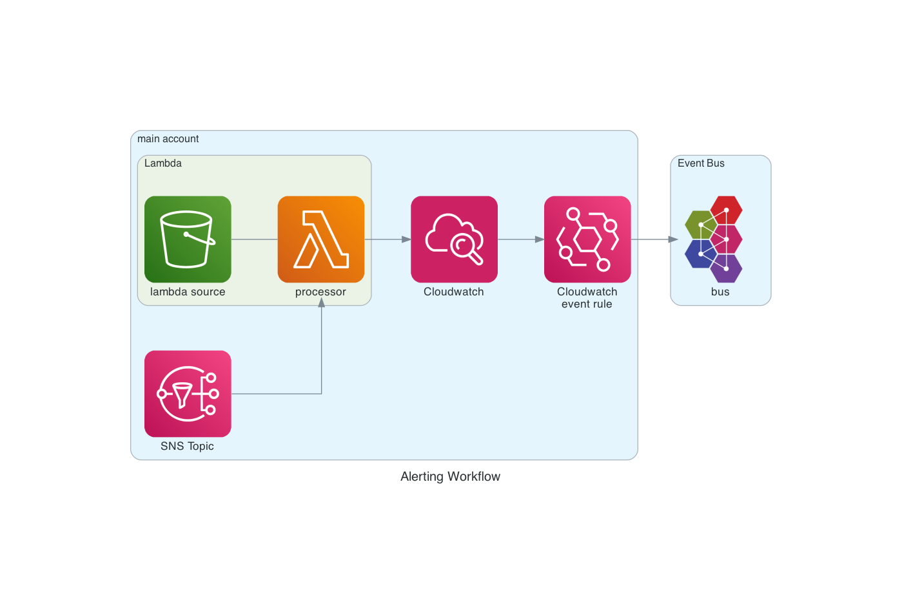
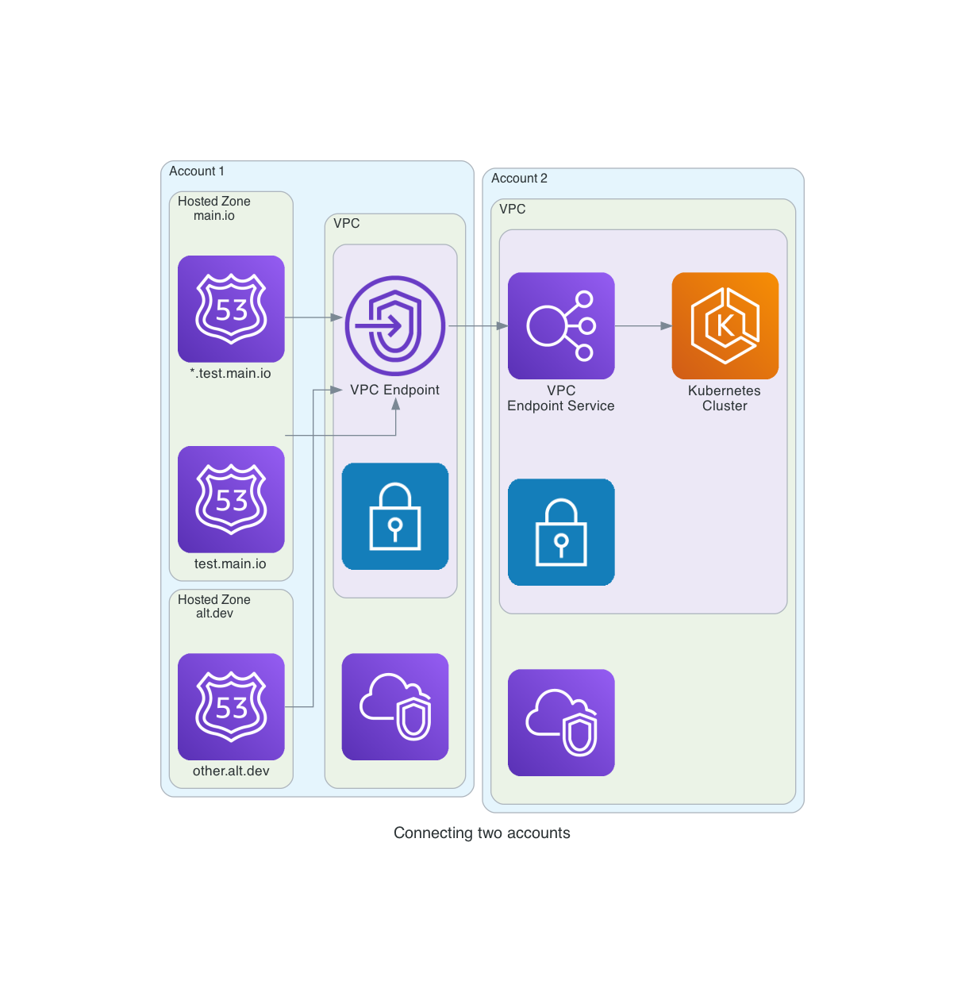

<figure class="figure figure--left">
  
  <figcaption class="figure__caption">
  a diagram is worth a thousand lines of poorly documented code
  </figcaption>
</figure>

If you're working with infrastructure, you're surely leveraging [infrastructure as code](https://searchitoperations.techtarget.com/definition/Infrastructure-as-Code-IAC), right? I sure hope so. Otherwise, start now. I'll be waiting.

A natural evolution might be creating a graphical representation of your infrastructure. Diagrams as code if you will. It is not a new idea. This technique appeared in the [tech radar](https://www.thoughtworks.com/radar/techniques/generated-infrastructure-diagrams) back in 2015. You can hark back to that period where people thought that generating code [from UML diagrams](https://softwareengineering.stackexchange.com/questions/124996/is-code-commonly-generated-from-uml) was a sensible idea.

Let's forget that ever happened! Instead, let's think about using visualization to understand complex architectures. And maintaining those artifacts up to date, while we're at it. I'm going to talk about a tool that builds on top of [Graphviz](https://www.graphviz.org/) called [Diagrams](https://diagrams.mingrammer.com/).

## What is diagrams?

A tool with a very generic name, that's for sure. If you check its website, it's described as:

> Diagrams lets you draw the cloud system architecture in Python code.

Pretty straight-forward. Installing it is a one liner.

```bash
pip3 install diagrams
```

We're going to create infrastructure diagrams with Python. We'll commit both the image and the code used to generate it, so that everybody in the team can make changes. Let's get coding, I mean drawing. I have two examples for you.

## Alerting workflow

Let's say you have a workflow where you publish alarms to an [SNS Topic](https://aws.amazon.com/sns/). That topic is processed by a _lambda function_, which transforms the data and writes it back to _Cloudwatch_. Through an event rule, the right alerts reach our event bus.

So much text for such a little thing. I'm surprised you're still paying attention. Let me hit you with a fancy diagram.

<figure class="figure">
  
</figure>

If you check the code, you'll notice how simple it is. There are three elements. 

- The **nodes**, which is a single component. It has a recognizable icon and a name.
- The **edges**, which are the connections between components. They can be directed or undirected.
- The **clusters**, which group nodes logically.

And there is not much else, really. The diagram is built with this snippet.

<!-- alerting-workflow -->
```python
from diagrams import Diagram, Cluster

from diagrams.aws.compute import Lambda
from diagrams.aws.integration import SNS, Eventbridge
from diagrams.aws.management import Cloudwatch
from diagrams.onprem.queue import ActiveMQ

with Diagram("Alerting Workflow", show=True):
    with Cluster('main account'):
        topic = SNS('SNS Topic')

        with Cluster('Lambda'):
            l = Lambda('processor')
            topic >> l
            S3('lambda source') - l

        cl = Cloudwatch('Cloudwatch')
        l >> cl

        event = Eventbridge('Cloudwatch\nevent rule')
        cl >> event

    with Cluster('Event Bus'):
        event_bus = ActiveMQ('bus')
        event >> event_bus
```

Notice how quickly you can get a decent overview of your system with a just bit of Python.

## Network diagrams

Networking seems to be uniquely suited for this approach. While researching [VPC endpoints](../understanding-vpc-endpoints/), I realized that a clear drawing aids understanding significantly.

Let's say we are connecting to a [Kubernetes](https://kubernetes.io/) cluster, because that's what we all do these days. We're routing a bunch of different domains to a VPC endpoint. The cluster resides in a different account, so we use an endpoint service to make it available. Add a few more routes and the whole thing becomes a tangled mess, much like the pile of cables behind your desk. That is, until you see this diagram.

<figure class="figure">
  
</figure>

Better, isn't it? What about the code used to generate it?

<!-- connecting-accounts -->
```python
from diagrams import Cluster, Diagram
from diagrams.aws.network import VPC, PublicSubnet, PrivateSubnet, Endpoint, ELB, Route53
from diagrams.aws.compute import EKS

with Diagram("Connecting two accounts", show=True):
    with Cluster("Account 1"):
        with Cluster("Hosted Zone\nmain.io"):
            star = Route53("*.test.main.io")
            subdomain = Route53("test.main.io")

        with Cluster("Hosted Zone\nalt.dev"):
            alt = Route53("other.alt.dev")

        with Cluster("VPC"):
            VPC()

            with Cluster(""):
                PrivateSubnet()

                endpoint = Endpoint("VPC Endpoint")
                [star, subdomain, alt] >> endpoint

    with Cluster("Account 2"):
        with Cluster("VPC"):
            VPC()

            with Cluster(""):
                PrivateSubnet()

                service = ELB("VPC\nEndpoint Service")
                cluster = EKS("Kubernetes\nCluster")

                endpoint >> service >> cluster
```

The amount of code used to represent it has grown compared to the previous example. Luckily, using _Python_ gives us access to functions, comprehensions, and other tools to manage this complexity.

## The curious case of the diagram that could not be updated

That's how you use _Diagrams_. Is it really valuable? I certainly like the pretty icons. Apart from that, it shines is enabling visual documentation to evolve.

I've tried to digitalize technical diagrams before. I really tried. [Sketch](https://www.sketch.com/), [sketchboard](https://sketchboard.io/), or even just taking a picture of a hand drawn diagram. It works, until you need to update it and you don't have the original source. Perhaps it was done by somebody else, who preferred a completely different tool. I've seen it many times that the documentation of a project gets more and more out of date because nobody is able to update the damn diagrams. If it's just source code, your chances get a lot better.

## Conclusion

_Diagrams_ is a neat, albeit limited, tool. You can't really add much more than what I've shown. While that is constraining, it can protect you from yourself. Overly complex diagrams do more harm than good. If you are representing the system in its entirety, why not check the code directly? The point of abstraction is to make it simpler to understand by omitting some of the details.

In summary, it's a convenient way to bring clarity into your impenetrable READMEs, and you'll be able to update the images as your code evolves.
