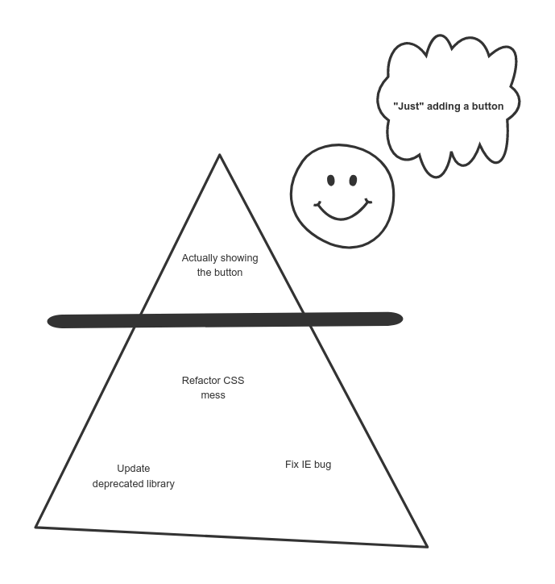

### Technical Stories

- [**Part 1 - Writing technical stories**](../technical-stories-a-miscast-artifact-of-agile-development/)
- [Part 2 - Getting technical stories into an iteration](../getting-technical-stories-into-an-iteration/)
- [Part 3 - Keeping a technical backlog](../keeping-a-technical-backlog/)

<figure class="figure figure--left">
  
</figure>

_Technical stories_ are a controversial topic in the agile world. If you google [technical stories antipattern](https://www.google.com/search?q=technical+stories+antipattern), you'll get plenty of people advocating never to do them. On the other hand, some teams religiously outsource any refactoring onto technical stories.

Should we eschew technical stories altogether? Or should we embrace them and put all of our (technological) dreams and hopes into them?

I believe this kind of story belongs in a healthy backlog, as long as we don't use it to hide our corpses under the rug.

### What is a technical story, anyways?

I'll quote myself for this since there isn't a universal definition.

> A technical story is one where the main stakeholders are the developers in the team.

The end-user benefits only indirectly from such a story. As our system becomes better, the theory goes, we'll have an easier time delivering actual user stories.

## Are technical stories an antipattern?

<figure class="figure figure--right">
  
  <figcaption class="figure__caption">
  How hard could it be?
  </figcaption>
</figure>

Back to the original question. To answer it, let's picture a user story as an iceberg.

The visible part is above water. Your stakeholders probably won't care much about what happens underwater. Yet, the complexity hides below. Most of the effort will be spent there.

The problem with technical stories comes when they are used to draw an artificial line. We do the visible part, then extract the rest into a technical story. What an improvement in our velocity!

<figure class="figure">
  
</figure>

Except, this is a **crucial mistake**. We're avoiding essential technical work in a misguided effort to move faster. Striping a _user story_ of this bottom part **is** the antipattern. It leads to an endless list of tickets in the backlog that will never happen. It encourages cutting corners and short-term thinking.

If the story is too big, let's agree on a smaller scope that still delivers meaningful value.

### Why do we extract this work when we know it's so important?

Does this happen in your team? You're not alone. Many teams struggle with this. There are many reasons, among them:

<figure class="figure figure--left">
  
  <figcaption class="figure__caption">
  PO and Dev align expectations
  </figcaption>
</figure>

_Avoidance of conflict_. If the product owner and the developers push in opposite directions, there's tension that needs to be solved. Avoiding the conflict solves nothing, but it's the path of least resistance.

_Delivery pressure_. Yes, features almost always take priority. Technical work is a catalyst for features. There might be real urgency, in which case it's worth talking about managing the created [tech debt](https://martinfowler.com/bliki/TechnicalDebt.html).

_Lack of empowerment_. Developers sometimes feel that they can't stand for what they believe is necessary, or that their voice won't be heard. Maybe they're genuinely not being listened to, or perhaps their voice is too quiet.

Let's be honest; these are symptoms of deeper problems than writing some stories (or not). However, keeping the platform healthy is in everyone's best interest.

## Then when **do you** create technical stories?

I thought you'd never ask. The most natural place to create technical stories is the [dev huddle](../dev-huddle-as-a-tool-to-achieve-alignment-among-developers/). As a result of a successful dev huddle, the development team will agree on certain experiments, refactorings, or changes to be made. Any action big enough is a prime candidate for a technical story. To name some examples:

- Refactor the layout of our product cards to use [flexboxes](https://css-tricks.com/snippets/css/a-guide-to-flexbox/).
- Let's try out [strikt](https://strikt.io/), a new assertions library.
- Refactor our API calls to use [React hooks](https://reactjs.org/docs/hooks-intro.html).

Once there is an agreement in the team, reflecting these points in stories helps build the team's technical vision. These stories will (hopefully) happen soon, and increase the quality of the system. That, in turn, means that the iceberg's visible part will have an easier time floating, which will lead to more fancy features for our happy stakeholders.

### Monitor the amount of technical stories in your backlog!

The number of technical stories is a useful [fitness function](https://www.thoughtworks.com/radar/techniques/architectural-fitness-function). If that number only grows and grows, this whole process is not working very well. If anything, it can even discourage further attempts to improve the situation.

## The tenets of a good technical story

Let's say you grudgingly agree to start writing technical stories. How do you do it? This is the kind of story that will likely be written by a developer. And, to be fair, many lack the experience.

<figure class="figure figure--right">
  
  <figcaption class="figure__caption">
  Like everything else, good writing takes practice
  </figcaption>
</figure>

Poorly written technical stories are sadly all-too-common. They are dense. They don't get to the point. They are vague on the provided value. Because of this, they languish in the backlog. That leads to important topics not being addressed. This cycle is hard to escape from.

**A technical story has to be held to the same standards as a user story**. A story with a one-line description like _Upgrade Rails to a new version_ doesn't cut it. It's unfair to demand that user stories are descriptive, complete, and clear if that won't apply to the technical ones.

There are many resources on [how to write user stories in general](https://www.mountaingoatsoftware.com/books/user-stories-applied). There is even an acronym, [INVEST](https://www.agilealliance.org/glossary/invest). Follow these practices while using your best judgment. Here are five suggested sections based on my last five years of story poetry.

    - Context
    - What's the value
    - What to do (Acceptance Criteria)
    - Out of scope
    - Tech hint
    
I'll explain what I think should be part of each, plus some bad and good examples.

### Context

Where does this story come from? Understanding the background prevents misunderstandings. It allows us to understand if some parts are more critical than others.

 ❌ _We want to use `flexbox` now._

 ✅ _When we started this application, we had to support older versions of Internet Explorer. Support for `flexbox` is limited for them, so we decided to build our product cards using a more traditional inline-block layout to avoid incompatibilities. This requirement has been dropped, so we're free to switch to a more modern technique._

### What's the value

Technical stories are in a perpetual fight for survival. At the end of the day, it's the product owner who controls the backlog. Stories without clear value get ignored in favor of user stories that bring a tangible benefit. Getting hard numbers is ideal, although not always possible. A qualitative judgment of what we want to improve can be helpful enough.

 ❌ _I like `flexbox` a lot._

 ✅ _Using `flexbox` will lead to a simpler CSS structure, resulting in less maintenance effort. We expect less visual bugs and less difficulty with typical tasks like centering elements._

### What to do (Acceptance Criteria)

Yes, this seems pretty self-evident. Still, you'll find stories that are neither actionable nor verifiable. Is it clear what we want to do? How will we know when we're finished? Can somebody in the team that didn't write the story pick it up?

 ❌ _Fix the product cards._

 ✅ _Replace layout based on inline display with flexbox for product cards._
 
### Out of scope

Technical stories can be very broad. It's useful to be explicit if we won't touch some parts that folks would expect to be part of this story. In the end, you want small, incremental improvements. Not a complete rewrite.

 ✅ _The customer preview uses a similar layout, but we won't touch that one until we've finished changing the product cards._

### Tech hint

Help your teammates by giving them some guidance. If it's about upgrading _React_, what did we check already? Are there some pitfalls to take into account? Usually, there was a prior investigation, which is invaluable information that we don't want to rediscover. 

Be mindful, however, of not writing an instruction list. Nobody wants to be ordered around. Moreover, writing down a very detailed list of steps can be as much effort as doing the story in the first place.

<figure class="figure">
  
  <figcaption class="figure__caption">
  An exact blueprint will prevent so many needless discussions
  </figcaption>
</figure>

## Technical stories are another tool in the belt

Technical stories have helped the teams I've been on managing evolution and improving. The two fundamental points that I want to highlight again are:

- _Don't_ strip the underlying complexity of a story and put it in technical stories that you "will just do later."
- _Do_ yourself a favor and treat technical stories with the same respect and care as you do for user stories.

Notice that I haven't talked about the tension between including user stories and technical stories in an iteration. That relates to building a technical backlog and assessing the health of a system. I plan to dig into that on its own post.

*Thanks to Anna, Rachael and Felix for the feedback.*

