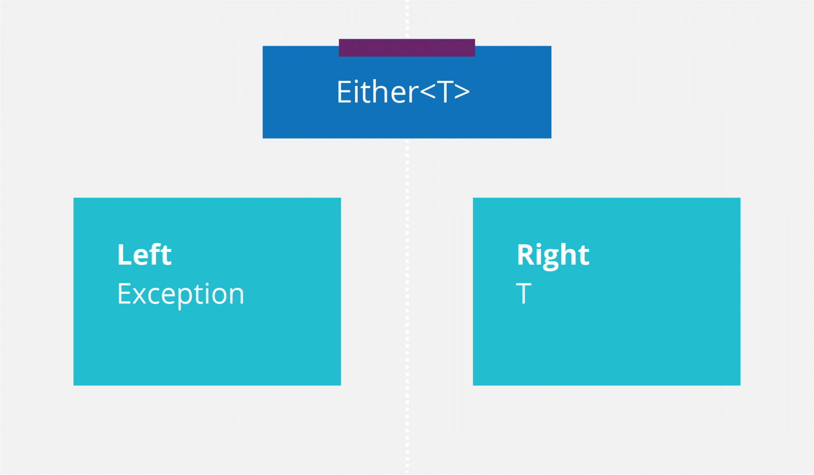

<figure class="figure figure--left">
  
</figure>

I've written extensively about the [Either datatype](https://www.thoughtworks.com/insights/blog/either-data-type-alternative-throwing-exceptions) this year. It's an excellent way to model errors without resorting to exceptions.

_Kotlin_ has been thus far my go-to language to show this concept. However, I've been playing a lot with _Rust_ lately. My first instinct was to explore its functional programming capabilities. Rust really delivers there.

There are plenty of exciting ideas in Rust. The borrow checker, lifecycles, and plenty of others. I'm going to focus on _Either_ in this post, although you might be more familiar with its actual name in the language, _Result_.

## A reason to use Rust

Rust is an increasingly [popular language](https://stackoverflow.blog/2020/01/20/what-is-rust-and-why-is-it-so-popular/). It's [defined as:](https://www.rust-lang.org/)

> A language empowering everyone to build reliable and efficient software.

<figure class="figure figure--right">
  
  <figcaption class="figure__caption">
  A tool with a simple interface
  </figcaption>
</figure>

Is Rust a replacement for, say, _Kotlin_ or _Ruby_? I don't think so! A systems programming language like Rust might not be the tool you want to use to write applications, especially if there is no need to have tight memory management.

However, I've found a use case where Rust fits very well: CLI Tools. By that, I mean tools like `cat` that are used from the command line. Typically, they start as shell scripts that inevitably get too hard to read and maintain. With Rust, you can use a pretty high-level language, and package it as a binary that's extremely easy to distribute, be it in a Docker container or anywhere else.

_Go_ has seen success in this space ([envconsul](https://github.com/hashicorp/envconsul) comes to mind). After having been involved with both, I find Rust much more pleasant to use.

## Either is actually called Result in Rust

Just in case you missed previous posts, let's quickly present Either. Either is an entity whose value can be of two different types, called left and right. It represents a computation that can fail. So the `Right` side is the result in case of success, and the `Left` one is the error if something goes wrong.

<figure class="figure">
  
</figure>

It turns out that Rust has a built-in Either datatype, called [Result](https://doc.rust-lang.org/std/result/enum.Result.html). It has two possible values, `Ok` and `Err`. Rust doesn't have [exceptions](https://doc.rust-lang.org/book/ch09-00-error-handling.html), which means that handling error conditions is predominantly done using Result. Great news!

## Using Result

Result integrates well into the language. It's implemented as an enumeration with two possible types.

<!-- result-base -->
```rust
enum Result<T, E> {
   Ok(T),
   Err(E),
}
```

Being an enumeration comes in handy when we try to unwrap the value, as we'll see in a second.

### Returning a Result

Any value can be wrapped using `Ok` and `Err` as constructors.

<!-- result-create -->
```rust
let success: Result<i32, &str> = Ok(42);
let failure: Result<i32, &str> = Err("failed :(");
```

### Unwrapping a value

Many operations in Rust return a Result. How do you get the value inside? How do you decide what to do based on the outcome of the operation? The answer to both questions lies in pattern matching.

<!-- result-unwrap -->
```rust
fn read_state(file: Result<i32,&str>) {
    match file {
        Ok(answer) => println!("Extracted from file {}", answer),
        Err() => println!("Bitter disappointment"),
    }
}
```

Note how we can decide what to do based on the Result type and extract our data in one operation. That's convenient. Moreover, pattern matching is exhaustive, so we're sure we've handled every possibility. I love pattern matching.

### Chaining

You rarely do just one computation. So, are you expected to unwrap the value, transform it, and rewrap it every time? That'd be very annoying. Instead, let's use `map` and `flatMap` (called `and_then` in Rust) to apply a function and get a new Result. If you remember, these methods are biased, so they'll never be applied to an error case.

<!-- result-chaining -->
```rust
pub fn from_file(file_name: &str) -> anyhow::Result<Self> {
    fs::read_to_string(file_name)
        .and_then(|content| serde_json::from_str(&content))
}
```

### Flat syntax

One disadvantage of modeling errors with Result/Either is that your code can become quite nested as you operate on the data contained within it. The [do notation](https://en.wikibooks.org/wiki/Haskell/do_notation), coming from Haskell, attempts to address this, though it's not without [detractors](https://wiki.haskell.org/Do_notation_considered_harmful).

Luckily, Rust has a solution for that as well! The [question mark operator](https://doc.rust-lang.org/edition-guide/rust-2018/error-handling-and-panics/the-question-mark-operator-for-easier-error-handling.html). Using it, you can extract the data from an Ok result or return directly the Err if it didn't work. It looks like this:

<!-- result-flat-syntax -->
```rust
pub fn from_file(file_name: &str) -> anyhow::Result<Self> {
    let content = fs::read_to_string(file_name)?;
    let result = serde_json::from_str(&content)?;
    Ok(result)
}
```

Both `read_to_string` and `from_str` can fail, thus returning a `Result`. If that happens, computations stop, and the method will return an error. The code remains readable without compromising its security.

It combines well with the [anyhow](https://docs.rs/anyhow/1.0.33/anyhow/) crate. If you have multiple kinds of errors in your method, _anyhow_ helps with the propagation. If they implement `std::error::Error`, that is.

## Conclusion

Who said you couldn't use functional programming concepts in a systems programming language like Rust? I've been reading a lot of Go code lately, and this code feels so much more readable than the endless list of `if err != nil` spread through it. If only _Kubernetes_ stuff would be written in Rust!
