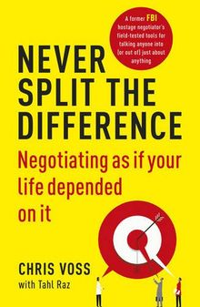

<figure class="figure figure--right">
  
</figure>

Essentially, this is a book about negotiating written by a former hostage negotiator. How is this relevant for software development, you might ask? Well, it **is** relevant. How many meetings do you attend per week? Probably a lot. You always want to get **something** out of every meeting (I'm fond of saying that a meeting without a goal is a social gathering). In many cases, what you want might not be what others want to give you. Thus, negotiation ensues.

If you're _constantly_ negotiating, so you might as well pretend to know what you're doing, right? [Getting to yes](https://www.amazon.com/Getting-Yes-Negotiating-Agreement-Without/dp/0143118757) was the canonical book about the topic. The big difference is that this one is very explicit about the fact that people don't usually behave rationally, which rings very accurate.

## The magic recipe

There is no magic recipe that will instantly transform every situation, as you might expect. There are, however, things that you need to do in every negotiation to tilt the odds in your favor.

It starts with _listening_. Who knew? But really, listening is vital. Not just paying attention to the words coming out of your counterparty. Being empathetic towards them. Empathy is **hard**. Understanding their concerns. It sounds so easy, yet you often feel that people don't truly listen in meetings or listen having already decided what they're going to hear in advance.

Your tone and posture impact how you're perceived. Chris Voss recommends using a downward inflection when talking. This one is particularly difficult for non-native speakers. Mirroring is another tool to create rapport. I've always heard that consultants are most effective when they plant ideas so that your clients believe they thought of it. That's another one that's difficult in practice.

### The folly of _yes_

The book touches on a topic that is very dear to me: The dangers of abusing _yes_. I've seen countless times that people will agree to everything to avoid being perceived as _negative_ or _unconstructive_. Not only can it be an empty agreement, but it can hide real issues in the name of fake consensus.

### Getting to a price

The last part is about getting numbers, be it while buying a car or getting a raise. I'm not sure if this is more culture-specific than other parts. For instance, in Germany, I've seen that mentioning extreme ranges tend to kill the whole conversation instead of working as an anchor.

## Negotiation in a remote world

What if you are not face to face anymore? I'm sure there're many adjustments to make to account for that. Sadly this book was written before the lockdown times, so it assumes physical presence. There is a book waiting to be written for remote setups, I'm sure.

## Verdict

I liked the book quite a lot. I want to try some of the things mentioned here in my _crucial conversations_. Sometimes it kind of sounds a bit too self-convinced for my taste, but I think it's worth a read. I'm giving it ⭐⭐⭐⭐ stars.
