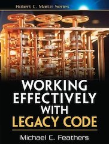

<figure class="figure figure--right">
  
</figure>

Do you wake up in the morning and tell yourself, "man, I would love to work on some legacy code today"? I guess you don't. We need to talk if you do.

But anyway, whether you like it or not, you probably **will** work on legacy code more often than you'd like to. That's where this book comes in. If you have read [Refactoring](https://martinfowler.com/books/refactoring.html), the structure will ring familiar. A collection of patterns to handle different aspects of working in a legacy system. I read it in one go, but it's probably a book that works best as a reference that you revisit whenever you're facing a concrete issue. 

## A collection of patterns

There are plenty of patterns to choose from. Some examples include:

- Interception Points
- Delete Unused Code
- Adding New Behavior

Each pattern describes a problem, proposes a way of handling it, and has sample code to visualize it better. That part is crucial. Actionable advice based on real-life experience with examples make the scenarios a lot easier to digest.

An interesting point is that some language features that we normally appreciate can hinder when dealing with legacy code. If a class is entirely untestable, overriding some parts through subclassing might enable you to write some tests. But if the constructor is private, then you are out of luck.

## A shared vocabulary

I'm a big believer in having a shared vocabulary inside a team. If we use different words whenever we talk about the same thing, a lot of effort is spent understanding each other. Referring back to the way concepts are named in the book is something I'd like to try at some point to see if it helps or not.

## Verdict

Having a strategy in place to handle code that is, to put it nicely, _problematic_ will be crucial at some point in your career. How do you start testing a monstrosity with dozens of methods and dependencies that you inherited? TDD won't help here.

That's why I liked this book, as it covers an area of development that isn't sexy. You can almost feel the pain that led to some of the techniques to add test harnesses or bring structure in a code grown without a plan. It gets ⭐⭐⭐⭐ stars from me.
