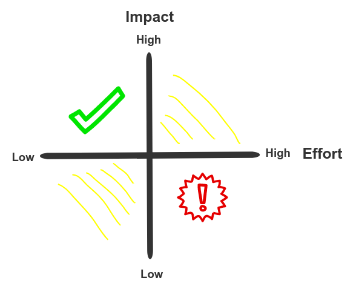

### Technical Stories

- [Part 1 - Writing technical stories](../technical-stories-a-miscast-artifact-of-agile-development/)
- [Part 2 - Getting technical stories into an iteration](../getting-technical-stories-into-an-iteration/)
- [**Part 3 - Keeping a technical backlog**](../keeping-a-technical-backlog/)

After talking about creating [technical stories](../technical-stories-a-miscast-artifact-of-agile-development/) and [how to get them into an iteration](../keeping-a-technical-backlog/), the technical backlog remains. We have done most of the work by now, so what's left is essentially bookkeeping. It's nevertheless an important topic. If you made it this far, you're likely willing to spend a fair amount of effort handling technical stories. It's only fair to give them a proper home.

<figure class="figure">
  
  <figcaption class="figure__caption">
  Backlog of fresh and relevant stories
  </figcaption>
</figure>

The technical backlog is the place to put all these stories we've been carefully writing and refining. We all are busy, so we want to spend the least amount of effort possible while keeping an overview and a priority.

## Why keep a technical backlog?

We aim to address two concerns:

- _Visualization:_ How many open technical topics do we have on our plate?
- _Prioritization:_ If we have capacity available to work on technical topics, which stories should we pick?

_Visualization_ is crucial to assess our current situation. For instance, we want to know the size of our backlog. Absolute numbers are often misleading. Are ten stories a lot? What about twenty? That's why I prefer focusing on _trends_. Is our backlog growing, and if so, how rapidly? Are we consciously accumulating tech debt? Or worse, is it happening without us realizing it?

<figure class="figure figure--left">
  
  <figcaption class="figure__caption">
  Easy, hard, everything in between
  </figcaption>
</figure>

We need a place that's easily accessible, or nobody will bother looking. If you're already using JIRA, that can be a good place. Maybe you want to use Github to keep these stories closer to the code. It doesn't matter as long as access is guaranteed for everyone interested. Once the stories get into an interation, **then** they will have to be where your product backlog resides. Remember that we don't want to create first and second class citizens in this process.

_Prioritization_ is equally important. Let's face it, there won't be enough time to work on everything we'd like to. Typically, you see stories being considered based on two factors, effort and impact, which maps nicely to a bidimensional chart.

Doing the low-effort, high-impact stories is a no brainer. Honestly, it's almost hard not to do it by mistake. Discarding high-effort, low-impact stories is easy as well. You should avoid creating them in the first place. After that, it gets dicier. How much effort should we invest in ordering technical stories? You'll be surprised to know that I have an opinion about that as well.

### Leverage a relative ordering

Trying to create objective, precise metrics to rank stories is a laudable goal. If nothing else, you have my respect. Personally, I have never seen it work in practice. A relative ranking seems like a plausible alternative. Assuming we only write stories that we believe are needed and useful (Seriously, why bother if not), we just have to order them in a way that makes sense. And by we I mean the team. Not a very scientific approach, but tends to work well enough. Some considerations:

- If somebody is really passionate about a story, that can be a sign that this story can be put in front of others that don't have as much support. In fact, that person is a great candidate to be the [feature lead](https://www.thoughtworks.com/de/insights/blog/feature-leading-agile-team) for it.
- Mix it up. Presumably different areas of your application will need some love, so it's good not to overinvest in one.
- Whatever you do, don't fall into the [sunk cost fallacy](https://en.wikipedia.org/wiki/Sunk_cost#Fallacy_effect). Don't keep investing your valuable time just because you already invested too much.

### Avoid ridiculous metrics

<figure class="figure figure--right">
  
  <figcaption class="figure__caption">
  By comparison, buying tulips seems like a better deal
  </figcaption>
</figure>

As I mentioned in my first article, we should aim to quantify the value that any technical story provides. Unless your organization is very data driven, you might not be in the position to provide accurate numbers, and that's ok. Making up shit isn't going to help anybody.

In a previous job, we had to assign a monetary value to every story shown in the sprint review. A developer would come and claim that _feature X_ was worth 30k EUR. Based on what? On nothing, really. Those numbers were pulled straight out of somebody's ass. Nobody believed for a second that any of these numbers were remotely true. Nonetheless, management wanted it so we kept doing it. This was _absurd_. If you don't have precise numbers, use the best approximation that you can get.

## The size of a technical backlog

Is there an expected size of such a backlog? Not if you ask me! It feels that it should be noticeably smaller than the regular backlog. Say, 10% or so. If your technical backlog is as big as the product backlog, you're not really working on a product, are you? 

Anyways, I already said that keeping an endless amount of stories doesn't really bring anything, unless you measure progress by the number of stories created. That might be a sign that you should spend less time on stories, and more time polishing your resume.

## Conclusion

I've written around 3k words in total just about technical stories. Did we get anywhere? I think so! Technical stories are definitely not the solution to every problem in agile. They require dedication, and are only worth if you actually follow through and implement them. Once you get there, they help having better and more transparent, conversations. More facts and less opinions. 

The difference in effort between having crappy technical stories and good ones is not very high. If you're going to do it, you might as well get some value out of it.
    
