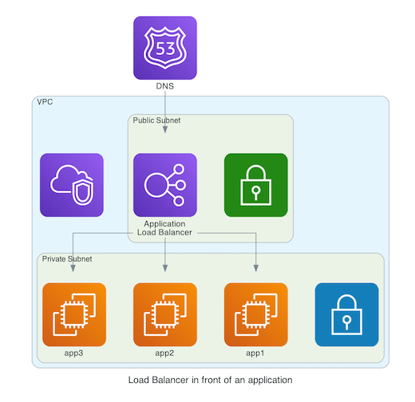

<figure class="figure figure--left">
  
</figure>

I wrote about [Network Load Balancers](../provisioning-a-network-load-balancer-with-terraform/) recently. You get a lot of mileage out of NLB's, but sometimes you do need Layer 7 features.

One alternative is keeping the NLB and putting a reverse proxy like [Traefik](../setting-up-traefik/) behind it. However, a simpler approach can be replacing both with another offering from AWS, the [Application Load Balancer (ALB)](https://docs.aws.amazon.com/elasticloadbalancing/latest/application/introduction.html). In this post I'll show how to provision ALBs with help of the old trusty [Terraform](https://www.terraform.io/).

## Setting up an Application Load Balancer

There are three main components to consider: The **load balancer**, the **listeners** and the **target groups**. I wrote in depth about this in my [previous article](../provisioning-a-network-load-balancer-with-terraform/), so I won't belabor too much. Most of the concepts are similar.

<figure class="figure">
  
</figure>

Let's focus on some concrete aspects. For the `aws_lb`, we use a different `load_balancer_type` (`application`).

<!-- alb -->
```hcl
data "aws_subnet_ids" "this" {
  vpc_id = var.vpc_id

  tags = {
    Tier = "Public"
  }
}

resource "aws_lb" "this" {
  name               = "basic-load-balancer"
  load_balancer_type = "application"
  subnets            = data.aws_subnet_ids.this.ids

  enable_cross_zone_load_balancing = true
}
```

### Listeners

For an ALB, our listeners have to be either `https` or `http`. We can choose to do SSL termination at this stage. Let's see an example.

<!-- alb-listener -->
```hcl
resource "aws_lb_listener" "this" {
  load_balancer_arn = aws_lb.this.arn

  port              = 443
  protocol          = "HTTPS"

  ssl_policy        = "ELBSecurityPolicy-2016-08"
  certificate_arn   = aws_acm_certificate.this.arn

  default_action {
    type             = "forward"
    target_group_arn = aws_lb_target_group.this.arn
  }
}

data "aws_acm_certificate" "this" {
  domain = "${var.dns_record_name}.${var.dns_zone_name}"
}
```

You can read more about the different [SSL Security policies here](https://docs.aws.amazon.com/elasticloadbalancing/latest/application/create-https-listener.html#describe-ssl-policies). I'm referencing an existing certificate for now. We'll see how to provision it thanks to _Route53_ later on.

### Target groups

Having carried the SSL termination in the step before, our target group is going to work over `http`.

<!-- alb-target-group-instance -->
```hcl
resource "aws_lb_target_group" "this" {
  port     = 80
  protocol = "HTTP"
  vpc_id   = var.vpc_id

  load_balancing_algorithm_type = "least_outstanding_requests"

  stickiness {
    enabled = true
    type    = "lb_cookie"
  }

  health_check {
    healthy_threshold   = 2
    interval            = 30
    protocol            = "HTTP"
    unhealthy_threshold = 2
  }

  depends_on = [
    aws_lb.this
  ]

  lifecycle {
    create_before_destroy = true
  }
}

resource "aws_autoscaling_attachment" "target" {
  autoscaling_group_name = var.autoscaling_group_name
  alb_target_group_arn   = aws_lb_target_group.this.arn
}
```

There are some extra features to show:

- We're customizing the load balancing [algorithm](https://aws.amazon.com/about-aws/whats-new/2019/11/application-load-balancer-now-supports-least-outstanding-requests-algorithm-for-load-balancing-requests/).
- We're using sticky sessions through a cookie with the `stickiness` block.
- We've got a custom healthcheck with the `health_check` block.

### Security Groups

Just like network load balancers, you need to allow traffic to flow through security groups.

<!-- security-groups -->
```hcl
resource "aws_security_group" "this" {
  description = "Allow connection between ALB and target"
  vpc_id      = var.vpc_id
}

resource "aws_security_group_rule" "ingress" {
  for_each = var.ports

  security_group_id = aws_security_group.this.id
  from_port         = 443
  to_port           = 443
  protocol          = "tcp"
  type              = "ingress"
  cidr_blocks       = ["0.0.0.0/0"]
}
```

## Path-based routing

Our load balancer is aware of the path and headers that we're requesting, and thus we can make routing decisions based on that. We use extra `aws_lb_listener_rule` resources to enrich the regular listener.

```hcl
resource "aws_lb_listener_rule" "redirect_based_on_path" {
  listener_arn = aws_lb_listener.this.arn

  action {
    type             = "forward"
    target_group_arn = aws_lb_target_group.alternative_target.arn
  }

  condition {
    path_pattern {
      values = ["/rest/v2/*"]
    }
  }
}
```

If the condition matches (in this case, we're using a new version of the API in the URL), the default listener will be ignored. Instead traffic is redirected to a different target group. Similarly, we can make other rules based on a specific header, or on a host name.

## Setting up Route53

We're surely not going to access the load balancer through an autogenerated domain, are we? We want pretty domains, using [Route53](https://aws.amazon.com/route53/). First we set up a `CNAME` record.

<!-- route53-lb -->
```hcl
data "aws_route53_zone" "this" {
  name = var.dns_zone_name
}

resource "aws_route53_record" "this" {
  name = var.dns_record_name
  type = "CNAME"

  records = [
    aws_lb.this.dns_name,
  ]

  zone_id = data.aws_route53_zone.this.zone_id
  ttl     = "60"
}
```

We're also setting up a certificate for the domain. It's validated automatically through a DNS challenge.

<!-- route53-cert -->
```hcl
resource "aws_acm_certificate" "this" {
  domain_name       = "${var.dns_record_name}.${var.dns_zone_name}"
  validation_method = "DNS"

  lifecycle {
    create_before_destroy = true
  }
}

resource "aws_acm_certificate_validation" "this" {
  certificate_arn         = aws_acm_certificate.this.arn
  validation_record_fqdns = [aws_route53_record.web_cert_validation.fqdn]

  lifecycle {
    create_before_destroy = true
  }
}

resource "aws_route53_record" "web_cert_validation" {
  name = aws_acm_certificate.this.domain_validation_options.0.resource_record_name
  type = aws_acm_certificate.this.domain_validation_options.0.resource_record_type

  records = [aws_acm_certificate.this.domain_validation_options.0.resource_record_value]

  zone_id = data.aws_route53_zone.zone.id
  ttl     = 60

  lifecycle {
    create_before_destroy = true
  }
}
```

## A word on pricing

As you can see in the [pricing page](https://aws.amazon.com/elasticloadbalancing/pricing/), ALBs have the same fixed costs as NLBs, but are more expensive when processing traffic (LCU vs NLCU). The pricing details are a bit arcane. A good rule of thumb is to use an ALB if there is a specific feature that you want to utilize, I guess.

## Conclusion

A combination of [NLBs](../provisioning-a-network-load-balancer-with-terraform/) and ALBs will cover most if not all your load balancing needs. The sheer amount of features can be overwhelming. I've found it easier to start focusing on the basics and discover the vast array of possibilities one by one.
