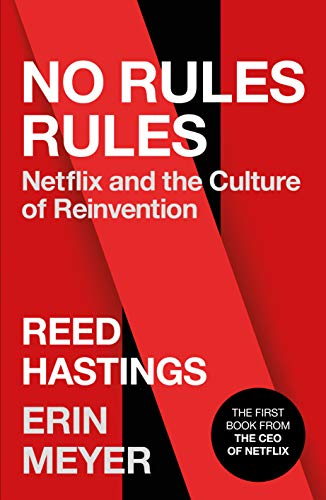

<figure class="figure figure--right">
  
</figure>

Netflix is a scrappy startup doing some video stuff. Maybe you've heard of them. They are famous for their extensive use of [microservices](https://smartbear.com/blog/develop/why-you-cant-talk-about-microservices-without-ment/), [chaos engineering](https://github.com/Netflix/chaosmonkey), and family-friendly shows like [Narcos](https://www.netflix.com/title/80025172).

Anyway! There is a book out talking about their corporate culture in all of its glory. You know how many companies have tribes and squads and all those words popularized by Spotify and think they are totally agile? Then, it turns out that they're actually not, and regardless, Spotify doesn't even follow that model anymore. Thanks to books like this, we've got a whole new set of cargo culting opportunities.

After reading about their ethos, I would define Netflix's culture as _compassionate Darwinism_. They are pretty cutthroat, expecting high performance and culling whoever falls behind. On the other hand, they foster feedback, a culture of experimentation, and empower employees to make decisions instead of waiting for orders. You can't argue with the success, so I'm sure they must be doing something right. How much is that applicable to other situations, though?

## What this book is not

If you're picking this book up to learn how Netflix develops software, you're going to be disappointed. There is almost nothing about how their engineering teams are organized, other than mentioning that when somebody got an offer from Google, they gave him a massive raise.

At least Netflix shares many of its practices in [its engineering blog](https://netflixtechblog.com/), so there are other venues to find more about what they do.

## Talent density

Netflix has very high expectations for their employees. Doing your job adequately is not good enough. You have to be great at it. You get paid for it accordingly at the top of the market or are let go. It sounds scary. Still, there is a very direct link from performance to compensation. Not sure how such an environment would feel, although it has a certain appeal. Most companies are _not_ willing to pay top of the market (despite their claims), so I guess it's a hard one to copy. There is a saying from Reid Hoffman that resonated with me:

> We are a team, not family

I couldn't agree more. Your colleagues are not family, and that's fine. I already have a family. Working together effectively requires mutual respect and communication. I have always found the family BS questionable.

## Candor culture

Netflix is committed to exchanging feedback openly and frequently, which many other companies will claim to do even though they avoid feedback like the plague. This is understandable to some extent. Feedback is **hard**. You need psychological safety to talk about vulnerability without fearing repercussions. You need to ensure that everybody has good intentions. You need to practice it often. Having a feedback board on a wall isn't going to create this environment.

I enjoyed the part of adapting to different cultures that have different customs regarding feedback. I didn't know that the Dutch are so direct.

## Empower your employees

Another very quotable belief refers to the role of managers:

> Lead with context, not with control

Give every member of your organization the context they require to take the appropriate decisions, and then let them _actually_ do it. Compared to the micromanagement level that you can observe in your day to day, that sounds refreshing.

## Verdict

Every book about a company or its founder tends to be a bit of a hagiography. Nevertheless, I found this one to be pretty balanced. It paints an interesting picture about Netflix, which has a culture that's not suited for everyone, yet has put a fair amount of thought into how they do things. You can't say that about every organization out there.

It's a bit of a bummer that there is so little about software development, as that was the part I wanted to hear about the most. Despite that, it's a worthy read. I gave it ⭐⭐⭐⭐ stars.
