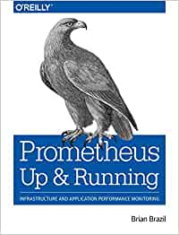

<figure class="figure figure--right">
  
</figure>

[Prometheus](https://prometheus.io/) is a complex beast. I've been using it at work for the past year, and I always felt that I could barely understand what was going on. Picking up this book is a great way to start filling those gaps. Roughly, there are the following sections:

- Application Monitoring
- Infrastructure Monitoring
- PromQL
- Alerting
- Deployment

Whether you are monitoring applications or infrastructure, the core components are the same. Instrumenting the code or using exporters, and then publishing metrics that Prometheus will scrape, with a few labels to sprinkle on top.

There are plenty of components that need to be deployed to have a more complete setup. The [node-exporter](https://github.com/prometheus/node_exporter), the [blackbox-exporter](https://github.com/prometheus/blackbox_exporter), and others make an appearance. This is more relevant as an operator, however.

I set up a simple installation of Prometheus to try things more practically. It's in [this repository](https://github.com/sirech/example-prometheus-setup) and can be run with Docker.

## PromQL

The toughest part of the book is the comprehensive overview of _PromQL_, Prometheus's query language. If you want to write queries that make any sense, this section is a must-read. Otherwise, you'll find yourself trying different combinations of `sum`, `rate`, and whatnot until your queries somehow work.

## Alerting

Alerting is especially relevant if you handle on-call for a system. From experience, a misconfigured alerting setup can cause a lot of friction and pain, so it's good to invest in understanding which kind of alerts you can get, and when.

## Dashboarding

Visualizing your metrics is a big part of monitoring, which in this ecosystem is handled by [grafana](https://grafana.com/). Grafana is another complex beast. You'll find about twenty pages on the topic, which is not nearly enough to get a deep understanding of how to build all those fancy dashboards that you see out there. But it's an interesting appetizer to get started.

## Verdict

[Prometheus](https://www.thoughtworks.com/de/radar/tools/prometheus) has been around for a while, all in all. It seems to be the standard monitoring collecting tool these days. Knowing about it is a good investment of your time, and I think this book strikes a reasonable balance of being practical and giving you deeper insights, thus getting ⭐⭐⭐⭐ stars.

