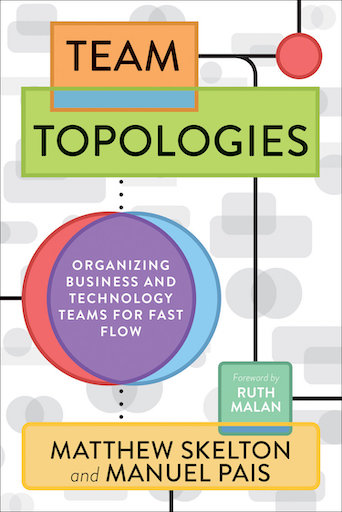

<figure class="figure">
  
</figure>

[Team topologies](https://teamtopologies.com/book) is a book about software delivery that doesn't mention technology. Rather, it's about how to organize teams.

It's almost impossible to work in the software industry and not hear regularly about [Conway's law (It's not actually a law)](https://en.wikipedia.org/wiki/Conway%27s_law). It turns out that the way an organization is set up will influence the software architecture that it produces. Everybody is mindlessly using [microservices](https://microservices.io/) regardless of fit. But if I'm allowed to quote myself:

> All the fancy technology in the world won't fix an organizational problem.

That's pretty much the point of this book. Fast flow is easier to achieve if the teams are set up in a way that favors autonomy, and easy communication. Architecture will follow organization (See [the inverse Conway maneuver](https://www.thoughtworks.com/radar/techniques/inverse-conway-maneuver)).

## The core premise

This book essentially boils down to four team templates to use throughout an entire organization:

- Stream-aligned team
- Enabling team
- Platform team
- Complicated subsystem team

_Stream-aligned_ teams are what others call product teams. Teams aligned along the lines of a product, a stream, or a feature. They should be able to work independently for the most part without handing their artifacts over to another team. It requires a proper cross-functional setup.

Certain services are too complex to handle for a team of generalists. That's where _complicated subsystem_ teams come in. Those can take ownership over these systems while they are (hopefully) refactored or replaced.

Stream teams rely on infrastructure that is handled by _Platform_ teams. A platform team treats other teams as customers and offers them a product they can consume to make their life easier. I want to get into this in more depth, as I've spent the last year working in such a team and have seen many challenges arise.

Lastly, _enabling_ teams help upskilling other teams that don't have the time to dig into certain areas themselves. It can be focused on a concrete technology, or agile practices, or any skill that is required by those teams.

## Models of communication

The last part of the book is dedicated to the communication patterns between the different types of teams. There are three: collaboration, X-as-a-service, and facilitation. I really like the idea of creating a vocabulary to talk about the different ways that teams use to interact with each other. 

## Verdict

In my view, the value of this book becomes clearer if you have seen how difficult it can get when the boundaries between teams are messed up. There are many examples:

- An operations team working in a ticket based model, blocking everybody else. Just renaming them to DevOps doesn't fix anything, by the way.
- A strong separation between backend, frontend, and QA teams means that any simple feature goes through multiple teams to reach a customer.

As as I said in the beginning, no amount of microservices is going to fix that. And I like this book for providing a clear and explicit set of recommendations, and a language to talk about it. It gets ⭐⭐⭐⭐ stars.
