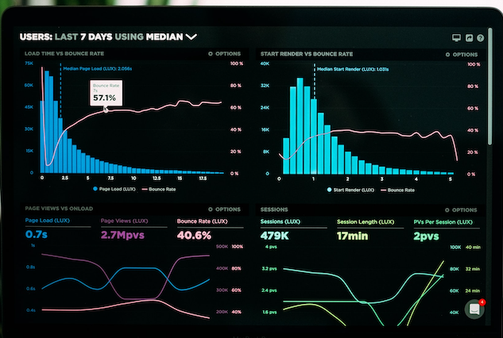
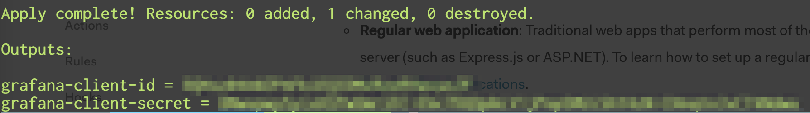
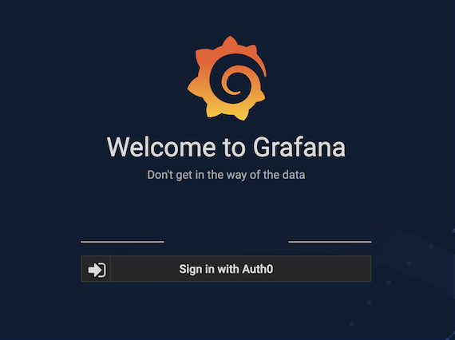

<figure class="figure figure--left">
  
</figure>

If I say _monitoring_, probably the first thing that comes to mind is [Prometheus](https://prometheus.io/). And its trusty sidekick, [Grafana](https://grafana.com/). It doesn't feel like I'm doing software engineering if I'm not constantly checking some dashboards. However, we don't want to expose those dashboards on the public internet. That would be bad! In this post I'm going to show how to set up authentication for it using [Auth0](https://auth0.com/) as an identity provider.

I wrote some time ago about [setting up Auth0 with Terraform](../setting-up-auth0-with-terraform/). Auth0 is an excellent product and a very convenient way to set up authentication and authorization without handling the gory details yourself. OAuth is the last thing you want to implement yourself. I hadn't checked my Auth0 account in a while. Nevertheless, having the whole thing set up with [Terraform](https://www.terraform.io/) makes a lot easier to navigate and extend.

## The flow

I'm going to configure Grafana to allow log in through Auth0. I'm too lazy to handle user managment, so in fact I'm going to use Google users.

My Grafana instance is available under a domain like https://grafana.mydomain.com. Technically, it's sitting behind an nginx acting as a reverse proxy. But that's not relevant for our purposes.

## Client and connection

As mentioned, I leverage Google accounts through the `auth0_connection`. Additionally, I'm defining a new client (`auth0_client`) pointing to Grafana. The application type in Auth0 is a [regular web application](https://auth0.com/docs/applications).

<!-- auth0-client -->
```hcl
resource "auth0_client" "grafana-frontend" {
  name        = "grafana"
  description = "Grafana - Terraform generated"
  app_type    = "regular_web"
  callbacks   = ["https://${local.grafana_host}/login/generic_oauth"]
  web_origins = ["https://${local.grafana_host}"]
}

resource "auth0_connection" "google" {
  name     = "google"
  strategy = "google-oauth2"

  enabled_clients = [
    auth0_client.grafana-frontend.id
  ]
}

output "grafana-client-id" {
  value = auth0_client.grafana-frontend.client_id
}

output "grafana-client-secret" {
  value = auth0_client.grafana-frontend.client_secret
}
```

Provisioning this client generates a `client_id` and `client_secret` that I require to configure Grafana. There is no need to set up an [application](https://auth0.com/docs/dashboard/reference/settings-application) on Auth0's side.

<figure class="figure">
  
  <figcaption class="figure__caption">
  Let's not go through the trouble of setting up OAuth to then share the client secret openly
  </figcaption>
</figure>

## Configuring Grafana

We're connecting the client with Grafana using what they call the [generic OAuth authentication](https://grafana.com/docs/grafana/latest/auth/generic-oauth/). There are a bunch of endpoints based on the domain, plus the `client_id` and the `client_secret` that I got before.

<!-- grafana-config -->
```toml
[server]
domain = grafana.$__env{HOST}
root_url = https://grafana.$__env{HOST}

[auth]
disable_login_form = true

[auth.generic_oauth]
enabled = true
allow_sign_up = true
team_ids =
allowed_organizations =
name = Auth0
client_id = $__env{GRAFANA_CLIENT_ID}
client_secret = $__env{GRAFANA_CLIENT_SECRET}
scopes = openid profile email
auth_url = $__env{AUTH0_HOST}/authorize
token_url = $__env{AUTH0_HOST}/oauth/token
api_url = $__env{AUTH0_HOST}/userinfo
```

I **definitely** don't want to store the credentials in the code. Luckily, we can use [variable expansion](https://grafana.com/docs/grafana/latest/administration/configuration/#env-provider) to inject those values from the outside. That spares us from templating the configuration. Nicely done, Grafana. We can pass those values with `docker-compose`:

<!-- grafana-docker-compose -->
```yaml
grafana:
  container_name: grafana
  image: grafana/grafana

  env_file: .env

  volumes:
    - "./prometheus/grafana/dashboards:/etc/grafana/provisioning/dashboards"
    - "./prometheus/grafana/datasources:/etc/grafana/provisioning/datasources"
    - "./prometheus/grafana/grafana.ini:/etc/grafana/grafana.ini"

  networks:
    - web
    - backend
```

Keep in mind that Grafana needs internet access to communicate directly with Auth0 and fetch the access token.

After all this work, Grafana rewards us with a welcoming screen.

<figure class="figure">
  
  <figcaption class="figure__caption">
  Don't tell me whether I can get in the way of the data or not!
  </figcaption>
</figure>

## An unforeseen problem

<figure class="figure figure--right">
  
  <figcaption class="figure__caption">
  Did somebody say dashboards?
  </figcaption>
</figure>

Looking good! No unauthorized user will access our dashboards. Right? Turns out, anybody with a Google account can log in! Not very secure!

When I was setting up SPAs, I added a custom scope to the JWT that was verified on the backend side. Grafana offers no way of veryfying scopes, sadly. This is a known issue, and it doesn't look like it's going to be fixed [anytime soon](https://github.com/grafana/grafana/issues/6809).

You can specify an expected organization or team id, but that's not based on standard OAuth. It seems like it's a straight copy-paste based on Github's interpretation of OAuth. The documentation for those two parameters is pretty awful, by the way. I spent a lot of time reading the source code until I understood that you need some endpoints that Auth0 doesn't implement.

Anyways, there is an alternative. Instead, we're going to use a [rule](https://auth0.com/docs/rules) that checks if the user has a specific role. We'll drop the requests by users without the role without sending them to Grafana. Rule and role are defined like this:

<!-- provision-rule -->
```hcl
resource "auth0_role" "grafana-user" {
  name = "Grafana - User"
}

resource "auth0_rule" "grafana-drop-unauthorized" {
  name = "grafana-drop-unauthorized"
  script = templatefile("${path.module}/drop-unauthorized-grafana.js", {
    application : auth0_client.grafana-frontend.name,
    role : auth0_role.grafana-user.name
  })

  enabled = true
}
```

The rule is implemented in JavaScript.

<!-- rule-definition -->
```javascript
function dropUnauthorizedGrafana(user, context, callback) {
  if(context.clientName !== "${application}") {
    return callback(null, user, context);
  }

  const auth = context.authorization || {};
  const roles = auth.roles || [];

  if(!roles.includes("${role}")) {
    return callback('Access denied');
  }

  return callback(null, user, context);
}
```

Rules are applied to _every_ application, so make sure you only process the correct application.

## Summary

The temptation to do some half-assed measure to protect internal tools like Grafana is always there. Many of these tools end up behind a VPN, or (God forbid) using something like Basic Auth. Thanks to providers like Auth0 doing the right thing is easier than ever. With infrastructure as code, you can ensure not only that the installation is repeatable, but also that you'll be able to come back and still understand it.


