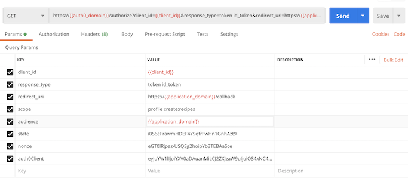
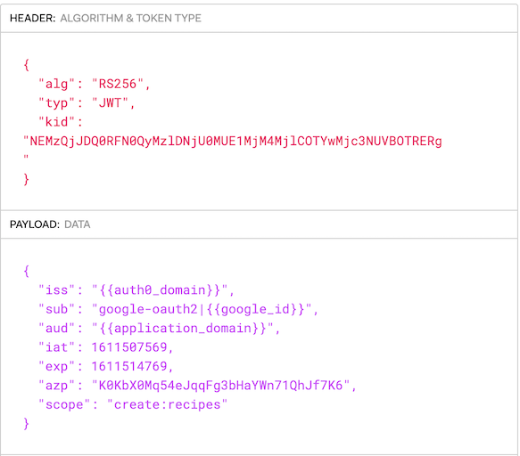
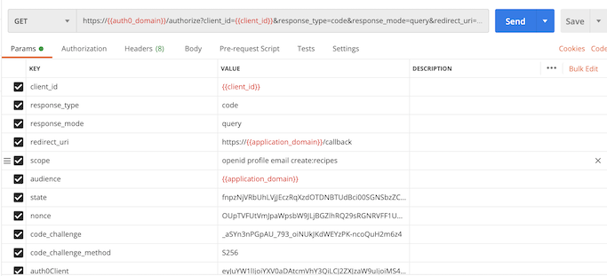
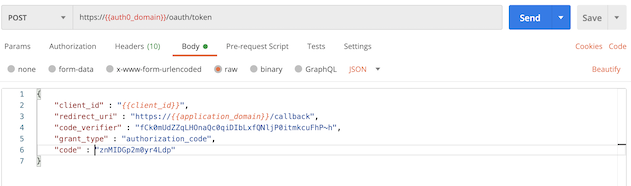
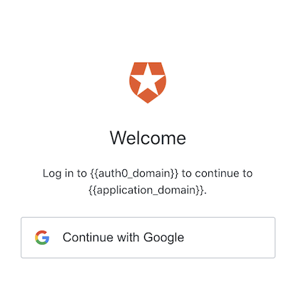

<figure class="figure figure--left">
  
</figure>

I've been working with OAuth a lot lately. Just recently, I wrote about setting it up for [grafana](../setting-up-oauth-for-grafana-with-auth0/). Today, I want to talk about the recommended flow for Single Page Applications, _Authorization Code Flow with PKCE_. I'm going to add authorization to a React application leveraging [Auth0](https://auth0.com/) as an Identity Provider.

I mention Auth0 so often around here, you'd think I'm getting a referral bonus. I promise you I'm not! It's deserved praise. The UI is easy to navigate, is conveniently provisioned with Terraform, and has powerful libraries for most programming languages. I wrote about verifying JWTs from a [SpringBoot backend](../authorize-spring-backend-with-jwt-in-kotlin/) in the past. Now it's time to talk about the frontend.

## Choosing the right flow

OAuth is not a monolithic entity. There are so many [flows](https://nordicapis.com/8-types-of-oauth-flows-and-powers/) it's no wonder people still succumb to the temptation of Basic Auth. The first step always is [choosing the right one](https://auth0.com/docs/authorization/which-oauth-2-0-flow-should-i-use). Given that an SPA can't store a secret id (the source code is sent to the browser, you know), we have two possibilities.

### Implicit Flow

Traditionally, SPAs tended to use the [implicit flow](https://developer.okta.com/blog/2018/05/24/what-is-the-oauth2-implicit-grant-type), also known as the implicit grant type. You make a request to the `authorize` endpoint with `response_type=token id_token`. It looks like this:

<figure class="figure">
  
  <figcaption class="figure__caption">
  When using OAuth, it's key to ask things nicely
  </figcaption>
</figure>

Typically, you lack authentication for the first request, so you'll land in a login screen artfully presented by Auth0. Afterward, the response is a redirect (302) with an `access_token` and an `id_token` appended to the URL as query parameters. The `access_token` is a JWT similar to this:

<figure class="figure">
  
</figure>

Now that you've learned about this flow, you can pretty much forget about it. Implicit flow is no longer considered the best option for SPAs. Instead, if you're implementing a new application you're advised to use the [Code Flow with PKCE](https://auth0.com/docs/flows/authorization-code-flow-with-proof-key-for-code-exchange-pkce) because it's more secure. Don't you love the _argument by security_?

### Code Flow with PKCE

This is an enhanced version of the Code Flow that doesn't require a client secret (remember, no secret in SPA code). Like before, we use the `authorize` endpoint, this time with a different `response_type`. We include a `code_challenge` as well.

<figure class="figure">
  
  <figcaption class="figure__caption">
  Find the differences
  </figcaption>
</figure>

If you're authorized, the response is a redirect again. This time, we are getting a `code` appended to the URL as a query parameter. To obtain the token, we need to make another request to the `oauth/token` endpoint (a _POST_ this time) with the `code` we got and the `code_verifier` we used to generate the challenge.

<figure class="figure">
  
</figure>

This call returns the `access_token` and `id_token` as part of the body, ensuring that we don't store tokens in our browser history.

## Using the right library

Alright, we're getting in the _flow_. Our next step is extending our application to actually use OAuth. Implementing it by hand is error-prone and cumbersome. Spare yourself the trouble and use a library instead. Auth0's seems to be trying to corner the market, as they have three different JavaScript libraries. I've worked with all three in some capacity, but as of today, I endorse [auth0-react](https://github.com/auth0/auth0-react) as the most convenient one. Let's see some code samples.

### Auth0 provider

This library uses the [Context API](https://reactjs.org/docs/context.html). We have to instantiate a component called `Auth0Provider` with the parameters for our connection with Auth0 that we get from the [application associated with the UI](https://auth0.com/docs/applications).

```jsx
const host = () => process.env.REACT_APP_HOST || ''
const redirectUri = () => `${host()}/callback`

render(
  <BrowserRouter>
    <Auth0Provider
      domain="{{auth0_domain}}"
      clientId="{{client_id}}"
      scope="openid profile create:recipes"
      audience="{{application_domain}}"
      redirectUri={redirectUri()}
    >
      <App />
    </Auth0Provider>
  </BrowserRouter>,
  document.getElementById('root')
)
```

### Triggering the login flow

In our code, we use a [hook](https://reactjs.org/docs/hooks-intro.html) to interact with Auth0. We get a whole bunch of stuff from the hook. For our example, we're interested in knowing if the user is authenticated. We need login and logout functions as well.

```jsx
const Navigation: React.FC = () => {
  const {
    loginWithRedirect,
    logout,
    isAuthenticated,
  } = useAuth0()

  return (
    <AppBar data-testid="navigation">
      <Toolbar>

        {!isAuthenticated && <Login onClick={() => loginWithRedirect()} />}
        
        {isAuthenticated && (
          <Logout onClick={() => logout({ localOnly: true })} />
        )}

      </Toolbar>
    </AppBar>
  )
}
```

If you have worked with hooks already, you'll have seen this pattern. Once we click on the login button, the OAuth dance begins. We land on a form like this:

<figure class="figure">
  
  <figcaption class="figure__caption">
  Welcome, for the love of God, don't build this yourself
  </figcaption>
</figure>

After the authentication, Auth0 redirects back to the URL defined in the `redirectUri` specified above. I put a `Callback` component under that route that waits for the process to finish. That appears to work better than waiting on the main component directly. 

```jsx
const Callback: React.FC = () => {
  const { isLoading } = useAuth0()

  return (
    <>
      {!isLoading && <Redirect to="/" />}
      <p>Waiting for log in to be confirmed</p>
    </>
  )
}
```

Subsequently, `isAuthenticated` is true, and we have access to the user data. You can configure the provider to store the token in `localStorage`, but that's apparently a security risk so forget I mentioned this. 

### Making API calls

Displaying the user's data is nice, but the crucial part is making sure that we include our token when querying the backend. This token is then [verified](../authorize-spring-backend-with-jwt-in-kotlin/), and then actual useful things ensue.

Again we make use of the `useAuth0` hook. I'm after the `getAccessTokenSilently` method, which returns the token if present or makes a silent request if not. 

```jsx
const Submitter: React.FC<Props> = ({ history }: Props) => {
  const { getAccessTokenSilently } = useAuth0()

  return (
    <Formik
      initialValues={initialValues}
      validationSchema={validationSchema}
      onSubmit={async (values: RecipeForm) => {
        const accessToken = await getAccessTokenSilently({})
        const response = await newRecipe(values, {
          Authorization: `Bearer ${accessToken}`,
        })

        fold(
          response,
          (error) => console.log('Error happened: ', error.code),
          (response) => history.push(`/recipes/${response.id}`)
        )
      }}
    ></Formik>
  )
}
```

The token needs to be included as a bearer token in any API request that requires authorization. We might get fancy by passing different scopes to the `getAccessTokenSilently` method if we need granular permissions. That's too much for this simple app, though.

## Summary

I've seen some nasty, bespoke approaches to handle authz/authn, especially when frontend code is involved. Do not roll your home-cooked solution, it's likely to be much more complex and probably a lot more insecure. With Auth0 most of the work is already done for you. You might as well use it!

