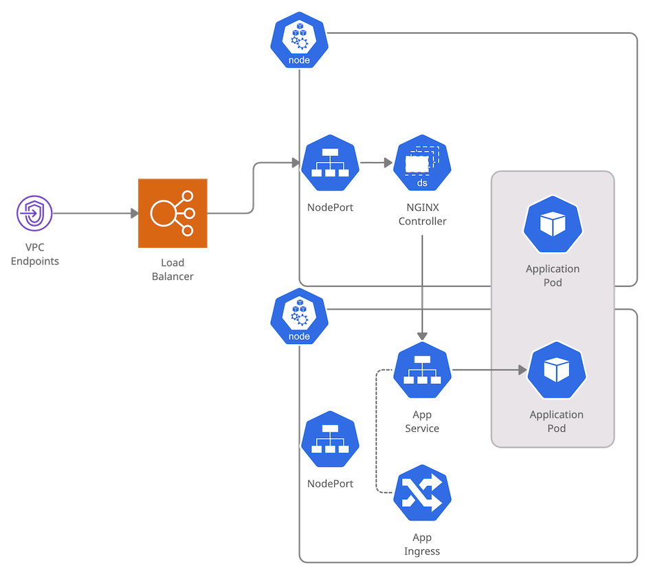

<figure class="figure figure--left">
  
  <figcaption class="figure__caption">
  The ingress police is watching
  </figcaption>
</figure>

It seems hard to believe, but I had never written about [Kubernetes](https://kubernetes.io/) before. It feels impossible to hold a conversation about technology for more than five minutes without coming to the topic of _k8s_. Let's fix that. I have to publish a couple of articles centered around Kubernetes to catch up.

If you operate a Kubernetes cluster with any significant usage, chances are you're using [an Ingress Controller](https://kubernetes.io/docs/concepts/services-networking/ingress-controllers/). It just seems the thing to do. I've had a thing for [Traefik](/setting-up-traefik/) for a while. However, the path of least resistance is to use the [NGINX Ingress Controller](https://kubernetes.github.io/ingress-nginx/). That's the one I'm familiar with and the one I will be deconstructing in this post.

## An introduction

What is an Ingress Controller? Essentially, it makes connectivity for applications easier. You can have one entrypoint into the cluster and let different applications define the URLs they serve. Moreover, you don't need to change the controller when you add new applications, keeping the whole thing nicely decoupled.

It's pretty easy. For the applications, I mean. The complexity doesn't disappear, it just moves somewhere else.

<figure class="figure">
  
  <figcaption class="figure__caption">
  You'll notice that the sum of the three smaller circles is bigger than the original one
  </figcaption>
</figure>

There are three somewhat distinct components involved:

- [NGINX](https://www.nginx.com/): Proxies requests to the right application.
- [Ingress](https://kubernetes.io/docs/concepts/cluster-administration/networking/): Allows defining endpoints for applications.
- [Controller](https://kubernetes.io/docs/concepts/architecture/controller/): Ensures that the ingresses we defined end up configured in NGINX.

Even though they only make sense together, I find it easier to understand if we consider each part separately.

### A quick word on tooling

There is a [krew](https://github.com/kubernetes-sigs/krew) plugin for `kubectl`, called [ingress-nginx](https://kubernetes.github.io/ingress-nginx/kubectl-plugin/). It simplifies interactions significantly. Go get it.

## NGINX

NGINX is the Swiss Army Knife of delivering content. It serves static assets. It works as a reverse proxy. It can be modded with [Lua](https://blog.cloudflare.com/pushing-nginx-to-its-limit-with-lua/). It can probably run on toasters.

Naturally, there are a million different configuration options. Let's focus on what we need. We're using NGINX as a reverse proxy. This means we want to route an HTTP request to an application, based on the domain and the path. We need an entrypoint (a `server`) that can specify URLs, a way of defining downstream applications (an `upstream`), and a connection between the two of them (the `proxy_pass`). A simplified configuration looks like this:

<!-- nginx-config -->
```nginx
# The target service
upstream upstream_target {
    server upstream:4003 max_fails=1 fail_timeout=15s;
}

server {
    # Domain under which the service is reachable
    server_name upstream.domain.io;
    
    # https is used
    listen 443 ssl http2;
    listen [::]:443 ssl http2;

    # we need a certificate to terminate https
    ssl_certificate           /cert/live/upstream.domain.io/fullchain.pem;
    ssl_certificate_key       /cert/live/upstream.domain.io/privkey.pem;
    ssl_trusted_certificate   /cert/live/upstream.domain.io/chain.pem;
    include /etc/nginx/includes/ssl-settings.conf;

    # Proxy to the target service
    location ^~ /rest/ {
        proxy_pass http://upstream_target;
        proxy_set_header X-Forwarded-For $proxy_add_x_forwarded_for;
        proxy_set_header Host $http_host;
        proxy_redirect off;
    }
}
```

This is not quite the configuration that the Ingress Controller uses. A real one for one of the clusters in my project is 12K lines long. And a lot of calls to Lua functions. For your sanity, start with the simpler example.

### Checking the actual configuration

If you still want to check that monstrous config file, use the plugin I mentioned above:

```
kubectl ingress-nginx conf --namespace $NAMESPACE --pod $POD > /tmp/nginx.conf
```

Inspect the dynamically handled backends:

```
kubectl ingress-nginx backends --namespace $NAMESPACE --pod $POD
```

## Ingress

The [Ingress](https://kubernetes.io/docs/concepts/services-networking/ingress/) resource is a way of declaratively defining how to reach an application. On its own, it does nothing. The controller ensures it's reachable by creating an appropriate NGINX configuration. That configuration points to the [Service](https://kubernetes.io/docs/concepts/services-networking/service/) associated with the ingress. I prefer using [Terraform](https://www.terraform.io/) for that, though it's not a requirement.

```hcl
variable "host" {
  default = "upstream.domain.io"
}

resource "kubernetes_ingress" "this" {
  metadata {
    name      = var.name
    namespace = var.namespace

    annotations = {
      "kubernetes.io/ingress.class"    = "nginx"
      "cert-manager.io/cluster-issuer" = "letsencrypt"
    }
  }

  spec {
    tls {
      hosts = [ var.host ]
      secret_name = "${var.name}-tls"
    }

    rule {
      host = var.host

      http {
        path {
          path = "/"

          backend {
            service_name = var.service_name
            service_port = var.service_port
          }
        }
      }
    }
  }
}
```

Certificates are handled by another controller, the [cert-manager](https://cert-manager.io/docs/tutorials/acme/ingress/).

### How is the application getting the requests?

An Ingress is a nice abstraction, but it looks a bit like magic, doesn't it? What's the journey of a request from the beginning until it reaches the application? Let's go down the rabbit hole.

<figure class="figure">
  
</figure>

This is the setup: We have a cluster with a bunch of nodes, with a _Load Balancer_ in front. The NGINX Controller runs as a _DaemonSet_ in every node. Our application is configured as a _Deployment_. To reach it, there is a _Service_ and an _Ingress_.

Let's assume we start our request from a [VPC Endpoint](https://hceris.com/understanding-vpc-endpoints/). What happens next?

- We reach the Load Balancer. As I explained in my article about [NLBs](../provisioning-a-network-load-balancer-with-terraform/), a target group points to individual instances. In this case, the worker nodes of the cluster.
- _(1st Load Balancing)_ The Load Balancer picks one of the nodes.
- The request reaches a Node. Through a Service of type `NodePort`, there are `iptables` set up so that the request goes to the right place.
- _(2nd Load Balancing)_ [kube-proxy](https://kubernetes.io/docs/concepts/services-networking/service/#proxy-mode-iptables) selects one of the instances of the NGINX controller.
- NGINX does its magic, and it forwards the request to the correct Service.
- The Service for the application is of type `ClusterIP`. All the Pods in the Deployment appear as targets.
- _(3rd Load Balancing)_ One of the Pods is chosen.
- The application Pod finally receives the request.

Whew! That was a perilous trip! I got tired by typing all this, and you can argue that I missed many details. Isn't Kubernetes wonderful? What's interesting is that will all these routing decisions, you can never guarantee who is going to process or receive a particular request.

## Controller

The [controller](https://kubernetes.io/docs/concepts/architecture/controller/) pattern is widely used in the Kubernetes ecosystem. It's based on the idea of a _control loop_.

1. Figure out the target state, as defined by some resources defined in the cluster
2. Determine the current situation
3. If 1 and 2 diverge, change the system so that they match
4. Repeat the loop

Coming back to networking, the Ingress Controller handles the relationship between Ingress resources and the NGINX configuration. You declare what you expect to have, and the controller goes to work to morph that into a functioning reverse proxy.

<figure class="figure">
  
</figure>

As mentioned, the output is a gigantic config file. The controller gets notified when an ingress is created, deleted, or changed through a [Kubernetes informer](https://pkg.go.dev/k8s.io/client-go/informers#NewFilteredSharedInformerFactory).

## What did we learn?

The NGINX Ingress Controller is a surprisingly complicated piece of software. [Look](https://docs.nginx.com/nginx-ingress-controller/installation/installation-with-helm/#configuration) at all the configuration parameters of the helm chart. And it's no surprise. It's a complex NGINX proxy, a control loop written in golang, and a connector of all these different networking pieces. I've used it for a while without really understanding what it does. It's definitely worth spending some time on the details.

*Thanks to Donald for the feedback.*
