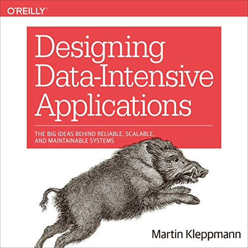

<figure class="figure">
  
</figure>

If you're in the mood for a challenging book, then _Designing Data-Intensive Applications_ (often known as DDIA) is exactly what you need. It packs an insane amount of content inside its ~500 pages. I can't think of a better candidate to learn about distributed systems at scale.

## Full Attention Demanded

The book covers distributed systems. General knowledge is probably required, otherwise, it will be a bit too much for you. You don't need to be a Big Data specialist, though.

Before you start with this one, beware: This is a pretty heavy book to read. Be prepared to read chapters multiple times. I've read the consensus chapter quite a few times already, and I still don't feel confident that I know what's going on.

## Each Chapter is a Mini Book

There are twelve chapters in the book. Each chapter centers around one main topic, such as:

- Replication
- Partitioning
- Transactions
- Consensus
- Streams

Most chapters start relatively easy, but they go into extensive _depth_. Like, they go up to the very edge of the state-of-the-art. You'll notice by the number of references to recent research papers.

## The Oracle of System Design

System Design is a big part of interviewing for [BigTech](https://en.wikipedia.org/wiki/Big_Tech) (FAANG and others), starting from senior positions. DDIA touches on several topics that are quite relevant for that kind of interview. Can this book replace the experience of designing distributed systems at scale? No, of course not. But, it's an excellent way to start building a solid base. Since I read DDIA, I've noticed that I pick up more details when I read the engineering blog of some companies.

Besides, the gigantic list of references for every chapter is an invaluable resource if you want to dive deeper into any of these topics. No kidding, there are like 100 references per chapter. 

## Verdict

Don't get fooled: If you want to power through the whole book you're going to invest some serious effort. It's not some light reading just before going to bed.

Even then, it's written clearly and concisely, so it won't make your life unnecessarily hard. Despite the cognitive load, it's one of the best purely technical books I've read in a while. It gets ⭐⭐⭐⭐⭐ stars from me. 
