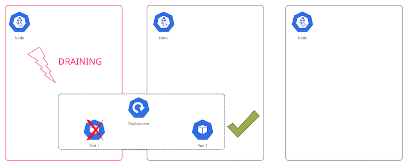

<figure class="figure figure--left">
  
  <figcaption class="figure__caption">
  Be careful of the debris
  </figcaption>
</figure>

The appeal behind using [Kubernetes](https://kubernetes.io/) is that you can abstract the details of _where_ your applications run and leave it in k8s's hands. It'll schedule containers following a given logic and constraints, and restart them if they crash.

However, a Kubernetes cluster is not a perfect abstraction. That is clearly visible if you are servicing clusters as an operator. Even if you use a managed solution like [AWS EKS](https://aws.amazon.com/eks/), you still have to perform some maintenance yourself.

As an operator, I want this maintenance to happen frequently, to avoid stagnation and prevent failure. As a developer, I don't want unwanted interruptions for my applications. A Pod Disruption Budget (PDB) is a resource that Kubernetes offers to harmonize both needs in a decoupled manner. I want to talk about how to use it in this article.

## Pod Disruption Budgets to the rescue

A classical maintenance scenario in the world of Kubernetes is the replacement of a worker node. That can happen due to a version upgrade, a new AMI being rolled out, or an adjustment in the insance size, for example. When the old node is replaced, the Pods running there will get evicted and rescheduled. In k8s parlance, this is called a [voluntary disruption](https://kubernetes.io/docs/concepts/workloads/pods/disruptions/#voluntary-and-involuntary-disruptions). If your application gets an unplanned, unwanted downtime you'll think of it as pretty damn involuntary. Swearing might happen.

Luckily, somebody has thought of this. With a PDB you can define how many Pods have to remain available at all times in a Deployment (or similar). If you replace worker nodes one by one, the scheduler ensures that the application still runs some Pods in the remaining nodes throughout the process, avoiding the dreaded downtime.

<figure class="figure">
  
</figure>

The really cool part is that you just need to define it as an extra resource and apply it as part of your application release. It's decoupled from any operational action, which makes it very convenient to use. This is the [official documentation](https://kubernetes.io/docs/tasks/run-application/configure-pdb/).

## Do you really need to use PDBs?

<figure class="figure figure--right">
  
  <figcaption class="figure__caption">
  He wouldn't do it
  </figcaption>
</figure>

This is a fair question. PDBs should be reserved for applications that **really** need to remain online.

If your application can allow some minor downtime, it might be easier to let it happen instead of putting an unfair burden on the operators of your cluster. 

As we'll see in a bit, if you misconfigure a PDB you can create a situation where nodes can't be drained, making these nameless operators mad at you. Nobody wants to be the blocker. Let's not do that.

## Creating a PDB

Alright, so let's get down to basics and create one such PDB. Usually, you'll have one deployment that you want to protect from downtimes.

### A simple deployment

Let's use [Terraform](https://www.terraform.io/) for this deployment.

```hcl
locals {
  app   = "hello-world"
  image = "nginx:1.14.2"
  port  = 80
}

resource "kubernetes_namespace" "this" {
  metadata {
    name  = "${local.app}-namespace"
  }
}

resource "kubernetes_deployment" "this" {
  metadata {
    name      = "${local.app}-deployment"
    namespace = kubernetes_namespace.this.metadata.0.name
    labels = {
      app = local.app
    }
  }

  spec {
    replicas = 2

    selector {
      match_labels = {
        app = local.app
      }
    }

    template {
      metadata {
        labels = {
          app = local.app
        }
      }

      spec {
        container {
          name  = local.app
          image = local.image

          port {
            container_port = local.port
          }
        }
      }
    }
  }
}
```

This is a simplified deployment of an NGINX image. We are running two replicas to ensure availability. Now, let's create a PDB for this deployment.

### The PDB

The PDB is another resource in Kubernetes. As of the date of this post, its `apiVersion` is still `policy/v1beta1`.

You need to define a target. It uses the same `selector` as the deployment, which we'll reuse. The Pods created by our previous Deployment are subject to this PDB.

The key part of this resource is specifying how many Pods you want to keep up at all times. You have to specify one of `maxUnavailable` or `minAvailable`, but not both. They do what you'd expect. In my example, I want to ensure that there is always at least one instance running.

```hcl
resource "kubernetes_pod_disruption_budget" "this" {
  metadata {
    name      = local.app
    namespace = kubernetes_namespace.this.metadata.0.name
    labels    = kubernetes_deployment.this.metadata.0.labels
  }

  spec {
    min_available = "1"

    selector {
      match_labels = kubernetes_deployment.this.spec.0.selector.0.match_labels
    }
  }
}
```

This is it. Once I've applied this resource, Kubernetes will make sure that a node being drained respects this constraint. Now we can replace these nodes knowing that my application won't experience downtime in the process. I mean, as long as we don't destroy all nodes at once, you know.

## Don't block maintenance!

When you are using PDBs, you have to to be mindful of not creating impossible scenarios. For instance, if you have a Deployment with only one replica, setting `minAvailable = 1` will ensure that the Pod is never voluntarily evicted.

This is bad! Node maintenance is necessary. Your Pods should be flexible coming in and out of the system. Besides, a PDB doesn't prevent _involuntary_ evictions. If the EC2 hosting a node goes down, there is nothing that can be done about that. Don't do this. 

## Summary

To recap, by adding a Pod Disruption Budget resource we can make sure that our application remains online during maintenance windows. It can save a lot of coordination effort between people operating a cluster, and people running applications that are expecting to remain online.
