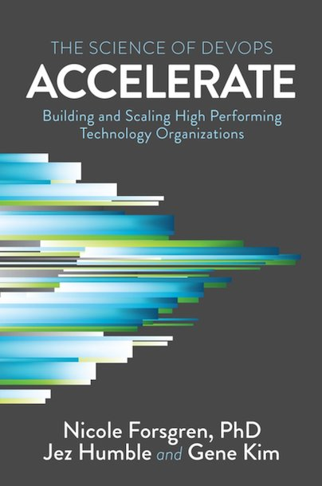

<figure class="figure">
  
</figure>

This seminal book aims to answer one simple yet fundamental question: What makes an organization that develops software successful? This is a topic that has been explored in depth by many, many authors. The key difference is the comprehensive body of research that the authors have compiled. Like, they're using actual science for this, man.

As could be expected, it is a mixture of product development, practices, organizational alignment, and technical practices. The book is not exploring the topics comprehensively, but it's definitely a good start. 

It comes down to [Continuous delivery](https://continuousdelivery.com/), in the end. Who would've thought? Rapid iteration, automation, loose coupling, enablement. You might be familiar with some, or all of these concepts already. However, the key message that I took out of this book is that Continuous delivery is a _business artifact_. It's not about figuring how what makes developers happy. It's about delivering more value, using practices that are repeatable.

### The four key metrics

The research they conducted shows a direct link between organizational performance and software delivery performance. Assessing an organization boils down to [four key metrics](https://www.thoughtworks.com/radar/techniques/four-key-metrics).

- Lead time
- Deployment frequency
- Mean time to restore
- Change fail percentage

Any organization doing well in all four is able to deliver quickly in a safe and sustainable way. Intuitively, it was always clear to me that this was the case, but this book brings strong evidence to confirm it. Measuring these metrics in some way is something that any team can do.

## Verdict

This book is an absolute must-read if you have any interest in delivering value through software for an organization. It's a compact and digestible book. I not only recommend reading it but advocate for it to be read across any organization that you're part of. It's a clear ⭐⭐⭐⭐⭐ stars.
