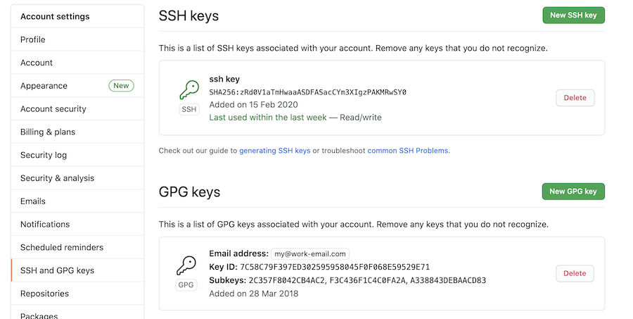
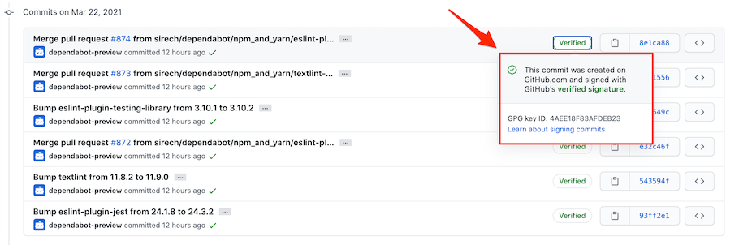

<figure class="figure figure--left">
  
  <figcaption class="figure__caption">
  We'll need your signature, mister
  </figcaption>
</figure>

I've gotten into the habit at work of signing my commits in `git` with my [GPG key](https://gnupg.org/). It adds an extra layer of integrity to the source code, as it enables us to know who produced each commit (if the practice is followed widely).

It requires some initial configuration, but after that, it adds very little overhead.

Even if your organization doesn't have a policy requiring it, I think it's still worth setting up. Let's see how to do it.

Even if it's not required by your organization's policies, I think it's still worth setting up. Let's see how to do it.

## What do I need?

At the risk of being obvious, you need a `gpg` key. You might have one already if you sign your emails or store secrets in [gopass](../storing-passwords-with-gopass/).

If not, you need to create one first. Don't worry, it's free and not too painful. I learned from a colleague to keep my key in a Yubikey. [Check this guide](https://support.yubico.com/hc/en-us/articles/360013790259-Using-Your-YubiKey-with-OpenPGP) if you want to know how to do this.

## Setting up the git configuration

I'm keeping work-related repositories in a different folder, using a [conditional configuration](https://github.com/sirech/shell/blob/master/git/gitconfig#L173-L174). I recommend it because you split cleanly between work and personal stuff. [This post](https://heiber.im/posts/git-client-configurations-for-multiple-identities/) contains extra details.

My configuration, imported from the main `~/.gitconfig`, resides in `~/work/gitconfig`. It enables commit signing for every repository in that folder.

```shell
[user]
  email = my@work-email.com
  signingkey = 7C58C79F397ED302595958045F0F068E59529E71
[commit]
  gpgsign = true
```

The email needs to match with the one assigned to the key. You can see the id of your key by running `gpg --list-keys`. Try to commit something: you'll get asked for the passphrase of your `gpg` key.

## Visualizing signatures

There is a flag for `git log` that displays whether a commit is correctly signed (`%G?`). I use the following alias:

```
lg = log --pretty=format':%C(yellow)%h%Cred%d%Creset %C(green)%G?%Creset %s %C(cyan) %an, %ar%Creset'
```

An excerpt of the commit history looks like this:

```
43d4e36 (HEAD -> master) N fix typo  Mario Fernandez, 13 hours ago
b433463 (origin/master, origin/HEAD) N add on call talk  Mario Fernandez, 4 days ago
aae0b0c U Merge pull request #870 from sirech/dependabot/npm_and_yarn/eslint-7.22.0  dependabot-preview[bot], 7 days ago
```

There is a single letter after the commit hash and branch that provides information about the signature. `N` means unsigned, and `U` means good signature with unknown validity. You can also show the signatures as part of the log output for extra details:

```
[log]
    showSignature = true
```

### Github

You can visualize this information in Github directly. You can add your `gpg` key following [these instructions](https://docs.github.com/en/github/authenticating-to-github/managing-commit-signature-verification). It will end up looking like this:

<figure class="figure">
  
</figure>

Github displays information about verified commits directly on its UI. It does a good of making this information visual and accessible.

<figure class="figure">
  
</figure>

## That's it?

Yes! If you don't already have a `gpg` key, there is a bit of work involved. Honestly, you should probably have one. Adding some extra configuration and separating your config a bit is a good investment. Let's make our delivery a bit more secure, a small step at a time.
