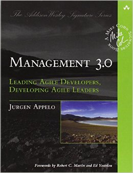

<figure class="figure figure--right">
  
</figure>

Agile development has a complex relationship with management. Some old school organizations want to call themselves agile, without changing anything substantive. So they maintain the same hierarchies as before and keep decisions out of the team. But they use story points. Others react to this and go the opposite way: They have teams where every single thing is supposed to be decided in a "democratic" way. It tends to lead to a lot of meetings and few if any actual decisions.

So, there seems to be still plenty of space for books like this one. This book intends to give you a better toolbox to engage in agile leadership. It's not about a concrete set of steps. If you're looking for a recipe to follow, you're going to be dissapointed.

The book talks about many different aspects of what some call [servant leadership](https://www.thoughtworks.com/insights/blog/leadership-agile-environment). These are some chapters in the book:

- How to energize people
- How to empower teams
- How to develop competence
- How to grow structure

Each chapter gives you a lot of different thoughts and ideas, that you can then consider and adapt for your own organization. As I said, it doesn't get very concrete, so you'll have to do your homework if you want to translate the ideas into actions. It might not be the first book you want to read about agile development.

## Pragmatism

The thing I like the most is the pragmatism throughout the content. Agile development materials are sometimes a bit _naive_. If you call yourself a _self-enabled_ team, everything will be fine! Or so goes the thinking. But some people don't argue in good faith. Or are not that motivated. Or something else. That's a reality that many choose to ignore willfully. And it might lead to frustration.

## Verdict

There are things to learn from this book. It's an interesting view on agile, and it covers a lot of ground on how to organize teams effectively. However, it ends up being a bit too long. I think more aggresive editing would've helped. There's a bit too much rambling for my taste in some parts. That's why I score it with ⭐⭐⭐ stars.
