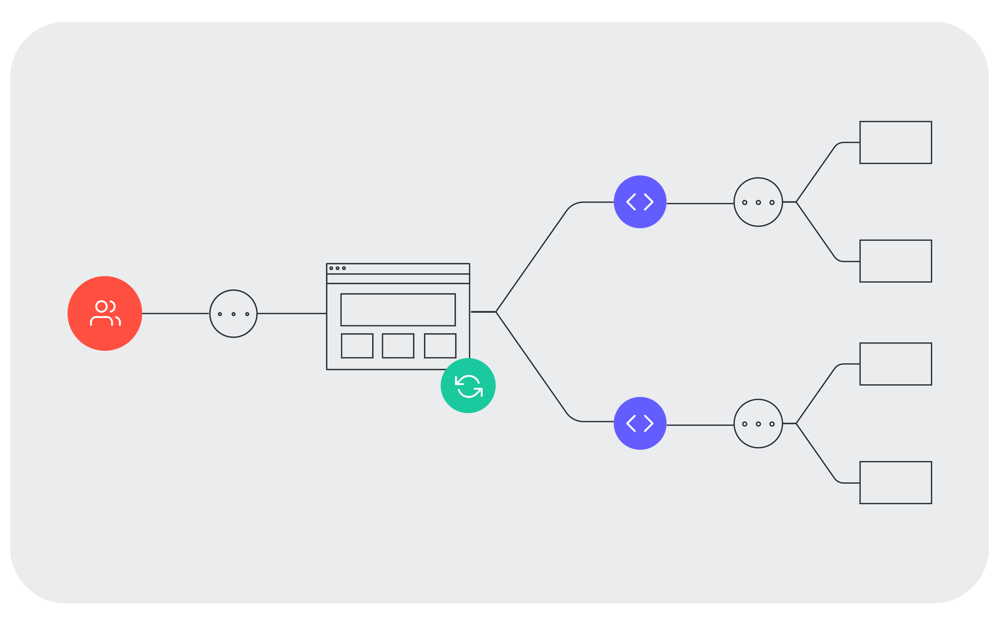
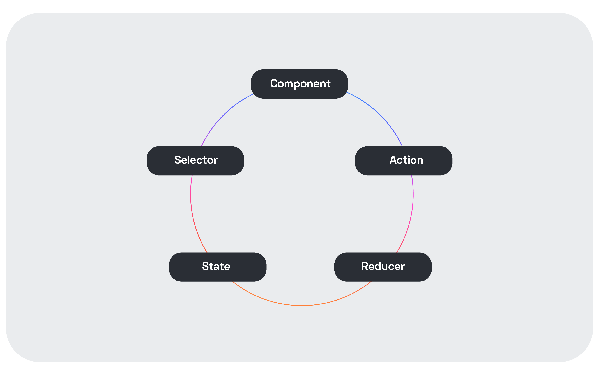
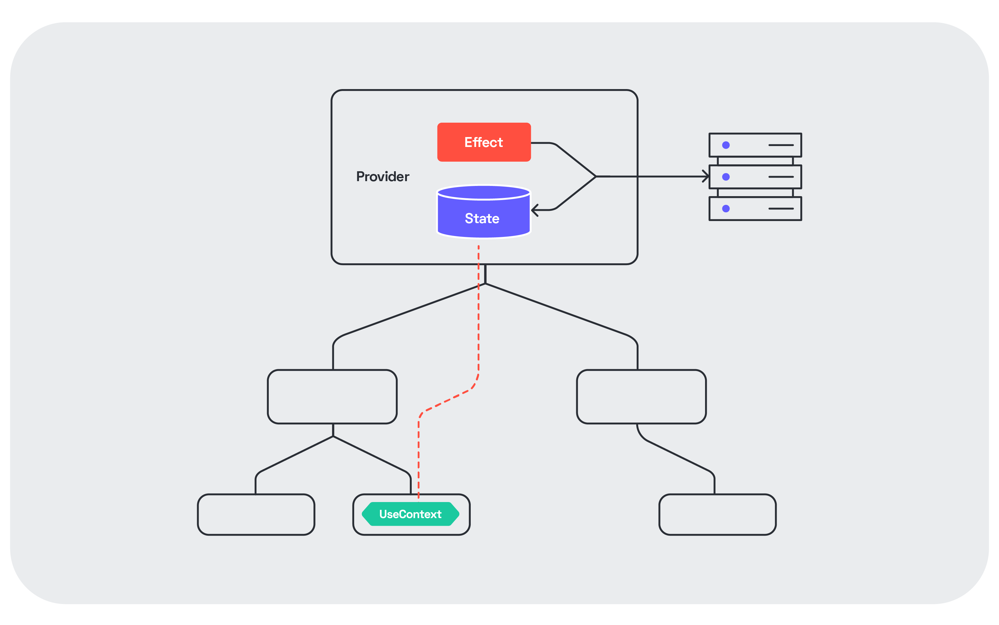

If you're bootstrapping a new [React](https://reactjs.org/) application today, ingrained habits might lead you to pick [Redux](https://redux.js.org/). After all, you **need** to manage the state. _Should you start with Redux, though?_ That has become a valid question. The latest versions of React have improved their offerings for state handling massively. In this post, I want to talk about a simpler approach, using the Context API instead.

## Let's Reminisce: Why Did We Embrace Redux?

A structured approach to state transitions in frontend applications wasn't always the norm. I remember trying to update multiple places in an application back when we were still using jQuery. That wasn't a pleasant experience.

<figure class="figure">
  
</figure>

A change in one place leads to an update somewhere else. Now we need to patch that code as well. But then, there is a third area of the page that depends on the first two. At this point, the logic is convoluted and complex, and the snowball is just getting started.

Compared to that, Redux was eye-opening:

- The complete state of the User Interface (UI) is represented as an object.
- Any action that can modify the state is an object that contains data.
- Pure functions (reducers) ingest those actions and morph the state.
- Through selectors, we shape the data in the state for easy consumption for our components.

It seems self-evident now. But it was magical at the time.

<figure class="figure">
  
</figure>

All the reasons that brought us here still apply. But the context has changed.

## Should Redux Be the Default When Starting a Project?

React's ecosystem has evolved quite a bit lately. Two additions have transformed the landscape and opened new possibilities:

- [Hooks](https://reactjs.org/docs/hooks-intro.html)
- [Context](https://reactjs.org/docs/context.html)

With those two, managing state across a hierarchy tree and triggering side effects is easier than ever. So easy that I claim that Redux is no longer necessary in many cases.

Most frontend applications don't have the rich flow of data that justifies introducing Redux. If you're only fetching some data from an API plus some basic interactions, then Redux is probably overkill.

### The over-abstraction trap

Forms are an example that hit close to home. I've built complex forms using Redux, helped by some supporting libraries. As complexity grows, things get messy. And for what? In the end, the state contained in a form tends to be fairly local. There is little need of exporting a detailed representation of the current state of a bunch of input controls.

Modeling something like a form with Redux can lead to a path of pain. Is the state truly global? A specialized library will often do the job just fine. Nowadays I recommend [Formik](https://formik.org/) for this problem. It's built for that purpose and will cover most requirements you can think of.

## An Alternative: Leveraging the Context API

### What is the Context API?

Let's go to the source to find out:

> Context provides a way to share values between components without having to explicitly pass a prop through every level of the tree.

The Context API is meant to solve the [prop drilling](https://kentcdodds.com/blog/prop-drilling/) problem. You have a component that owns some state. A child component wants to access it. If you pass it through `props` every intermediate component becomes aware of it, even if it's not being used at that level. That adds coupling between the different components that form that part of the page.

I've seen Redux used to handle the challenge of providing state access to components that are further away from the source. For this scenario, the Context API is a valid alternative. One that doesn't need an extra library, bootstrapping code, and further complexity.

### How does it work?

The Context API has two main components. First, we have a `Provider` where we keep the relevant state. It is equivalent to the store in Redux. It can be statically initialized or fetched dynamically. Combined with the `useState` and `useEffect` hooks, we can build the logic we need to keep it up-to-date with little effort.

The second part is the `Consumer`. Any component that is rendered below the `Provider` has access to the information stored in it thanks to it. Another hook, [useContext](https://reactjs.org/docs/hooks-reference.html#usecontext) makes the syntax even more lightweight. Consumers get re-rendered on updates to the state.

Essentially, we're reproducing the store and connecting to the store, which is what we'd do in Redux. But we have far less code and abstractions involved.

### One example: High-level configuration

Let's say we're storing information that is relevant for the whole application. For example, the theme that dictates how other components are displayed. In general, a configuration that influences most components. That probably won't change during the lifetime of the application. If we put it in a `Provider`, every component that needs it can access this state easily.

Theming is such a clear use of Context that it's basically the canonical scenario. It's the example mentioned in React's official documentation as well.

### Another example: Fetching information from a REST API

Imagine you divide your application into subpages, each with its separate URL. The data transfer between pages is limited. Each subpage is practically a small independent application. When you render one of these pages, it needs to fetch data from an API.

However, inside the subpage, the data might be used everywhere. There is no clear component that can assert ownership over the data. I like handling this scenario with the Context API as well. We have a `Provider` that wraps the page and fetches the data asynchronously by contacting a [backend for frontend](https://samnewman.io/patterns/architectural/bff/). That information is stored in the provider. After this, every component on the page uses the data without having to worry about the remote interaction. Thus, we contain that to a component that we test dedicatedly, making the others more independent.

As mentioned, the use of hooks reduces the complexity significantly. Moreover, we avoid having to deal with lifecycle methods, which is a common source of subtle errors.

<figure class="figure">
  
</figure>

### Caveat: The Context API is not for every use case

The Context API is a convenient tool that has a low barrier to adoption. But we have to be aware of its limitations. If the data stored as a value in a `Provider` changes, the whole tree under it will be re-rendered. If you save state that frequently mutates high up in your component hierarchy, that'll lead to flickering. It may compromise the experience of the application. Measuring the performance of your application regularly helps to prevent nasty surprises.

Apart from that, we have to consider how to mutate the state. We can enhance our state stored in the `Provider` with a function to change the state. That way, the components are not merely passive consumers. And closing the cycle, we might long at some point for Redux's Action -> Reducer -> State loop. We can do this as well without Redux.

## Reducers Without Redux

You might be used to Redux's model by now. Modeling state transitions through reducers has become a well-understood problem. It's supported by high-quality libraries like [immer](https://github.com/immerjs/immer). This idea of forsaking Redux sounds scary and revolutionary.

Do not despair, though. You can benefit from Redux's ideas without using Redux the library. The [useReducer](https://reactjs.org/docs/hooks-reference.html#usereducer) hook brings the power of reducers. Once again, the hook syntax makes the code less dense and easier to follow. You keep using reducers as you were before. As an added benefit, it comes in React out of the box.

## Conclusion

This article is not about rejecting Redux. The ideas behind Redux are as valid as ever. Using Redux makes sense if your application is sufficiently complicated. But considering your circumstances is crucial when making an informed decision. React is constantly improving, and it's getting easier to do state management natively.

Developers tend to have a hard time predicting the evolving needs of a system. Given this fact, I advise [building an evolutionary architecture](https://evolutionaryarchitecture.com/). Try to start simple. If your code is structured thoughtfully, there is always the possibility of adding Redux later, as the requirements become clearer. Likely, you'll never reach this point. This approach thus saves you time and lets you iterate faster in reaching your goals. That is a better alternative than introducing technology for the sake of technology.

*This post was published initially in [Auth0](https://auth0.com/blog/starting-a-new-app-with-redux-consider-context-api-first/).*
