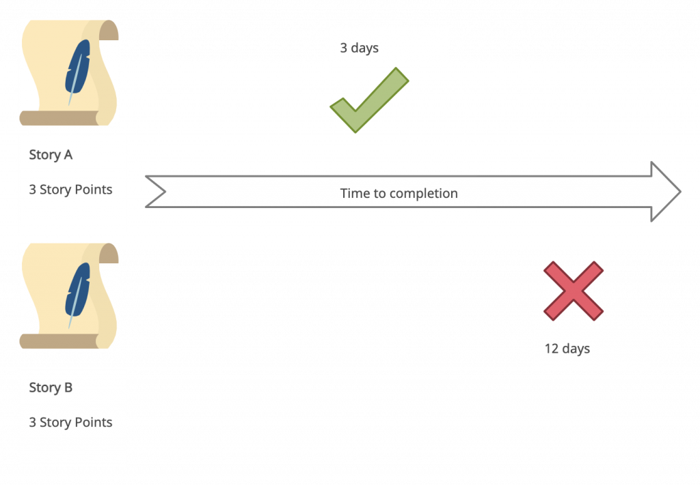
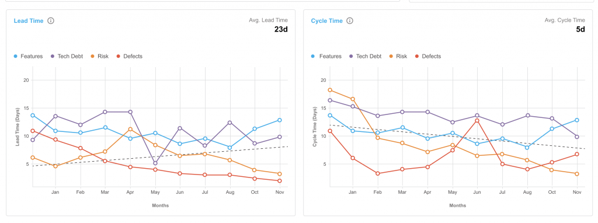

<figure class="figure figure--left">
  
</figure>

Story points are a source of endless debate in agile teams. Every team I've been part of has discussed the role of story points in retrospectives, usually numerous times. 

Having a common understanding of what story points bring to your team prevents many fruitless arguments. It helps everybody work toward the same goal. 

So, let's talk about story points.

## What Are Story Points?

Software projects are unpredictable. This isn't news to anybody in the industry. _[The Mythical Man-Month](https://en.wikipedia.org/wiki/The_Mythical_Man-Month)_, published in 1975, already explores this problem in depth. Estimating the duration of a whole project is difficult, if not impossible. As such, one of the core tenets of agile is accepting this as a fact and dealing with it. Concretely, you break a bigger work package into smaller chunks, called user stories, and estimate them. For that, you use story points. That still doesn't answer the question of what story points are, though. Let's have a look at a [definition](https://www.workfront.com/project-management/methodologies/agile/story-points):

> A story point is a measurement unit that represents the amount of effort required to complete a task.

So, a story point indicates the effort required to complete a piece of work. Different teams use different approaches. Usually, story points are an estimation of either time or complexity. The meaning of this number is vague on purpose. Story points aren't a universal metric, and there's no formula to convert them into hours spent. The number of story points is not an absolute number. Estimations in story points are relative to other items in the team's backlog. It's common to use a [reference story](https://rgalen.com/agile-training-news/2019/12/5/reference-stories-amp-story-points) with a known size to calibrate the numbers. Even if the numbers don't translate to days of work, they're consistent with one another. That way, the product owner can compare the effort involved in different stories. Whatever metric you use, always keep in mind that this is a rough estimation. It's not a commitment. I'll come back to this when I talk about the limitations of story points. To make the lack of accuracy more transparent, you should use [Fibonacci numbers](https://en.wikipedia.org/wiki/Fibonacci_number) so that higher numbers correlate to bigger stories to reflect the uncertainty of the process.

## The Role of the Team in Estimating Stories

The agile team that's going to implement the stories is responsible for the estimations as well. After all, the team members are the ones who understand the scope of the work. If an external stakeholder tries to push estimations onto the team, reject them. That's no longer an estimation but an order. If you want to go in this direction, make deadlines clear and be aware that what you're doing isn't really agile development anymore. Assigning story points to stories happens in a [refinement meeting](https://www.agilealliance.org/glossary/backlog-grooming/) with the whole team involved. Everybody provides estimations independently, and then they discuss the results until they come to a satisfactory agreement.

## The Benefits of Sizing Stories

Sizing stories using story points is very established in the agile world, and it's here to stay. I think it's a useful practice, although not in the way that some people think about it. I'll get to that. In my view, there are two main benefits that you extract from sizing a story:

*   You get a shared understanding within the team. Everybody needs to have a similar picture of the scope of a story. A big disparity in the estimations indicates that people's thinking isn't aligned on that. Sizing a story is not bargaining for the smallest number but rather an exercise in getting more clarity.
*   Through the discussion, you get the opportunity to surface possible risks and challenges. Mitigating risks at this stage helps make delivery more predictable, as you'll find fewer surprises later that block the team.

The numbers are a nice output, but in my view, the more important outcome is the process that helps you figure out this number.

## Understand the Limitations of Story Points

My issue with story points is that people misconstrue them as something they're not. First of all, a story point is a rough approximation. Building detailed release plans based on them is bound to be imprecise. Story points aren't an excuse for going back to waterfall development. A second challenge is that people sometimes take a number of story points as a binding commitment and want to hold teams accountable for inherently unpredictable situations. Have a look at these two stories: 

<figure class="figure">
  
</figure>

I've seen this situation happen many times. Both stories have identical sizes, yet one took much longer than the other to finish. Why is that? There are many valid reasons. The team underestimated the complexity or missed an undiscovered dependency. It's completely normal, and it happens sometimes. If you make a big fuss out of that, the team gets more conservative and defensive as a result. So, this cycle leads to story point inflation and meaningless conversations that don't mitigate any risk. That doesn't help anybody. Last, here's the biggest problem of story points: Story points say nothing about value. A story point measures effort (or some definition of effort). But effort on its own doesn't lead to results. A team delivering loads of story points each iteration might be creating no business value whatsoever. People optimize for what you measure.

## Let's Talk About Value Instead

The focus on story points misses the forest for the trees. You need a better abstraction that takes value created into account. So, let me suggest thinking in terms of [value streams](https://www.plutora.com/blog/value-stream-management). The development stage in the software development cycle is another step in the journey of delivering value to your customers. Instead of focusing on story points, it's important to have the value created in mind. Now, you need the right tools if you want to visualize value streams. If all you track are story points, your conversations won't go past that. A platform like [Plutora](https://www.plutora.com/) enables value stream management for your organization. Consider this dashboard: 

<figure class="figure">
  
</figure>

[Lead time](https://www.plutora.com/blog/lead-time-vs-cycle-time-whats-the-difference) is one of the [four key metrics](https://www.thoughtworks.com/radar/techniques/four-key-metrics) to measure high-performing organizations. If you have an accurate view of it, then you make informed decisions and react quickly to changes. That requires up-to-date data that matches the reality on the ground. A dashboard for lead time, or other metrics, is useful for development teams and stakeholders within your company. You can also tie these metrics to your tactical and strategic goals with a framework like [OKRs](https://www.plutora.com/blog/okr-executive-handbook) if you want.

## What's the Role of Story Points in Value Stream Mapping?

Don't get me wrong, story points are a useful tool. You don't need to go the #NoEstimates route if you're not comfortable with that. Instead, focus on getting lightweight estimations for your tasks, and combine them with the value you expect to create by implementing each unit of work. That gives you a view of the expected return on investment for the stories in your backlog that's an invaluable help to decide the correct priority. Picking the right stories will set you on the right path toward delivering more value to your customers.

## Going Beyond Story Points

So, what should you make of story points? I think they're a useful abstraction to assign a rough size to the pieces of work for an agile team. But that's about it. They're low fidelity estimations. You have to treat them as such. I despair every time I see people trying to read too much into the numbers, leading to unrealistic expectations. Moreover, story points say nothing about value. Creating a continuous stream of value that you deliver to your customers is a far better way to approach software delivery. If you want to read more about value stream management, check out [Plutora's e-book](https://go.plutora.com/mastering-software-delivery-with-value-stream-management) on the topic.

*This post was published initially in [Plutora](https://www.plutora.com/blog/story-points-in-depth-everything-you-need-to-know).*
