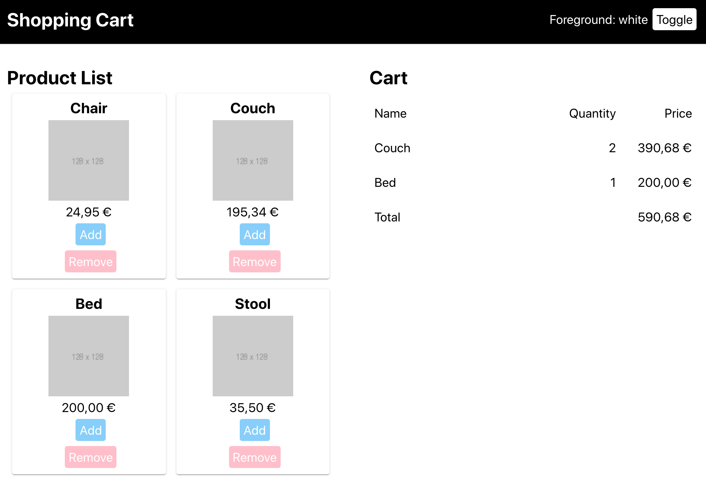
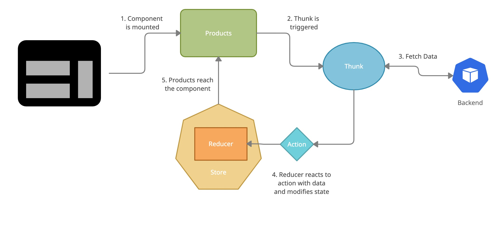

In my previous post, [**Starting a New App With Redux? Consider Context API First**](https://auth0.com/blog/starting-a-new-app-with-redux-consider-context-api-first/), I wrote about the [Context API](https://reactjs.org/docs/context.html) as a viable alternative to [Redux](https://redux.js.org/). In this post, I want to show how a React application using Redux looks when using the Context API.

## First Considerations

I'm assuming that my previous article intrigued you enough that you're considering migrating away from Redux. You have to ask yourself: Is a migration worth it? The approach based on the Context API might be simpler, but that's not enough of an argument on its own to rewrite perfectly functional code.

I can't tell you if your situation merits the change or not. You have to consider your circumstances and decide based on that. Here are some helpful questions:

- Is this application **likely** to change? The benefits of a simpler codebase become apparent when people are regularly working on it.
  
- Is this application **safe** to change? Without a solid base of tests to rely on, a major refactoring is doomed to fail.
  
- Does it make sense from a **business perspective**? I get it. Developers love to work on restructuring their applications. But without alignment with your stakeholders, they may perceive it as technology for the sake of technology.

## A General Approach

Alright, you're still here. You might be thinking: _Let's do this!_. What is the plan? You need _one_. I strongly recommend an incremental approach. Whatever you do, don't do a Big Bang release. Work on small chunks of functionality, and release them bit by bit. You'll thank me later.

Also, be realistic. If your application is big enough, this isn't going to be an immediate transition. In my experience, people often fail to account for the transition period during a migration.

## Enough Talking, Show me the Code!

This article is a practical guide with a working example. I've built a small application bootstrapped with [`create-react-app`](https://github.com/facebook/create-react-app). It implements a simplified shopping cart. This shopping cart has a preconfigured list of products. You can add and remove these products to your cart. The total price gets updated after each operation. Additionally, you can switch between two user interface themes. Here is a screenshot that shows how the application looks like:

<figure class="figure">
  
</figure>

The source code is [here](https://github.com/auth0-blog/example-redux-to-context). The state management uses Redux. I've included a new branch ([context-api](https://github.com/auth0-blog/example-redux-to-context/tree/context-api)) to show how I converted the project to leverage the Context API. To run it, do the following and it'll be available under http://localhost:3000:

<!-- context-migration-start -->
```
yarn
yarn start
```

There are three main areas worth talking about (theming, products, cart). Let's discuss them.

### Introducing Theming

Many websites today allow users to change the theme, like [Github](https://github.com/settings/appearance). You don't want to implement two separate versions of your site, right? A better approach is to define a _theme_, which is a collection of settings such as a color palette, stylings for primary and secondary actions, font sizes, and things like that. You propagate these settings through the application, then style your components accordingly.

A theme is a classic example of state that influences almost every component throughout the app. Moreover, it doesn't change very often unless you have very undecided users. It's an ideal scenario for the Context API.

I'm theming the [Header](https://github.com/auth0-blog/example-redux-to-context/blob/master/src/header/Header.js) component. This component styles itself based on two properties, `foreground`, and `background`.

<!-- context-migration-header -->
```jsx
import PropTypes from 'prop-types';
import cx from 'classnames';
import styles from './Header.module.css';

const Header = ({ foreground, background, toggle }) => {
  return (
    <header
      className={cx(
        styles.header,
        styles[foreground],
        styles[`${background}-bg`],
      )}
    >
      <h1 className={styles.heading}>Shopping Cart</h1>
      <span>Foreground: {foreground}</span>
      <span
        className={cx(
          styles.button,
          styles.header,
          styles[background],
          styles[`${foreground}-bg`],
        )}
        onClick={() => toggle()}
      >
        Toggle
      </span>
    </header>
  );
};

Header.propTypes = {
  foreground: PropTypes.string.isRequired,
  background: PropTypes.string.isRequired,
};
```

When using Redux, the theme resides in the state. The `Header` is connected to the store, and there's a [reducer](https://github.com/auth0-blog/example-redux-to-context/blob/master/src/header/reducer.js) that flips `foreground` and `background` when the user clicks the toggle button.

<!-- context-migration-toggle-theme -->
```js
// action
export const TOGGLE_ACTION = 'theme:toggle';
export const toggleAction = () => ({
  type: TOGGLE_ACTION,
});

// reducer
export const initialState = {
  foreground: 'black',
  background: 'white',
};

const theme = produce((draft, action) => {
  switch (action.type) {
    case TOGGLE_ACTION:
      const tmp = draft.foreground;
      draft.foreground = draft.background;
      draft.background = tmp;
      break;
    default:
      break;
  }
}, initialState);

export default theme;

// connected component
export default connect(
  (state) => state.theme,
  (dispatch) => ({
    toggle: () => dispatch(toggleAction()),
  }),
)(Header);
```

Sweet! How does the Context API version look in comparison? In this case, we're building an extra component, [ThemeProvider](https://github.com/auth0-blog/example-redux-to-context/blob/context-api/src/themeProvider/ThemeProvider.js). It holds the state and makes it available for downstream components through a `Context`. Concretely, using a custom hook `useTheme`. This custom hook is a wrapper around the handy [useContext](https://reactjs.org/docs/hooks-reference.html#usecontext) hook provided by React. It's an elegant way for the consumers to get access to the data.

<!-- context-migration-theme-provider -->
```js
import React, { useContext, useState } from 'react';

const Context = React.createContext();

const ThemeProvider = ({ children }) => {
  const [theme, setTheme] = useState({
    foreground: 'black',
    background: 'white',
  });
  const { foreground, background } = theme;
  const toggle = () =>
    setTheme({ foreground: background, background: foreground });
  const value = { theme, toggle };
  return <Context.Provider value={value}>{children}</Context.Provider>;
};

export const useTheme = () => useContext(Context);

export default ThemeProvider;
```

What about the `Header` component? It doesn't change much, except it's not connected anymore. Instead, we use the `useTheme` hook that we've created:

<!-- context-migration-simple-header -->
```js
const Header = () => {
    const { theme, toggle } = useTheme()
    const { foreground, background } = theme
...
}
```

One thing I like about this implementation is that we get a cleaner set of props. There is a clear difference between the two types of props: The ones passed by the parent and the ones belonging to the provider.

The purpose of a component like `ThemeProvider` is to enable theming for _every_ component. Much like the header does, every other component can access the settings through `useTheme` and style itself, without changes in intermediate components. In fact, this is how libraries like [styled-components](https://styled-components.com/) do it. Unsurprisingly, _styled-components_ supports theming out of the box.

### List of Products as a Provider

Next comes the list of products. This application is fetching the list of available products using a service. For simplicity, the list is hardcoded. In real life, there'd be a backend delivering these results.

Fetching data from a downstream service is an asynchronous operation. Once completed, I include it in the application's state. One way of doing asynchronous operations in Redux is by using [redux-thunk](https://github.com/reduxjs/redux-thunk). When the component is mounted, it triggers the thunk. The thunk runs asynchronously. After finishing, it modifies the state through an action. I know it sounds confusing, so let's have a look at a diagram:

<figure class="figure">
  
</figure>

The [Products](https://github.com/auth0-blog/example-redux-to-context/blob/master/src/products/Products.js) component is both the start and the end of this flow.

<!-- context-migration-products -->
```js
import React from 'react';
import PropTypes from 'prop-types';
import { fetchProducts } from './actions';
import Product from './Product';
import styles from './Products.module.css';

class Products extends React.Component {
  componentDidMount() {
    this.props.fetchProducts();
  }
  
  render() {
    return (
      <>
        <h2>Product List</h2>
        <ul className={styles.list}>
          {this.props.products.map((product) => (
            <Product key={product.name} {...product} />
          ))}
        </ul>
      </>
    );
  }
}
```

The action and the reducer aren't particularly interesting. It's only triggering an asynchronous call and putting the result as-is in the state.

If you think about it, there is a bit too much indirection for what is a fairly simple operation. I want to trigger the request, wait for it, and reflect that update in the state. We're using a more direct approach with the Context API.

I like to use [react-use](https://github.com/streamich/react-use) for this use case. It's a collection of [hooks](https://reactjs.org/docs/hooks-intro.html) that provide a thin layer of abstraction on top of the standard `useState` and `useEffect`. Let's see how to fetch the data with the help of [useAsync](https://github.com/streamich/react-use/blob/master/docs/useAsync.md). Again, we're extracting the data fetching to a provider. Planning ahead, other components are going to be interested in the list of products as well. You can find it [here](https://github.com/auth0-blog/example-redux-to-context/blob/context-api/src/productsProvider/ProductsProvider.js).

<!-- context-migration-products-provider -->
```js
import React, { useContext } from 'react';
import { useAsync } from 'react-use';
import { fetchProducts } from './fetchProducts';

const Context = React.createContext([]);

const ProductsProvider = ({ children }) => {
  const state = useAsync(fetchProducts, []);
  if (state.loading) {
    return <>Loading...</>;
  }
  if (state.error) {
    return <>Error!</>;
  }
  return <Context.Provider value={state.value}>{children}</Context.Provider>;
};

export const useProducts = () => useContext(Context);
export default ProductsProvider;
```

The structure is similar to the `ThemeProvider`. Notice that we don't render the children until we have the data. That way, there's no need to account for the empty state in the children components.
Simple, isn't it?

As a bonus, I get two extra variables in my local state, `loading` and `error`. My component provides feedback to the user in these two cases at little extra cost. I've implemented this behavior in the past in Redux. To get the same functionality, I had to add extra actions to trigger in the thunk, as well as extend the reducer. It's cumbersome, and it doesn't benefit from Redux's controlled state transitions.

### A Shopping Cart as a Provider

The last part is the shopping cart. The `Cart` itself receives the list of items and the total price. There's no logic here. This [component](https://github.com/auth0-blog/example-redux-to-context/blob/master/src/cart/Cart.js) is purely representational.

<!-- context-migration-cart -->
```js
import PropTypes from 'prop-types';
import Heading from './Heading';
import Item from './Item';
import Summary from './Summary';

const Cart = ({ cart, total }) => {
  return (
    <>
      <h2>Cart</h2>
      <section className={styles.table} data-testid="cart">
        <Heading boxed></Heading>
        {cart.map((item) => (
          <Item key={item.name} {...item}></Item>
        ))}
        <Summary boxed price={total}></Summary>
      </section>
    </>
  );
};

Cart.propTypes = {
  cart: PropTypes.arrayOf(
    PropTypes.shape({
      name: PropTypes.string.isRequired,
      quantity: PropTypes.number.isRequired,
      price: PropTypes.string.isRequired,
    }),
  ),
  total: PropTypes.string.isRequired,
};
```

There are two actions, adding a product to a cart and removing it. The trigger is in the product list, so they're attached to the individual products.

<!-- context-migration-simple-product -->
```js
<Product
  key={product.name}
  {...product}
  onAdd={() => addToCart(product.name)}
  onRemove={() => removeFromCart(product.name)}
/>
```

The [reducer](https://github.com/auth0-blog/example-redux-to-context/blob/master/src/cart/reducer.js) is trickier. Adding an element to the cart means looking for it in the list or adding a new element if it didn't exist. Then we increase the quantity. You want to avoid duplicating state, so you don't add any details that we store in the list of products, such as the price.

<!-- context-migration-cart-reducer -->
```js
import produce from 'immer';
import { ADD_TO_CART, REMOVE_FROM_CART } from './actions';
const cart = [];

export const initialState = { cart };

const findOrAdd = (cart, name) => {
  let item = cart.find((elem) => elem.name === name);
  if (item) {
    return item;
  }
  item = { name, quantity: 0 };
  cart.push(item);
  return item;
};

const remove = (cart, name) => {
  let item = cart.find((elem) => elem.name === name);
  if (!item) {
    return;
  }
  item.quantity -= 1;
};

const reducer = produce((draft, action) => {
  switch (action.type) {
    case ADD_TO_CART:
      const item = findOrAdd(draft.cart, action.payload);
      item.quantity += 1;
      break;
    case REMOVE_FROM_CART:
      remove(draft.cart, action.payload);
      break;
    default:
      break;
  }
}, initialState);

export default reducer;
```

There're two interesting details here to mention:

- The state **has** to be immutable. A library like [immer](https://github.com/immerjs/immer) simplifies the code quite a bit.
  
- All the code handling the list part is awkward. An alternative is using [normalizr](https://github.com/paularmstrong/normalizr) and storing our data in the state in a way that's easier to manipulate.
  The last part is the [selector](https://medium.com/@matthew.holman/what-is-a-redux-selector-a517acee1fe8). The state contains all the information that we need to represent the cart. But it can't be used directly by the component. We need to combine the `products` and the `cart` to get the prices. The selector is [here](https://github.com/auth0-blog/example-redux-to-context/blob/master/src/cart/selectors.js).

<!-- context-migration-selector -->
```js
import { createSelector } from 'reselect';

const enrich = (item, products) => {
  const product = products.find((e) => e.name === item.name);
  const price = (parseFloat(product.price) * item.quantity).toString();
  return { ...item, price };
};

export const fullCartSelector = createSelector(
  (state) => state.products.products,
  (state) => state.cart.cart,
  (products, cart) =>
    cart
      .filter((item) => item.quantity > 0)
      .map((item) => enrich(item, products)),
);

const sum = (cart) => {
  const total = cart.reduce((acc, item) => acc + parseFloat(item.price), 0);
  return total.toString();
};

export const totalSelector = createSelector(fullCartSelector, (cart) =>
  sum(cart),
);
```

The selectors contain some logic that we don't want to run more often than necessary. [reselect](https://github.com/reduxjs/reselect) is a standard library to create performant selectors in React.

#### How about a Cart full of Context?

And now, let's see how the cart looks using the Context API. Instead of a reducer, we have a [CartProvider](https://github.com/auth0-blog/example-redux-to-context/blob/context-api/src/cartProvider/CartProvider.js):

<!-- context-migration-cart-provider -->
```js
import React, { useContext } from 'react';
import { useImmer } from 'use-immer';

const Context = React.createContext();

const CartProvider = ({ children }) => {
  const [cart, updateCart] = useImmer([]);
  
  const addToCart = (productName) => {
    updateCart((draft) => {
      let item = draft.find((elem) => elem.name === productName);
      if (!item) {
        item = { name: productName, quantity: 0 };
        draft.push(item);
      }
      item.quantity += 1;
    });
  };
  
  const removeFromCart = (productName) => {
    updateCart((draft) => {
      let item = draft.find((elem) => elem.name === productName);
      if (item) {
        item.quantity -= 1;
      }
    });
  };
  
  return (
    <Context.Provider value={{ cart, addToCart, removeFromCart }}>
      {children}
    </Context.Provider>
  );
};

export const useCart = () => useContext(Context);

export default CartProvider;
```

The logic is similar to the reducer from before. I'm even using [use-immer](https://github.com/immerjs/use-immer), a hook that integrates _immer_.
The `Cart` combines the information from two providers, `ProductsProvider` and `CartProvider`. As there's no store, these aren't exactly selectors. The [concept](https://github.com/auth0-blog/example-redux-to-context/blob/context-api/src/cart/Cart.js) is close enough, though:

<!-- context-migration-cart-memo -->
```js
const Cart = () => {
  const products = useProducts();
  const { cart } = useCart();
  const extendedCart = useMemo(() => fullCart(products, cart), [
    products,
    cart,
  ]);
  const price = useMemo(() => total(products, cart), [products, cart]);
  
  return (
    <>
      <h2>Cart</h2>
      <section className={styles.table} data-testid="cart">
        <Heading boxed></Heading>
        {extendedCart.map((item) => (
          <Item key={item.name} {...item}></Item>
        ))}
        <Summary boxed price={price}></Summary>
      </section>
    </>
  );
};
export default Cart;
```

You'll notice that I'm wrapping the selector functions with [useMemo](https://reactjs.org/docs/hooks-reference.html#usememo). The function gets called only when one of the dependencies changes, avoiding unneeded rendering. Doing this won't prevent every re-render issue when using the Context API, but it helps mitigate it.

To be honest, this is the type of composite state with actions across different parts of the page where Redux starts making a bit of sense. There's one more hook to keep in mind for cases like this. With [useReducer](https://reactjs.org/docs/hooks-reference.html#usereducer), reducers are available to you without having to introduce Redux. If you end up building an application complex enough, a migration will be a smaller jump.

## Lightweight Redux

While I've talked quite a bit about the benefits of the Context API, it's fair to mention that Redux hasn't stood still these past few years. There're ways of improving readability and maintainability.

First, you have ways of making Redux code more lightweight. Newer versions of Redux do have support for [hooks](https://react-redux.js.org/api/hooks). Thanks to `useSelector` and `useDispatch` you get a simpler integration than by using the old `connect` function, although simple state transitions still end up being verbose.

Secondly, there is a library called [Redux Toolkit](https://redux-toolkit.js.org/) that brings, in their own words:

> The official, opinionated, batteries-included toolset for efficient Redux development
> It provides support to simplify creating a store, reducers, and actions according to well-established patterns. As you see, you have options to beat your code into shape. This underlines once again the need to consider carefully what's the best solution for your situation.

## Summary

To recap, should you migrate your existing application built with Redux to use the Context API and hooks? Maybe? It depends! Make sure to think it through and evaluate what you expect to get out of it.
If you decide to move forward, let this [repository](https://github.com/auth0-blog/example-redux-to-context) be a source of inspiration. Remember that you don't need a complete rewrite. Perhaps just using hooks is enough of an improvement for you. Maybe some parts of your application benefit from Redux. These are decisions to make having all the context in mind.

*This post was published initially in [Auth0](https://auth0.com/blog/redux-to-context-practical-migration-guide/).*

