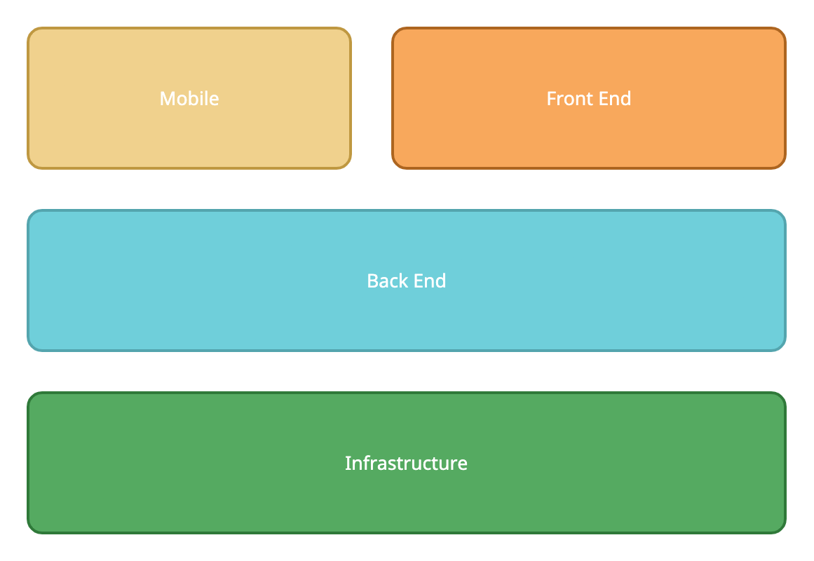
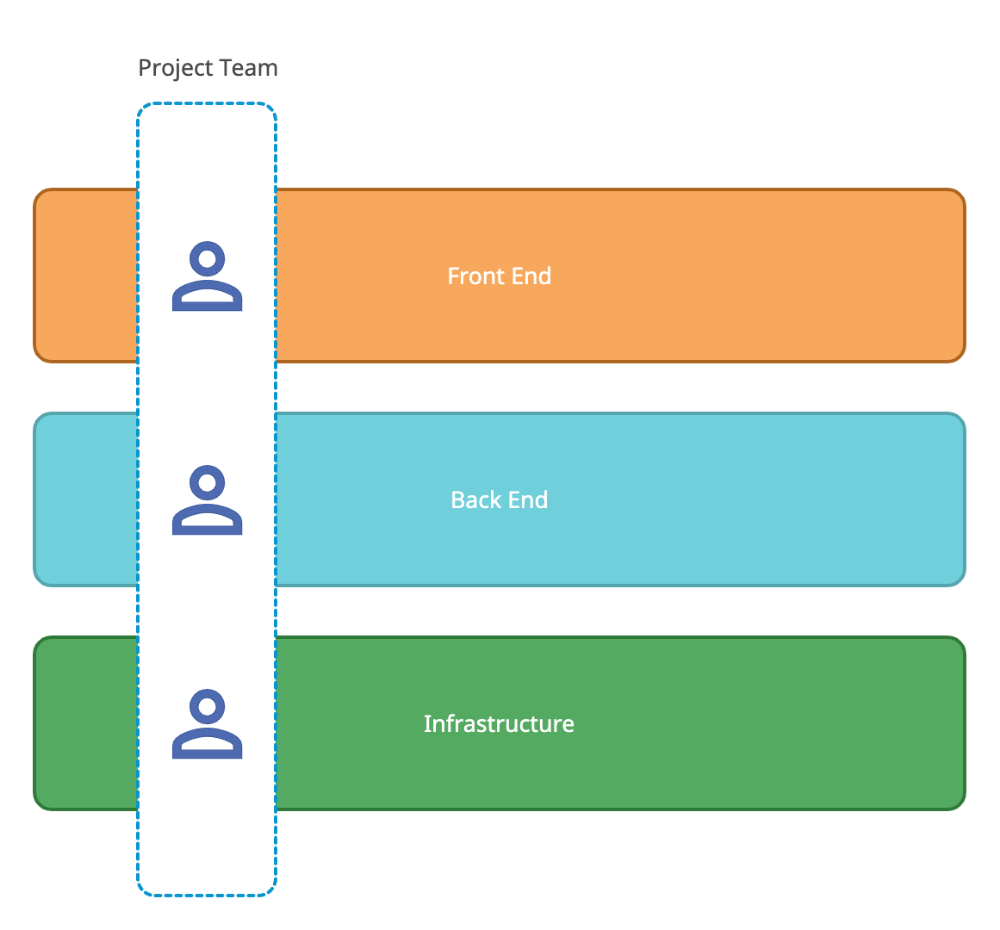
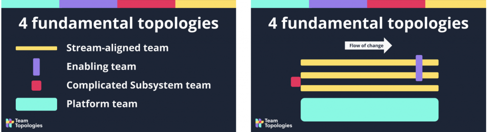

<figure class="figure figure--left">
  
</figure>

Do you belong to an organization that is experiencing rapid growth? Are you shoring up your software development capabilities because [software is eating the world](https://a16z.com/2011/08/20/why-software-is-eating-the-world/)? Congratulations, that's a nice problem to have! But it's a problem nonetheless. 

Delivering software quickly, reliably, and safely (also known as [continuous delivery](https://continuousdelivery.com/)) is no easy task. Surprisingly, the challenge is more about people than technology. Choosing the right structure reduces friction and leads to better outcomes, as books like _[Accelerate](https://itrevolution.com/book/accelerate/)_ by Nicole Forsgren show. 

In this post, I'm going to talk about different types of organizational structures. I'll talk about some older models and some more modern alternatives.

## Why You Need an Organizational Structure

According to [Conway's Law](https://en.wikipedia.org/wiki/Conway%27s_law), the software that an organization produces mirrors its shape. Or, as Eric S. Raymond said, "If you have four groups working on a compiler, you'll get a 4-pass compiler." Technical leaders spend a lot of time thinking about software architecture, for good reason. There are countless horror stories about companies where progress came to a grinding halt due to an impenetrable architecture. 

If the team's structure has an impact on the architecture, it follows that it's worth investing effort in building that structure the way you want it. This is known as the [Inverse Conway maneuver](https://www.thoughtworks.com/de/radar/techniques/inverse-conway-maneuver). Moreover, a structure is a tool to enhance alignment as well.

## Think About What You're Trying to Accomplish First

Before you get all excited and start drawing diagrams, stop and think for a second. Mindless reorganizations done by clueless management are an endless source of _Dilbert_ comic material. 

Thus, let's try to think about successful cases. You want teams that deliver quickly without breaking things. And you want to retain that speed as your organization scales in size. Teams need a certain level of independence. Otherwise, they'll spend most of their time waiting for others. They have to be autonomous.

Autonomy is desirable but insufficient. You need teams to be aligned as well. If they don't move in one direction, their speed will be just a local optimization that won't lead to a company-wide outcome.

## Old-School Structures

Let's have a look at some older structures. People don't consider them the blueprint to follow nowadays. Regardless, understanding their shortcomings is a valuable exercise.

## Technology-Based Teams

A classical way of setting up teams is grouping people by their function. So you have something like this: 

<figure class="figure">
  
</figure>

You have groups like front end, back end, infrastructure, and mobile. Developers work with other developers using the same tools, which in theory allows them to collaborate more closely without having to learn too many distinct technologies. 

The problem is that a product doesn't have such clear boundaries. Your users couldn't care less how your back end is structured. They're interested in how your product works. To deliver any useful feature, it needs to go through multiple teams. Each jump adds coordination effort and delays, thus increasing friction. This setup fosters silos, leading developers to worry about their domain only. In the end, the barriers between teams become higher.

## Matrix Organization

To address this issue, somebody invented the matrix organization. You have the functional groups from the previous setup, but this time you pick people from each area to form project-based teams. These teams work together for the duration of the project and then disband. The cycle happens again for subsequent projects. 

<figure class="figure">
  
</figure>

According to Wikipedia, it comes from the [aerospace industry](https://en.wikipedia.org/wiki/Matrix_management), back in the 50's. Aviation is not the first thing that comes to mind when you think of agility, so we're already off to a bad start. I see two main problems with the model. 

The first drawback is that in this model individual contributors end up having two different managers. If they're not aligned, they'll pull those poor developers in two different directions and introduce all kinds of dysfunction in the teams. One hierarchy is messy enough, let alone two.

The second drawback is treating software delivery as a project. You don't build a piece of software in one go and then hand it over. It requires constant iteration, and teams greatly benefit from the familiarity of working together in the same system for a while. This approach is now out of favor, with [product thinking](https://www.martinfowler.com/articles/products-over-projects.html) as an alternative.

## Modern Approaches

I don't like technology-based splits or project-based teams. What is the alternative then? What is the correct type of team to deliver software?

A team should be cross-functional and autonomous. This ideal team has people with all the required skills. End-to-end responsibility minimizes handovers. By staying together over a longer period, the team members can iterate frequently and attain a high level of context.

Additionally, following [agile practices](https://www.agilealliance.org/agile101/) is the best way to deliver software. Quick iteration and constant feedback are a repeatable way of achieving results.

## Spotify Model

The Spotify model is somehow best known for [not being in use at Spotify](https://www.agility11.com/blog/2020/6/22/spotify-doesnt-use-the-spotify-model) anymore. Nevertheless, it gets many things right.

In essence, it's a refinement of the matrix model. Instead of agile teams, they call them squads. Those squads group into tribes based around a domain. To prevent isolation and teams fixing the same problems multiple times, you form chapters that contain developers working on similar things. (Others call it [communities of practice](https://adaptmethodology.com/communities-of-practice-tools/)). A core aspect of Spotify's implementation is that teams are autonomous and highly independent.

If you read about Spotify's experience, you'll see that they struggled with the dual hierarchy problem from the matrix model. While teams were able to function individually, their interactions were messy. At a certain scale, not every team is working on user-facing applications. It makes sense for an organization to fix cross-cutting concerns. The last model in this article addresses this situation.

## Team Topologies

The book _[Team Topologies](https://teamtopologies.com/)_ by Matthew Skelton and Manuel Pais builds on the concept of autonomous, cross-functional teams. Its key insight is that one team type doesn't serve all the needs of a growing organization. The authors identify four different kinds of teams:

*   _Stream-aligned team._ Owns an entire slice of the business domain end to end. Similar to a product team.
*   _Enabling team._ Helps stream-aligned teams acquire capabilities they lack.
*   _Complicated subsystem team._ Owns a system that requires deep and specific expertise.
*   _Platform team._ Provides an internal product. Stream-aligned teams use this product as a service to accelerate development.

In a typical organization, most teams are stream-aligned and get support from the other specialized teams where necessary. The second major insight from _Team Topologies_ is that the interactions between teams are well defined.

*   _Collaboration._ Teams work together for a while. It can be to establish practices or new technologies or discovery.
*   _X-as-a-Service._ One team provides a service to other teams. It's treated as a regular product and consumed internally.
*   _Facilitation_: One team works with another team until they build a certain capability.

I don't remember reading about structured interaction models before, but it makes a lot of sense. If I think about my previous experience, I can picture many examples of teams not managing to work together because they didn't have a clear agreement on how they would interact. 

<figure class="figure">
  
</figure>

I like this model a lot because it's actionable and provides a blueprint to organize multiple teams effectively. It's much more flexible than something like [SAFe](https://www.thoughtworks.com/radar/techniques/safe).

## Find the Approach That Works for You

The biggest mistake that you can make is copying what somebody else did without considering your circumstances. It's unlikely to work. It's basically a [cargo cult](https://en.wikipedia.org/wiki/Cargo_cult).

A more sensible approach is to take a set of general principles like agility or autonomy and build a structure that makes sense for you. If you want to hear about the experiences of others on this journey, I've provided a bunch of resources that might be useful for you. Another place to find advice is LinearB's [Dev Interrupted Community](https://linearb.io/dev-interrupted-community/). It's a [Discord](https://discord.com/) community where technical leaders hang out. Having a place to ask other practitioners directly is very valuable to learn from their successes (and their mistakes).

*This post was published initially in [LinearB](https://linearb.io/blog/engineering-organizational-structure/).*
