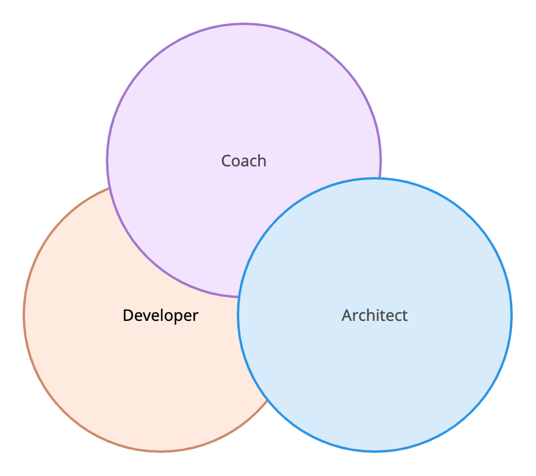

<figure class="figure figure--left">
  
</figure>

Technical leadership is a broad subject. Authors like [Michael Lopp](https://randsinrepose.com/) have spent years talking about leadership. Yet they still have plenty of things to [say](https://www.oreilly.com/library/view/the-art-of/9781492045687/).

At first glance, you'd think this is a straightforward question: _What does a technical leader do?_ Once you start digging, you realize there isn't a clear and concise answer to that. It's problematic because the unstated expectation for many senior engineers is that they'll eventually transition to a leadership position. And when that finally happens, they struggle because nobody prepared them for that moment.

Every organization needs to consider what they expect from their technical leaders lest they promote people who are unprepared for a role that they don't actually want. In this post, I want to talk about technical leadership in the context of an agile team.

## Different Names for Technical Leaders

If you scroll through enough job postings on LinkedIn, you'll notice that tech leadership positions don't have consistent names. The ones I've encountered the most are

*   Engineering manager
*   Team lead
*   Tech lead

While every company has its unique understanding of these positions, you can safely make some assumptions about what to expect. Usually, an engineering manager will focus more on the people side, whereas a tech lead will have a stronger focus on technical aspects. The team lead falls in the middle of the spectrum.

A tech lead is responsible for the technical output of the team: technology choices, architecture decisions, system design, and so on. Even if there's a tech lead in the team, it doesn't mean that the rest of the development team doesn't own this part.

The people side is about personal development, enabling the growth of others on the team. Some companies make that explicit by having them report to the technical leader and see the role as a manager rather than as an individual contributor. Honestly, I don't think it makes that big of a difference. Whether you're officially a people manager or not, your behavior shouldn't vary much. I'll get to that when I speak about servant leadership. 

For the rest of this article, I'll assume that a technical leader has both responsibilities. Let's talk about them.

## Three Circles of Responsibility

A technical leader's main job is to ensure that a team delivers successfully. Technology is a tool to deliver business results, and that has to be the first thing on your mind once you move to a leadership position.

That remains a bit too generic! I still haven't answered the crucial question: _What does a technical leader do?_ Let's split the question into smaller parts. A helpful model is [Pat Kua's circles of responsibility.](https://www.thekua.com/atwork/2015/06/tech-lead-circles-of-responsibility/)

<figure class="figure">
  
</figure>

As a technical leader embedded in a team, you're going to wear three different hats. Each is equally important, and it's up to you to keep the right balance at all times. Nobody said being a leader is easy!

### Developer

First of all, you're still, to some extent, a **developer** on the team. I strongly believe that a technical leader is more effective if she's involved in the team's day-to-day activities. Those include implementing features and reviewing code. So you've got to remain hands-on to a certain extent. Every situation is different, but you should aim to devote at least 30 percent of your time to that. 

Sitting in meetings all day atrophies your technical instincts, slowly but [inexorably](https://wiki.c2.com/?ArchitectsDontCode). Software development evolves rapidly. It's annoying to be told how to do things by somebody who's long ceased to be technical. Don't be that person.

### Architect

The next hat you wear is as an **architect** for the team. A team needs to have a technical vision based on its business goals, a vision that is known and shared by everybody on the team. It evolves as requirements change and new information becomes available. Architecture is a word that reminds developers of heavyweight documentation and committees. It doesn't have to be that way, though. Developing an [evolutionary architecture](https://evolutionaryarchitecture.com/) is your best bet to keep alignment between business and technology.

I've said it before, but it bears repeating: being responsible for the architecture doesn't mean you have to do it yourself. It means that you have to make sure it happens. Keep in mind the difference. If the team doesn't have any input in establishing this architecture, they won't see it as theirs.

### Coach

This is the last hat, and it's the fuzziest one. I prefer to think of this responsibility as being a **coach** instead of a manager or a boss. It puts you in the right mindset.

You might be the manager of part or all of the team. Nevertheless, it's more productive to consider how you can enable others to become better. Their growth is a positive outcome for the team. You're less of a bottleneck as they take extra ownership, thus boosting their confidence. It's a virtuous cycle that leads to a more resilient team that doesn't rely on heroic individual efforts to succeed.

In my view, the most important thing to do in this role is [foster a cultivation culture](https://www.thoughtworks.com/insights/blog/accelerate-employee-s-growth-fostering-cultivation-culture). Some skills that will help are

*   Active listening
*   [Giving actionable feedback](https://www.thoughtworks.com/insights/blog/5-ways-faster-and-more-effective-feedback)
*   Facilitating discussions instead of owning them
*   Being creative in finding growth opportunities

### There's Not Enough Time for Everything

After seeing this long list of things you're responsible for, you might be thinking, _"There is no way I'll have time for all this stuff!"_ You are completely right. Most newly anointed leads overburden themselves by trying to do everything. They feel responsible for every outcome and involve themselves in every discussion.

Rest assured, there aren't enough hours in a day. Learning to delegate is of paramount importance to keep your sanity. Moreover, it's an antidote against micromanagement.

## Servant Leadership

We went over the blocks that form the job of a technical leader in the previous section. How do you approach implementing them, though? I think that there is one answer for that: [Servant leadership](https://en.wikipedia.org/wiki/Servant_leadership).

The idea of servant leadership is that [high-performing agile teams](https://www.thoughtworks.com/insights/blog/leadership-agile-environment) run on their own for the most part. The best technical leaders I've observed stay in the background, saying relatively little. However, if you look under the hood, their impact is undeniable. Let's go over some anti-patterns that are a sign that something is going seriously wrong.

*   You're regularly telling others what to do. Giving guidance is fine, especially in a junior team. But if that's the norm, people won't think for themselves.
*   Seniority and title is a decisive factor in discussions.
*   You handle mistakes with punishment instead of as an opportunity to learn.

You don't need a fancy title to be a leader. In fact, anybody in the team can contribute by taking ownership of part of the delivery. Instead of waiting for a promotion, you should actively start demonstrating and building those skills.

## Tech Leadership Is a Journey

Tech leadership doesn't have a clearly defined start and end. If you read the book _[Talking with Tech Leads](https://www.patkua.com/media/books/talking-with-tech-leads/)_, you'll notice that people from very different backgrounds and levels of experience end up in a tech leadership position. It's not an easy transition, and it's normal to be lost. I've been leading software delivery teams for six years, and I still regularly find myself in situations where I don't know what to do.

The right decision depends so much on the concrete setup and the context. It's frustrating that giving concrete advice is so challenging. One thing that has helped me a lot is learning from the experiences of others. I've listed a couple of resources throughout the article. Additionally, I suggest [LinearB's Dev Interrupted Podcast](https://linearb.io/dev-interrupted-podcast-2/) as another source of inspiration for aspiring technical leaders. Each episode features a senior leader from a well-known company sharing their knowledge about topics like leadership or engineering practices. At around thirty minutes each, the episodes are easily digestible and packed with actionable advice.

*This post was published initially in [LinearB](https://linearb.io/blog/software-team-lead-responsibilities/).*
