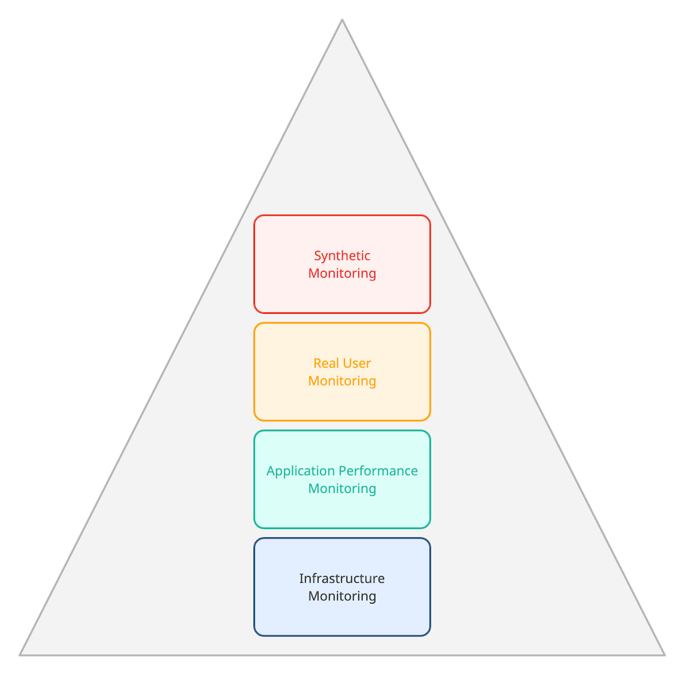

<figure class="figure figure--left">
  
</figure>

Monitoring is a must-have for any serious application. You can't hope to run a highly available system if you don't have real-time information about its state. In this day and age, it's almost negligent to forsake this [cross-functional requirement](https://en.wikipedia.org/wiki/Non-functional_requirement).

Monitoring has many facets that can be covered by using slightly different tools. Some of these tools focus specifically on technical aspects. One example is the state of the infrastructure or the errors observed in a microservice. That's unquestionably important, but it's also something that doesn't say much about the way users engage with your software. That's why you want to enhance your monitoring capabilities with tools that look at your application from the user's perspective. It's a valuable view that uncovers many hidden issues. 

In this post, I want to talk about synthetic transaction monitoring. It's a way of monitoring a system by simulating actions from real users.

## What Are Synthetic Transactions?

The term "synthetic transaction" isn't one that you hear every day. So let's talk about this before we move to the monitoring part. A [synthetic transaction](https://www.sciencedirect.com/topics/computer-science/synthetic-transaction) is a script or a tool that simulates the actions of a user in an application. 

Let's assume we're talking about a web application. It can run against an API. Most modern applications expose some APIs publicly, and those are natural candidates to check. A user doesn't typically interact with your APIs directly, although there are cases where you want to save a sequence of calls that come from real activity. 

In general, users access your application from a real browser. Thus, a synthetic transaction has to run in this environment as well. In this case, the script simulates actions performed by a user in her browser. These actions, from beginning to end, fulfill a flow in your system. 

One way or the other, you want to store these actions in a format that lets you run them repeatedly. Then you can execute them again at your leisure.

## Monitoring on Top of Synthetic Transactions

As you might have guessed already, [synthetic monitoring](https://en.wikipedia.org/wiki/Synthetic_monitoring) is about using the synthetic transactions we just discussed to monitor your system. Essentially, your monitoring tool runs the scripts that you defined from different locations at regular intervals. Then it compiles the results and aggregates the data for you. 

When you use this type of monitoring, there are a few things that you're going to observe:

*   You know if these transactions are working or not.
*   You have a history. It keeps track of when every run happened and its result.
*   You have access to the timing information for each run with detailed granularity.

Compared to other monitoring mechanisms, there is a crucial difference: The monitoring itself is the one triggering traffic in your application.

## Synthetic Monitoring is Pretty Useful

Now that we know what this kind of monitoring does, it's time to ask about its value. What's in it for you? Is it worth incorporating this method into your ecosystem? 

I briefly alluded to this already. The most significant value that you get out of synthetic monitoring is a new perspective. Given that you simulate actual interactions, the results are close to how your users experience your application, which is a powerful signal. Think of it from a business perspective: your stakeholders might not particularly care about the memory usage of the servers, but I'll bet they are keenly interested in knowing if your checkout process remains operational. 

So that's the first benefit. You ensure that your core flows are still running. That sounds basic, but you wouldn't believe how often organizations don't know for sure if their application, you know, _works_. 

Additionally, you get detailed performance information. All these runs that your monitoring system stores show how fast your application is for real-world flows. Remember that performance [matters](https://www.gigaspaces.com/blog/amazon-found-every-100ms-of-latency-cost-them-1-in-sales). 

Last, you get the opportunity to transition to an alert-based approach. If core flows of the application are failing, that sure sounds like a problem you want to fix ASAP, doesn't it? You probably want to connect these alerts to your [incident management](https://en.wikipedia.org/wiki/Incident_management) software to ensure that whoever is on call is notified quickly.

## Setting Up Synthetic Monitoring

Setting up this monitoring varies, depending on the monitoring tool of your choice, although there are some similarities between them. If you monitor APIs, it's about configuring the calls to the right endpoints plus passing the appropriate headers and parameters. It looks a lot like using [Postman](https://www.postman.com/). If you're checking authenticated routes, you need to provide credentials using, for instance, [OAuth2](https://oauth.net/2/). 

Meanwhile, browser-based tests typically use an interface where you combine several navigation steps, assertions, and other primitives to build a user's journey through your website. If you prefer staying close to the code, they tend to support custom scripting through [JavaScript](https://developer.mozilla.org/en-US/docs/Web/JavaScript).

## The Blurry Line Between Testing and Monitoring

I don't know about you, but to me, these synthetic transactions sound suspiciously like [end-to-end testing](https://www.browserstack.com/guide/end-to-end-testing). When does testing end and monitoring start? 

That's a blurry line! Look at it through two lenses:

*   In terms of time, testing happens **before** a release and monitoring **after** the release.
*   In terms of intention, you test to prevent errors from getting to your users, and you monitor to find errors as quickly as possible.

This is a good mental model, but the faster you get as an organization, the harder it is to tell them apart. If you follow the principles behind [Accelerate](https://itrevolution.com/accelerate-book/), one of the [four key metrics](https://www.thoughtworks.com/radar/techniques/four-key-metrics) is the Mean Time to Restore (MTTR). Optimizing that metric requires rapid detection of a faulty deployment, which is close to impossible without precise and reliable monitoring. 

It feels to me that as you get faster, both end up being different sides of the same coin. You run synthetic transactions everywhere, depending on the context they are testing or monitoring.

## The Place of Synthetic Monitoring in a Comprehensive Monitoring Setup

Synthetic monitoring coexists with other types of monitoring. If you are thoroughly monitoring your application, there are multiple monitoring flavors in your toolbelt:

*   Application Performance Monitoring ([APM](https://en.wikipedia.org/wiki/Application_performance_management))
*   Real User Monitoring ([RUM](https://en.wikipedia.org/wiki/Real_user_monitoring))
*   Infrastructure Monitoring

There are plenty more, but you get the point. Where does synthetic monitoring fit in this picture? If we come back to testing for a second, I see some similarities with the [testing pyramid](https://martinfowler.com/bliki/TestPyramid.html): 

<figure class="figure">
  
</figure>

The analogy isn't perfect, but I think it gives a pretty good indication of where these tests reside.

Synthetic transactions aren't a tool for observing basic building blocks, in my opinion. There's too much noise in the signal, and other tools fulfill that purpose more adequately anyway. However, offering a high-level overview of your system is where this concept truly shines. After all, you're simulating the actions of real users, aren't you? It's the cherry on top of your delicious monitoring cake!

## Enhance Your Monitoring Capabilities

Let's finish by recapping what we've learned. Synthetic transactions simulate the actions of a user in an application. We build monitoring with those transactions at the core. We these scripts over and over and gather data about the results and their performance. It's extremely useful as you add a layer of monitoring to your setup that's very close to the way your customers experience your application. 

Synthetics are only one piece and belong to a bigger monitoring ecosystem. Combined with other monitoring variants, they provide observability and peace of mind for the folks operating your platform. If you're intrigued by this, why not test [Netreo's](https://www.netreo.com/platform/) approach? Investing in monitoring is key to build resilient systems.

*This post was published initially in [Netreo](https://www.netreo.com/blog/synthetic-transactions/).*
