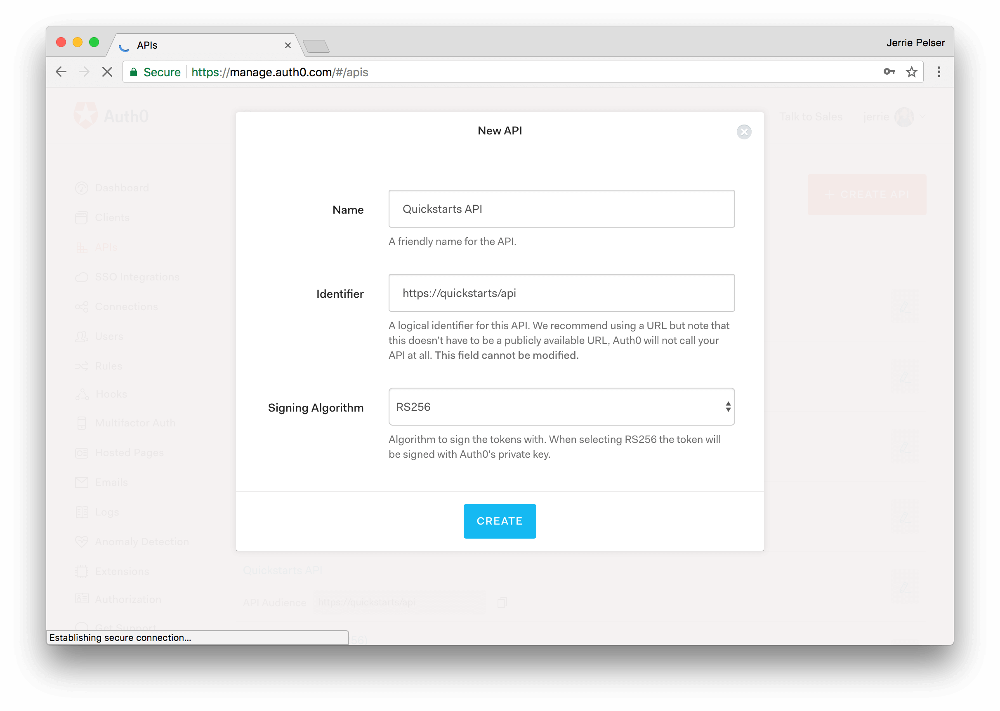
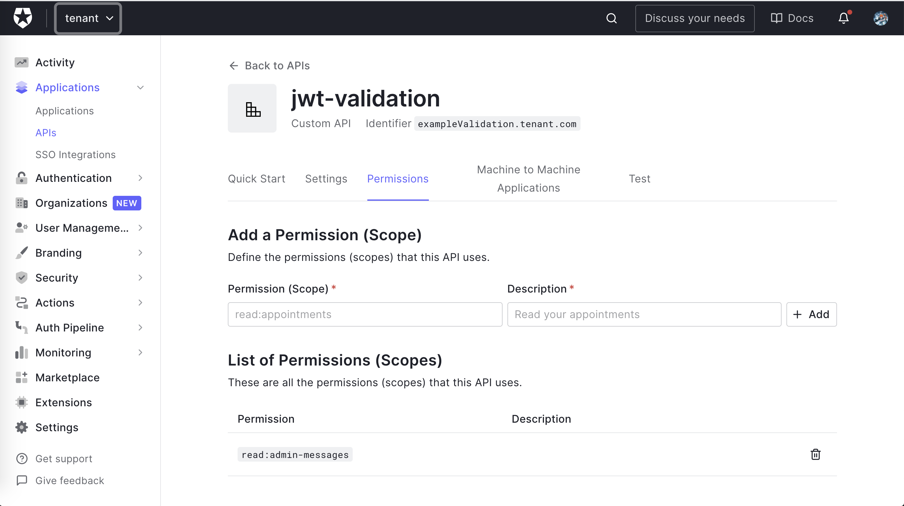
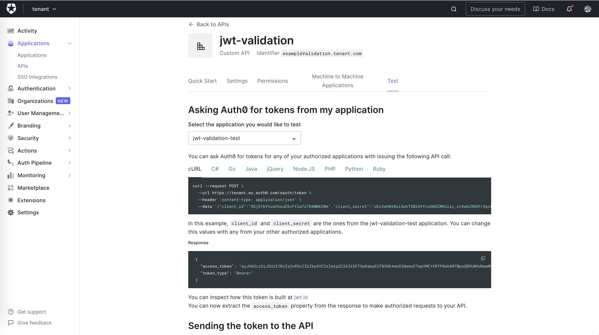
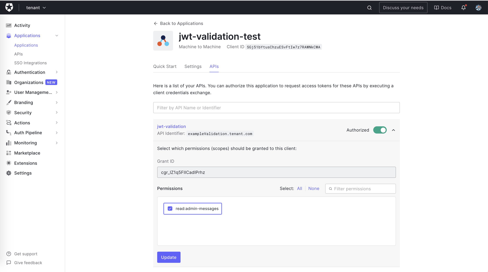

<figure class="figure figure--left">
  
</figure>


If you want to expose an API publicly on the Internet, authorization will be a requirement for you sooner or later. You want to verify that the client consuming the API has the appropriate permissions.

This guide is exactly about that. We'll be securing an API written using [Ruby On Rails](https://rubyonrails.org/), with [Auth0](https://auth0.com/) as the authorization server.

There's a repository with the code so that you can follow along in [Github](https://github.com/sirech/example-jwt-validation-rails).

## Securing an API

I didn't explain what I mean by securing an API yet. Essentially, we're ensuring that protected routes are accessible only for the users with enough rights.

When it comes to security, it's generally considered a bad idea to roll your own bespoke implementation. Instead, I'm using [OAuth](https://auth0.com/docs/protocols/protocol-oauth2), a battle-tested and widely used authorization framework for web applications.

In this context, Auth0 fulfills the role of the _Authorization Server_ and abstracts a significant part of the work away from us. That way, we can focus on delivering value to our users.

Without getting into too many details on how OAuth works, we assume that calls to our API will include a bearer token, using the industry-standard [JWT](https://jwt.io/) format. The token contains a series of claims regarding the its issuer, how long is it valid, and what rights are granted by it. Let's have a look at a sample token:

```json
{
  "iss": "https://yourTenant.eu.auth0.com/",
  "sub": "zHwnsh0j2sTj4u3ss6YedSFrzyb2",
  "aud": "https://targetAudience.com",
  "iat": 1621369130,
  "exp": 1791455530,
  "azp": "ThEkgdG1NndLlWoNMcEdEr2KJIs9vKad",
  "scope": "openid profile read:admin-messages",
  "permissions": ["read:admin-messages"]
}
```

We're going to implement verification for that token, and reject requests that don't have the required permissions.

## Getting Started

We're getting started with our base application, bootstrapped with Rails 6. This [branch](https://github.com/sirech/example-jwt-validation-rails/tree/starter) is a good starting point. You can download it by running the following command in a terminal window:

```shell
git clone -b starter --single-branch https://github.com/sirech/example-jwt-validation-rails.git
```

The API has three endpoints with different levels of protection:

- `/api/messages/public`: Public route.
- `/api/messages/protected`: Requires a valid access token.
- `/api/messages/admin`: Requires a valid access token. Since Auth0 uses JWT as its access token format, we can inspect it and make sure it has a `permissions` claim that contains the scope `read:admin-messages`.

### Running the Application

To run the application, we first need the correct ruby version. The easiest way to do so is to use a version manager like [rbenv](https://github.com/rbenv/rbenv). Once you install it, run this command inside the repository to install the right version of ruby:

```shell
rbenv install
```

Install the dependencies for the application:

```shell
bundle install
```

And finally, run the application:

```shell
bin/rails s
```

You can verify that the application is working correctly with `curl`:

```shell
curl localhost:6060/api/messages/public
```

The command will return a 200 code, plus the message:

```json
{"message":"The API doesn't require an access token to share this message."}
```

### Creating an API on Auth0

To secure the API with Auth0, you need an Auth0 account. If you haven't one, you can <a href="https://auth0.com/signup" data-amp-replace="CLIENT_ID" data-amp-addparams="anonId=CLIENT_ID(cid-scope-cookie-fallback-name)">sign up for free</a> right now. In the *APIs* section of the [Auth0 dashboard](https://manage.auth0.com/), click *Create API*. Provide a name and an identifier for your API. You will use the identifier as an `audience` later, when you are configuring the access token verification. Leave the *Signing Algorithm* as RS256.

<figure class="figure">
  
</figure>

Once you've created the API. Go to the _Permissions_ tab in the API details and add a permission called `read:admin-messages`.

<figure class="figure">
  
</figure>

> **Note**: While you are in the Auth0 Dashboard, take note of your Auth0 domain. You will need it soon. This is a string in the form `YOUR-TENANT-NAME.auth0.com` where `YOUR-TENANT-NAME` is the name you provided when you created your account with Auth0. For more information, [check the documentation](https://auth0.com/docs/getting-started/the-basics#domains).

## Preparing the Application for Validation

Alright, our application is ready to go and in dire need of some _security_. Before that, we need to add some configuration.

You dutifully stored the `domain` and the `audience` after creating the API, right? Let's use them. In the _Rails_ world, the convention is to add this in the `config` folder, using [YAML](https://yaml.org/). The file is called `config/auth0.yml`.

We don't want to store credentials in our code, so we'll export the values as environment variables, named `AUTH0_DOMAIN` and `AUTH0_AUDIENCE`. The configuration uses those values, and keeps them safely away from source control!

```yaml
development:
  issuerUri: <%= ENV["AUTH0_DOMAIN"] %>
  audience: <%= ENV["AUTH0_AUDIENCE"] %>
```

Now, set `AUTH0_DOMAIN` and `AUTH0_AUDIENCE` environment variables to the `domain` and `audience` values for your API.

With this, the application is ready to connect with Auth0. Let's move on to the implementation.

## Validating the Access Token

Before we get started, let's talk for a second about authentication frameworks for rails. There are a bunch of alternatives in the ecosystem, such as [CanCanCan](https://github.com/CanCanCommunity/cancancan), or [devise](https://github.com/heartcombo/devise).

However, our case is an awkward fit for those. We don't want to take over user management. We only want to validate tokens issued by the authorization server. In this case, using a framework won't bring us as much benefit as something like, say, [Spring Security](https://spring.io/projects/spring-security). That's why we only rely on an extra gem, [jwt](https://github.com/jwt/ruby-jwt).

The code implementing the authorization check lives in the [add-authorization](https://github.com/sirech/example-jwt-validation-rails/tree/add-authorization) branch. Let's see how it works!

### Utilizing the JWT Library

The `jwt` library brings a whole lot of functionality to make our API able to validate and manage tokens in JWT formats as the ones issued by Auth0. We need to do three things:

- We need to fetch the [JWKS](https://auth0.com/docs/tokens/json-web-tokens/json-web-key-sets) configuration from _Auth0_, so that we know what is the public key to verify the access token signature
- With the public key, the issuer, and the audience, we want to verify the token
- After verifying the token, we're decoding it to access the `permissions` claim (or any other information contained in the token, really)

### Decoding the Token

Let's get down to business. We're implementing the verification/decoding logic in the `lib` folder, in a file called `json_web_token.rb`. We're starting by fetching the _JWKS_ data:

```ruby
# lib/json_web_token.rb
require 'jwt'
require 'net/http'

class JsonWebToken
  class << self
    def algorithm
      'RS256'
    end

    def key(header)
      jwks_hash[header['kid']]
    end

    def jwks_hash
      jwks_raw = Net::HTTP.get URI("#{issuer}.well-known/jwks.json")
      jwks_keys = Array(JSON.parse(jwks_raw)['keys'])
      jwks_keys.map do |k|
        [
          k['kid'],
          OpenSSL::X509::Certificate.new(Base64.decode64(k['x5c'].first)).public_key
        ]
      end.to_h
    end

    def issuer
      "https://#{Rails.application.config.x.auth0.issuerUri}/"
    end
  end
end
```

As you can see, through the `issuerUri` we know where to look for the data. Then, we parse the key so that we can consume it in the library.

The next step is to add an extra method to the class, `verify`, that verifies and decodes the token at the same time:

```ruby
# lib/json_web_token.rb
class JsonWebToken
  class << self
    def verify(token)
      JWT.decode(token, nil,
                 true, # Verify the signature of this token
                 algorithm: algorithm,
                 iss: Rails.application.config.x.auth0.issuerUri,
                 verify_iss: true,
                 aud: Rails.application.config.x.auth0.audience,
                 verify_aud: true) do |header|
        key(header)
      end
    end
    
    # ... existing code ...
    
  end
end
```

This is all the code that we need for the actual verification. Neat, isn't it? But our controllers are still insecure. Not for long, though.

## Protecting the Endpoints

To make it as convenient as possible, we're creating a hook that we're going to run before any route that needs authentication. To make it available for every controller, it lives in the `app/controllers/application_controller.rb`:

```ruby
# app/controllers/application_controller.rb
require 'json_web_token'

class ApplicationController < ActionController::API
  def authorize!
    valid, result = verify(raw_token(request.headers))

    head :unauthorized unless valid

    @token ||= result
  end

  private

  def verify(token)
    payload, = JsonWebToken.verify(token)
    [true, payload]
  rescue JWT::DecodeError => e
    [false, e]
  end

  def raw_token(headers)
    return headers['Authorization'].split.last if headers['Authorization'].present?

    nil
  end
end
```

We take the token from the standard _Authorization_ header. Then, we verify it with the code from the previous section. There are two possible paths after running `authorize!`:

- If the token isn't there, or it's invalid for any reason, the processing stops right there, and the call returns a 401
- If the token is valid, we continue the execution and store the token in `@token` so that it's available

We're protecting both the `protected` and the `admin` routes with this hook, thanks to [before_action](https://api.rubyonrails.org/v6.1.4/classes/AbstractController/Callbacks/ClassMethods.html#method-i-before_action):

```ruby
# app/controllers/api/messages_controller.rb
module Api
  class MessagesController < ApplicationController
    before_action :authorize!, except: %i[public]
end
```

### Custom Error Messages

Don't you feel better knowing that the application is not exposing private stuff anymore? I definitely do. But we got to help our users. A blank 401 message might not give them enough information to debug the issue. Let's extend the hook to return something more explicit:

```ruby
# app/controllers/application_controller.rb
class ApplicationController < ActionController::API
   def authorize!
     valid, result = verify(raw_token(request.headers))

     # 👇 old code
     # head :unauthorized unless valid
     # 👇 new code
     render json: { message: result }.to_json, status: :unauthorized unless valid

     @token ||= result
   end
```

Now we get a message that's more helpful than an HTTP code without a body.

## Testing the Protected Endpoints

Let's test the protected endpoint:

```shell
curl localhost:6060/api/messages/protected
```

The command will return a 401, because we're not authorized. We need to get a valid token from Auth0.

The simplest way is to access the [API section of your Auth0 Dashboard](https://manage.auth0.com/#/apis) again, select the API that you created before and click the *Test* tab. In this section, you can get a temporary token to test your Web API by clicking the *Copy Token* icon as shown in the following picture:

<figure class="figure">
  
</figure>

Let's attach the token to the request:

```shell
export TOKEN=the-test-token
curl localhost:6060/api/messages/protected -H "Authorization: Bearer $TOKEN"
```

The request works now!

```json
{"message":"The API successfully validated your access token."}
```

## Checking for permissions

There's one requirement pending. As you might recall, for `/api/messages/admin` a valid token isn't enough. Rather, we expect the correct permission in the `permissions` claim. This extra check allows us to define more granular access criteria for our endpoints. This functionality is implemented in the [add-rbac](https://github.com/sirech/example-jwt-validation-rails/tree/add-rbac) branch.

We're adding a new method in the `application_controller`, `check_permissions`. It takes the decoded token and looks for a given permission:

```ruby
# app/controllers/application_controller.rb
require 'json_web_token'

class ApplicationController < ActionController::API
  # ... existing code ...
  
  def can_read_admin_messages!
    check_permissions(@token, 'read:admin-messages')
  end
  
  def check_permissions(token, permission)
    permissions = token['permissions'] || []
    permissions = permissions.split if permissions.is_a? String

    unless permissions.include?(permission)
      render json: { message: 'Access is denied' }.to_json,
             status: :unauthorized
    end
  end
  
  # ... existing code ...
end
```

We use a `before_action` again to protect the `admin` endpoint:

```ruby
# app/controllers/api/messages_controller.rb
module Api
  class MessagesController < ApplicationController
    before_action :can_read_admin_messages!, only: %i[admin]
    
    # ... existing code ...
end
```

With this, each route in our sample application is safe the way we wanted.

### Testing Permissions

If you try to call the `/api/messages/admin` endpoint with the token we generated before, it will return a 401. Our token is valid, but doesn't have the necessary permissions. Let's create a new one!

Back in your [API configuration page on the Auth0 Dashboard](https://manage.auth0.com/#/apis), select the *Machine to Machine Applications* tab. You'll get a list of applications, some of them with the *(Test Application)* label in the name. These applications are automatically created by Auth0 when you create an API there. They are meant as test clients from your API. One of them should have the *Authorized* switch on. Click the dropdown next to it and check the `read:admin-messages` permission:

<figure class="figure">
  
</figure>

Then, click the *Update* button, move again to the *Test* tab, and copy the new token that has been generated for you. Let's try again:

```shell
export TOKEN=the-new-test-token
curl localhost:6060/api/messages/admin -H "Authorization: Bearer $TOKEN"
```

The request works now!

```json
{"message":"The API successfully recognized you as an admin."}
```

## Conclusion

In this guide, we've added authorization to a Rails API by using Auth0 as an authorization server. Thanks to the `jwt` gem, we don't have to invest much effort. We use the library to decode the bearer token that the API receives. After that, it's a matter of checking the relevant routes before each request.
