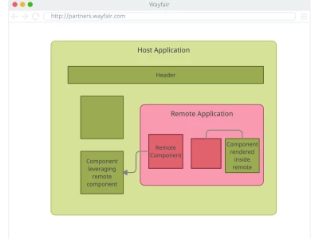
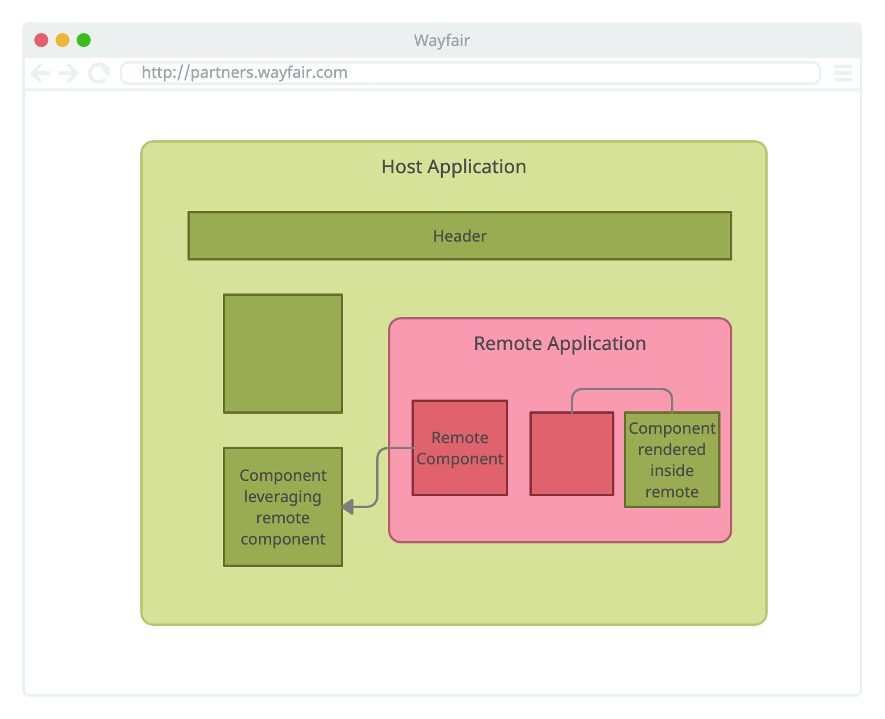
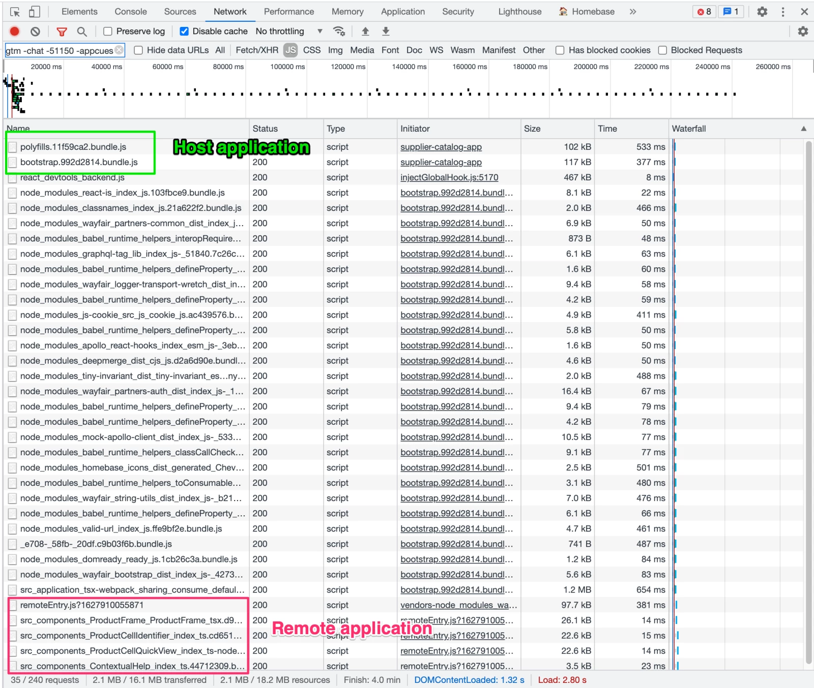
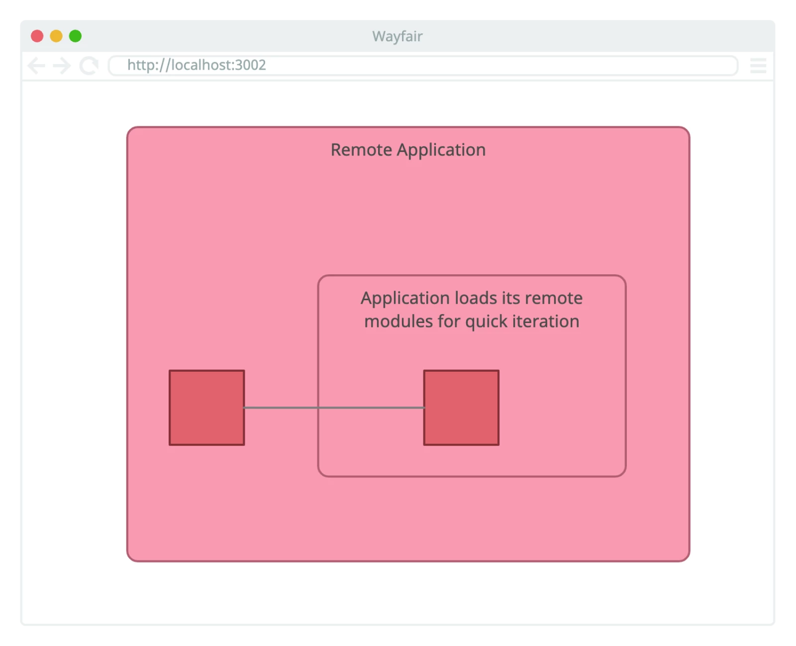

<figure class="figure figure--left">
  
</figure>

*Contributors: Ben Barnett, Diego Fiore, Verónica Machado, and Will Conover.*

In our [previous post](https://www.aboutwayfair.com/careers/tech-blog/applications-instead-of-libraries-part-1), we talked about the reasons that led us to consider a micro frontend architecture for Partner Home, the supplier portal for Wayfair. Now it’s time to dive into the details. 

In this post, we’re going to talk about how we leveraged Module Federation to implement decoupled applications to improve the experience of our suppliers. An application has a frontend and backend, and it owns a complete flow within our Partner Home portal. We’ll cover how to set up host applications that consume remote ones and how we’ve built micro frontends using this pattern. Lastly, we’ll talk about how we made the setup production-ready.

## A Start Full of Hope

There are multiple ways of implementing [micro frontends](https://martinfowler.com/articles/micro-frontends.html), and each has tradeoffs. We decided to use Webpack’s new [Module Federation feature](https://webpack.js.org/concepts/module-federation/). These are some of our considerations:

- At this point, a good chunk of our traffic still goes to the monolith. We don’t have many decoupled applications to support, yet. Thus, new technology isn’t a huge issue
- We know that every application uses React, which allows us to gear our solution towards it
- Changing the bundling of applications is something that we can control and enforce
- We don’t need to support server-side rendering. React 18 brings [some changes](https://github.com/reactwg/react-18/discussions/37) for that

With these factors in mind, the seamless integration that you get using federated modules becomes very appealing. 

What we aim for is: Two applications, a host and a remote, integrated to provide a unified experience. It’s important to note that these are independent applications. They have their repository and they have their CI/CD pipeline; and two separate teams are likely responsible for them. This [repository](https://github.com/sirech/example-applications-instead-of-libraries) presents a scaled-down version of our solution that illustrates the structure that we follow internally.

Now, on to the code!

<figure class="figure">
  
</figure>

## Exporting Modules from an Application

Let’s start from the beginning. A remote application provides some components. Another team wants to benefit from those. A tale as old as time.

The first step to export a module is the Webpack configuration. Do you avoid Webpack configurations like the plague? Do you stick to [CRA](https://reactjs.org/docs/create-a-new-react-app.html) as much as possible? I don’t blame you, but this time there is no way around some Webpack trickery. Luckily, the configuration to export a component is pretty manageable.

```js
new ModuleFederationPlugin({
  name: 'remote',
  filename: 'remoteEntry.js',
  exposes: {
    './Welcome': './src/Welcome',
  },
  shared: [
    {
      react: { requiredVersion: deps.react, singleton: true },
      'react-dom': { requiredVersion: deps['react-dom'], singleton: true },
      '@applications-instead-of-libraries/shared-library': {
        import: '@applications-instead-of-libraries/shared-library',
        requiredVersion: require('../shared-library/package.json').version,
      },
      '@material-ui/core': {
        requiredVersion: deps['@material-ui/core'],
        singleton: true,
      },
    },
  ],
})
```

Full configuration is [here](https://github.com/sirech/example-applications-instead-of-libraries/blob/master/remote/webpack.config.js).

Dependencies are a tricky side of micro frontends. You don’t want to force the users to download React multiple times when loading a page. On the other hand, strong coupling between applications defeats the approach’s purpose.

In our case, we use shared dependencies. Shared dependencies are a critical bit of configuration to ensure applications work as expected, and are resilient to upgrades in the future. 

Shared dependencies prevent duplication, version mismatching and provide a common internal state. For example, we ensure that React is configured as a singleton, meaning there can be only one instance running at a time. This is true for a bunch of other libraries, such as our component libraries too. 

In a nutshell, we offer all dependencies as potentially shared dependencies. This means that the part of the application to hit the dependency first will load it, and then [make it available](https://stackoverflow.com/questions/65634232/how-does-module-federation-choose-which-dependency-version-to-use) for any other components that might need it later. In practice, this has an additional benefit of progressively loading dependencies, thus reducing initial bytes required.

## Integrating a Remote Module in an Application

Our remote application is live and ready to go. Now it’s time to import some components into the host application. Just like in the previous section, it all starts with a Webpack configuration:

```js
new ModuleFederationPlugin({
  name: 'host',
  remotes: {
    remote: 'remote@http://localhost:3002/remoteEntry.js',
  },
  shared: [
    {
      react: { requiredVersion: deps.react, singleton: true },
      'react-dom': { requiredVersion: deps['react-dom'], singleton: true },
      '@applications-instead-of-libraries/shared-library': {
        import: '@applications-instead-of-libraries/shared-library',
        requiredVersion: require('../shared-library/package.json').version,
      },
      '@material-ui/core': {
        requiredVersion: deps['@material-ui/core'],
        singleton: true,
      },
    },
  ],
})
```

Full configuration is [here](https://github.com/sirech/example-applications-instead-of-libraries/blob/5442b9c4cbb996bcab0ef9a056be896ecfc3d900/host/webpack.config.js).

Simple enough, yet highly problematic. Can you spot the issue? That pesky, hardcoded URL! Our applications don’t have one source of truth, as we have multiple environments. Moreover, we need to consider other factors like the locale or the branding. All in all, different permutations are pointing to separate URLs.

To make it even more challenging, the locale is only available at runtime for us. Our solution is a bespoke component that builds the right URL and fetches the correct modules right before using them. Let’s call it a RemoteComponent.

Loading modules dynamically requires [quite a bit of code](https://github.com/sirech/example-applications-instead-of-libraries/tree/master/shared-library/src/RemoteComponent) to find the right bundle through Webpack. There’s a [module in the community](https://www.npmjs.com/package/external-remotes-plugin) to enable dynamic loading that looks quite promising.

Once we have the setup sorted out, it’s time to use a component in our code. We chose to use a dynamic import within a [React Suspense](https://reactjs.org/docs/code-splitting.html) wrapper. We have a thin wrapper around Suspense which provides consistent UX patterns for loading and error states.

```js
export default class LazyModule extends React.Component {
  static getDerivedStateFromError(error) {
    return { error }
  }

  // log error
  componentDidCatch(_error, errorInfo) { ... }

  render() {
    if (this.state.error !== null) {
      const errorFallback = this.props.error

      if (React.isValidElement(errorFallback)) {
        return errorFallback
      } else if (typeof errorFallback === 'function') {
        return errorFallback({ error: this.state.error })
      } else {
        return null
      }
    }

    return (
      <React.Suspense fallback={this.props.delayed ?? null}>
        {this.props.children}
      </React.Suspense>
    )
  }
}
```

See the full component [here](https://github.com/sirech/example-applications-instead-of-libraries/blob/master/shared-library/src/LazyModule/LazyModule.js).

The need for all of this abstraction will become apparent shortly.For now, our hard work is paying off because our component loads dynamically in the browser! You can see how remote modules are loaded afterward here:

<figure class="figure">
  
</figure>

## Beyond Single Components: A Frame Application

Loading simple components has its value, but it’s not quite micro frontends, is it? There are established ways of sharing UX components (picture [Material-UI](https://material-ui.com/)) with, frankly, less overhead.

The value surfaces as the components evolve toward full-fledged applications. A component that has its state and fetches data from a backend. However, we’ve faced many questions about ownership: If the component needs data, who passes the data? Is the host application responsible? Who owns that backend?

This is how we ended up with micro frontends. We want to treat a remote application as an entity with its lifecycle. We call them frame applications. It’s a wrapper that encapsulates the remote components until they form a proper application. It looks something like this:

```js
const Context = createContext('')
export const useContext = () => React.useContext(Context)

const WelcomeFrame = () => {
  return (
    <Context.Provider value="[private]">
      <Card variant="outlined">
        <CardHeader title="WelcomeFrame"></CardHeader>
        <CardContent>
          <Welcome />
        </CardContent>
      </Card>
    </Context.Provider>
  )
}
```

See the full file [here](https://github.com/sirech/example-applications-instead-of-libraries/blob/master/remote/src/WelcomeFrame.js).

In our experience, the [Context API](https://reactjs.org/docs/context.html) works beautifully to allow frame applications to handle their state in a lightweight way. It’s important to note that this state is hidden from the host application, providing encapsulation.

A frame application might want to fetch some data. We want to ensure strong encapsulation so that the host application can’t inadvertently influence this. We use [Apollo](https://www.apollographql.com/) to connect with our backends, but this applies to any way of interacting with APIs.

## Testing a Frame Application

You might be asking, *“All this sounds great, but how do you test it?”*  Glad we’re on the same page. Testing is crucial. We’re not distributing it as a library, but rather deploying it immediately as an application. If we break something, the mess propagates rapidly. Nobody wants that.

We follow the [testing trophy](https://kentcdodds.com/blog/the-testing-trophy-and-testing-classifications) for our frontend-based tests. The first layer is composed of unit tests. [jest-dom](https://github.com/testing-library/jest-dom) can’t handle remote module loading, so we need to mock it.

We want to confirm that the remote modules load correctly. To do so, we have a thin layer of end-to-end tests on top, built with [Cypress](https://www.cypress.io/). They enhance our unit tests and increase our peace of mind.

```js
context('Integrated Application', () => {
  beforeEach(() => {})

  it('shows the integrated remote component', () => {
    cy.visit('http://localhost:3001')

    cy.contains('Host Application').should('exist')
    cy.contains('The selected locale is de-DE').should('exist')
  })
})
```

Where do these tests run? This is where we encounter a slight ownership conflict. The host application and the frame application might be developed by two different teams. Without a clear boundary, expensive handovers are unavoidable.

To mitigate the issue, we configure each Frame Application to consume its modules remotely so that it works as both host and remote at the same time. We deploy it to our test environment and test against that. That provides the independence we’re seeking.

This setup has another usage: local development. Iteration speed is paramount, and that’s easier to achieve if we strip all the integrations while a developer is working locally. Our `RemoteComponent` handles that.

<figure class="figure">
  
</figure>

## Watch Out for Coupling

It is important to repeat that this approach is supposed to increase autonomy. Anything that brings coupling back is a significant risk that we have to assess carefully.

And yet, it seems that there are some natural points of integration. For instance, we have a custom logger that we use throughout every application which ensures that logs make it to our centralized logging system in a consumable format. We don’t want this to be reimplemented per application, as it’s a platform-shared concern.

So we built a provider (see [this one](https://github.com/sirech/example-applications-instead-of-libraries/blob/master/shared-library/src/LanguageProvider.js) as an inspiration). It’s part of the shared dependencies of the host and frame application.

```jsx
<LanguageProvider value="de-DE">
  <Box p={1}>
    <RemoteComponent
      component="WelcomeFrame"
      delayed={<>Loading...</>}
    />
  </Box>
</LanguageProvider>
```

We expect this provider to be there. Every page renders it at the top, guaranteed. If it’s not, Frame Applications are allowed to bail with a nasty error. This is a contract that we make with all the applications that participate in the ecosystem. It works well because we keep the surface area as small as possible. Still, we’re fully aware that this integration point can easily go awry if we aren’t careful.

## “It Works” is not the same as “Production-Ready”

Our Frame Application started as a proof of concept to test its viability. However, being viable does not  mean“releasable”. Before going to production, we have to ensure it’s solid.

Testing is the first step. A strong test suite that accounts for the remote loading part is not negotiable. Good start, but not enough.

Remember our custom [LazyModule](https://github.com/sirech/example-applications-instead-of-libraries/blob/master/shared-library/src/LazyModule/LazyModule.js)? Well, we want to monitor these components. If they blow up, it has to be a controlled demolition. And we want to hear about it. For that reason, our LazyModule makes heavy use of [error boundaries](https://reactjs.org/docs/error-boundaries.html) to prevent a cascading failure. We attach a logger to the boundary to get detailed telemetry.

The way you monitor an application is highly dependent on its implementation. It’s harder to set concrete expectations, rather than do it. We have been using [DataDog](https://www.datadoghq.com/), but, to be fair, many monitoring tools provide similar functionality. We particularly like using [RUM](https://www.datadoghq.com/product/real-user-monitoring/) to stay on top of everything that happens inside our clients. We like it so much that we initialize it automatically as part of our provider so that every team can benefit from it.

## The Beginning of a Journey

Micro frontends aren’t a silver bullet. As we often say, you can’t solve organizational problems with technology alone.

However, the early results are promising, and we plan to use module federation to decouple our different applications. This is just the beginning of the journey. Our examples show that there is still much to do and there is no substitute for running things in production to compile valid data. If you’re intrigued, check out the [example repository](https://github.com/sirech/example-applications-instead-of-libraries). Let us know about your experience!

As for the future, we’re focused on scaling this solution to support multiple remote applications in the most transparent way possible. Stay tuned for follow-up articles!

*This post was published initially in [Wayfair](https://www.aboutwayfair.com/careers/tech-blog/applications-instead-of-libraries-part-2).*
