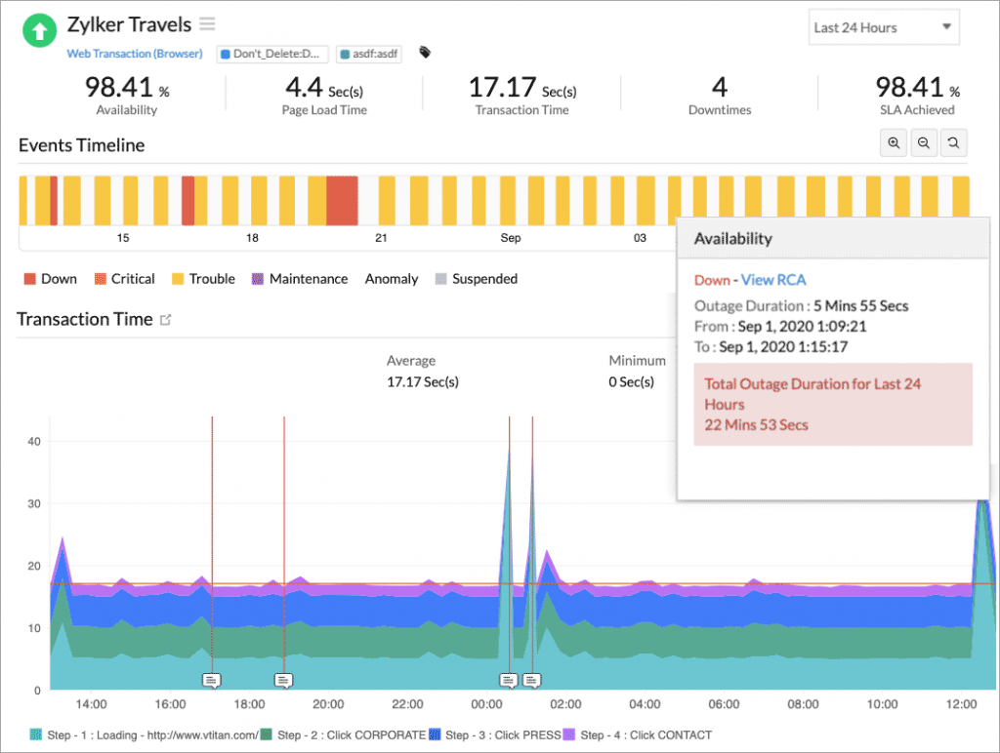

<figure class="figure figure--left">
  
</figure>

Have you ever said to yourself, "I'm not completely sure if my users can access my website"? It's frightening to say it out loud, yet more common than you think. Even if you use strong engineering practices while developing software, there are no guarantees. Your production system could be down with you being none the wiser.

Unless you actively monitor it, that is. There are many tools to monitor applications. One, in particular, called synthetic monitoring, is a great fit to answer that question. In this post, I'm going to introduce synthetic monitoring to you. We'll address the following topics:

* What synthetic monitoring is, and why it's useful
* Example scenarios and things to consider when writing synthetics
* Where synthetic monitoring fits in the monitoring ecosystem

## What Is Synthetic Monitoring?

[Synthetic monitoring](https://en.wikipedia.org/wiki/Synthetic_monitoring) is a technique where you run scripted interactions against your application. They simulate the behavior of a user. You execute them continuously at specified intervals. This monitoring doesn't rely on real traffic to detect issues, thus the term _synthetic_.

The individual scripts, which we call synthetic transactions, come in different shapes and flavors. You can run browser-based tests, in which you record interactions performed by a user during a core flow in your application. These are the closest way you have to reproduce user behavior in a controlled fashion.

If you're exposing a public API as part of your system, you can go down one level of abstraction and write synthetic tests for it. That way, you have more granular checks. Given that API contracts tend to be more stable than layouts, these tests are less likely to break.

Lastly, there are some more specialized synthetic test types. You can monitor parts of your infrastructure like DNS servers, SSL certificates, or even WebSocket endpoints through synthetic tests. Again, the added granularity aids debugging.

## The Value of Synthetic Monitoring

Let's focus on the value of synthetic monitoring. I aim to answer this question: what are the benefits of using this tool?

By simulating the interactions from real users, you know that your system works correctly, at least for the flows that you test. In a sense, this is akin to [end-to-end tests](https://www.browserstack.com/guide/end-to-end-testing) that run continuously in production, thus ensuring you get reliable metrics about your system's availability.

A key aspect of synthetics is that they run globally. If you use a tool like [Site24x7](https://www.site24x7.com/synthetic-monitoring.html), any synthetic test that you define runs from a configurable pool of locations distributed across the globe. If your application has a global presence, it's not enough to know that things work correctly from wherever your office is. There might be issues related to one specific region. If you want to keep your customers happy, I'm sure you're keenly interested in knowing about this.

Synthetics also help to measure service-level agreements ([SLAs](https://en.wikipedia.org/wiki/Service-level_agreement)). You might use SLAs as an internal tool to measure performance or provide them as a contract with your users. One way or another, it's valuable to extract SLA measurements from these monitors. With the right tool, this happens automatically without extra effort. 

<figure class="figure">
  
</figure>

## Examples of Synthetic Monitors

There are plenty of use cases for synthetic tests. Let's mention some examples:

* _User can log in_: Ensuring that users have access to their accounts is crucial. A synthetic can go to the login page, log in, and check that you get to your account profile in a reasonable time frame.
* _Add items to a shopping cart_: In an e-commerce site, the cart is probably the most important component. A test that simulates browsing through products and adding them to the cart covers that core flow.
* _Monitor the expiry of the main domain's SSL certificate_: Even [Google](https://www.bleepingcomputer.com/news/google/recent-google-voice-outage-caused-by-expired-certificates/) forgets about certificates sometimes.

## Things to Consider

When writing synthetic tests, there are a few aspects worth considering.

The practices that you use when writing end-to-end tests apply here. If you need to select elements, pick selectors that are robust and won't break if somebody slightly modifies the layout. Build assertions to prove that things work correctly, but keep them generic enough to remain resilient.

<figure class="figure">
  
</figure>

If you write tests that change the state of the system, what happens afterward? Perhaps you need to roll back purchases done by synthetics? Undo certain transactions? Some organizations eschew synthetic tests that change the state of the application. It can be limiting, but it's a valid option if you don't have the means to revert modifications.

Flakiness is the sworn enemy of any journey-based test. If your monitoring fails randomly due to, for example, unpredictable login times, developers will slowly lose trust in the monitoring until they ignore it altogether. [Alert fatigue](https://www.atlassian.com/incident-management/on-call/alert-fatigue) is a real risk here. Therefore, it's better to scale back the amount of synthetic testing if that makes it more reliable.

For many applications, the interesting stuff happens once you log in to your account. That means that the synthetics need to log in with some credentials. Managing credentials carelessly is a great way to end up with an embarrassing security leak. If you need to use test users, make sure to store the credentials securely and limit the permissions of these users as much as possible.

Another risk is letting the artificial traffic influence some of your KPIs. Depending on the volume of requests you get, a synthetic that runs every minute from multiple locations can skew the numbers you see in [Google Analytics](https://analytics.google.com/analytics/web/) or any similar tool. Make sure you work together with the rest of your organization to tag the users and prevent this from happening.

## Finding a Place for Synthetics in the Monitoring Ecosystem

Now that we've covered synthetic monitoring itself, I want to touch on one last topic: where does this kind of monitoring fit in your monitoring ecosystem?

The list of [types of monitoring](https://www.bmc.com/blogs/it-monitoring/) is constantly growing. With so many different tools, it's easy to get lost and struggle to find the right use case for synthetics. I believe the [testing pyramid](https://martinfowler.com/bliki/TestPyramid.html) presents a useful analogy in this case. Synthetic monitoring sits at the top of the pyramid. It's a high-level, [black box](https://en.wikipedia.org/wiki/Black-box_testing)–style type of monitoring. Thus, it follows that you should cover critical user flows with it and avoid using it for low-level metrics that are better suited for other monitoring tools. For example, don't try to monitor the response time of a single server with synthetics when you can do it with bespoke infrastructure monitoring instead.

Consider another type of monitoring that sits close to the customer: real user monitoring ([RUM](https://en.wikipedia.org/wiki/Real_user_monitoring)). RUM is a tool where you follow sessions based on what every customer is doing in your application. With RUM, you can get a broader perspective on what's happening in terms of where your users come from, the time they spend on different pages, and the errors they get. If you use an integrated monitoring tool, it should mark the sessions created by synthetic tests appropriately. That way, you won't extract the wrong conclusions from the data.

In summary, synthetic monitoring is the cherry on top of your monitoring. You shouldn't replace base monitoring metrics with it, but rather enhance them with extra tests that cover core business capabilities.

## Set up Some Synthetics!

In this article, I've introduced you to synthetic monitoring, a way of simulating user behavior. As you've seen, codifying user flows as reproducible tests helps you continuously monitor your application more effectively. While browser-based interactions are the most popular facet, let's not forget about how you can test APIs, certificates, and other endpoints.

*This post was published initially in [Site24x7](https://www.site24x7.com/learn/guide-to-synthetic-monitoring.html).*
