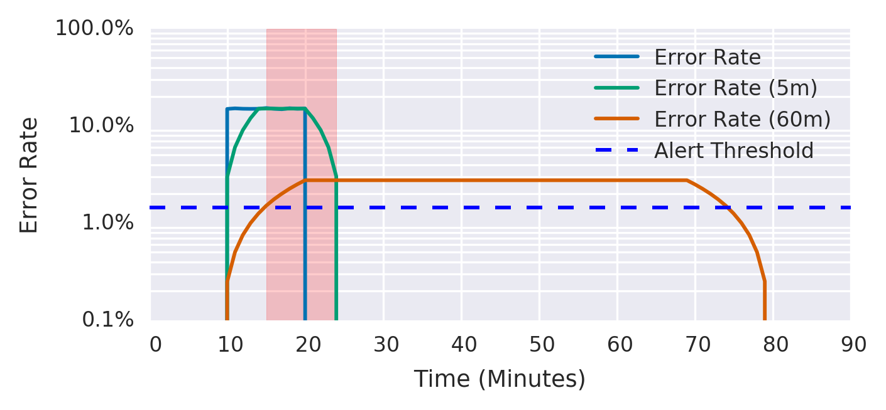
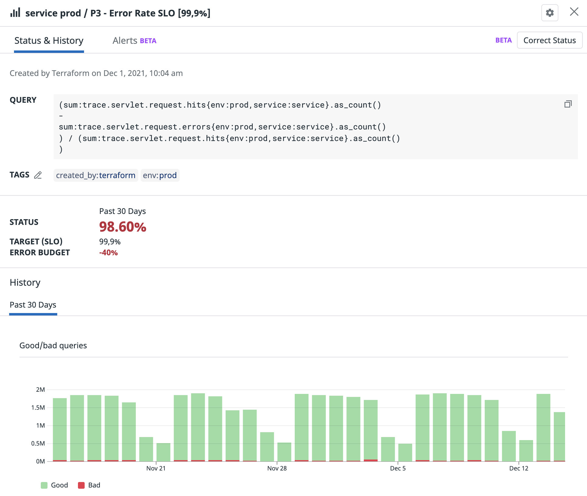
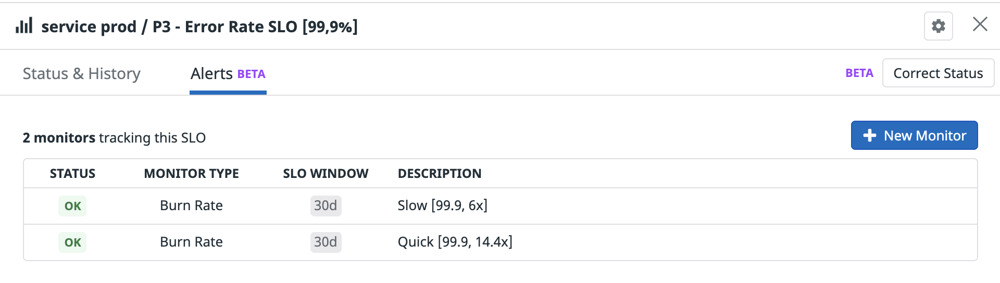

<figure class="figure figure--right">
  
  <figcaption class="figure__caption">
  Multiwindow indeed
  </figcaption>
</figure>
  
I used to pay little attention to automated alerts before. Until I started to be On-Call regularly, that is. Such a powerful motivator! Few things sharpen your thoughts regarding Type I and Type II errors more than waking up at three in the morning due to a misconfigured alert.

Since then, I've [written](../monitoring-alerts-that-dont-suck/) and [spoken](https://github.com/sirech/talks/blob/master/2021-11-devoxx-humane_on_call_alerting_doesnt_have_to_be_painful.pdf) about alerting. You'd think there's only so much so can say about the matter. Nothing further from the truth. It turns out it's a riveting topic. 

My newest obsession is multiwindow, multi-burn rate alerts. I've spent a lot of time trying to tune alerts to make my rotations less miserable when the answer was in front of me all along. Check out this post if you want to see how to provision them in DataDog, using Terraform.

## Multi Burn Rate Multiwindow

_That's a lot of multis in one sentence_. But hear me out. I recommend starting with [Chapter five](https://sre.google/workbook/alerting-on-slos/) of the SRE handbook to get a comprehensive overview. As far as I know, that's the first place that mentions it.

You'll likely read it the first time and stare at it blankly. It happened to me, at least. It's something to digest slowly, or it won't make much sense. Go ahead, I don't mind waiting.

<figure class="figure">
  
  <figcaption class="figure__caption">
  Credit to: https://sre.google/workbook/alerting-on-slos/
  </figcaption>
</figure>

Here's the TLDR: Having a burn rate measures how quickly you're exhausting your [error budget](https://www.atlassian.com/incident-management/kpis/error-budget). Two extra thoughts:

- Think in terms of error budgets. How many errors are acceptable? Don't trigger alerts if the budget isn't at risk.
- Using multiple burn rates makes alerts easier to tune. If a metric needs to track big spikes and sustained increases, it'll likely have to overcompensate for one or the other.

That being said, this article isn't about theory. I want to get into the _how_. I'm focusing on [DataDog](https://www.datadoghq.com/) because it's the monitoring system I've used the most lately.

## The Initial Attempt

After reading about burn rates, I tried to implement them in DataDog. Surprisingly, it didn't seem possible when I started looking. I only found this talk from [DevOps Austin](https://www.youtube.com/watch?v=iAKksNmAZDw) to send me down the right path.

You _can_ in fact simulate burn rates in DataDog. There's a catch, though. DataDog doesn't have an equivalent to the [rate](https://prometheus.io/docs/prometheus/latest/querying/functions/#rate) function in Prometheus. You don't have a reliable way of assessing a metric within a specific time frame.

The `rollup` [function](https://docs.datadoghq.com/dashboards/functions/rollup/) is the closest alternative. Sadly, it's fundamentally flawed. It evaluates once per window. Let's say you use a burn rate with a thirty-minute window. With a `rollup`, the metric fails after the full window's end. That, of course, won't cut it if you have a critical issue ongoing. What a bummer.

## Finally, Native Support!

I had given in to despair when I got the great news: There's now built-in native support for burn rates. They're [in beta](https://docs.datadoghq.com/monitors/service_level_objectives/burn_rate/), but completely usable. And best of all, it's available through the API.

I repeat it a lot, and I'm still not tired of saying it: Provision infrastructure with code. Alerting is infrastructure. If we click our way through the UI, whatever we conjure won't be repeatable. So let's get down to the code. I'm using my trusty tool [Terraform](https://www.terraform.io/). Any recent version of the [provider](https://www.terraform.io/) will do the trick.

Let's talk about the code that we need to build these alerts, bit by bit.

### SLO

The whole thing starts by defining an [SLO](https://docs.datadoghq.com/monitors/service_level_objectives/). You can use it in dashboards, but the good stuff comes when we combine the SLO with alerts associated with it.

This block is parametrized so that we can use it as part of a generic module:

```hcl
resource "datadog_service_level_objective" "slo" {
  count = try(var.enabled, false) == true ? 1 : 0

  name        = var.name
  type        = var.type
  description = ""

  query {
    numerator   = var.numerator
    denominator = var.denominator
  }

  thresholds {
    timeframe = "30d"
    target    = var.target
  }

  tags = var.tags
}
```

Let's instantiate one! We're leveraging the standard [Trace Application Metrics](https://docs.datadoghq.com/tracing/guide/metrics_namespace/) for [Java](https://docs.datadoghq.com/tracing/setup_overview/setup/java?tab=containers) here. If you instrument your application code with the [dd agent](https://github.com/DataDog/dd-agent) you'll have them. The most relevant parts in the next snippet are the `numerator` and `denominator`, which form the evaluation metric for the SLO:

```hcl
module "error_rate_slo" {
  source  = "../../slo"
  enabled = var.enabled

  name = "${var.service_name} ${var.environment} / P${var.priority_tier} - Error Rate SLO [${var.slo}%]"

  numerator = <<-EOT
sum:trace.servlet.request.hits{env:${var.environment},service:${var.service_name}}.as_count()
-
sum:trace.servlet.request.errors{env:${var.environment},service:${var.service_name}}.as_count()
EOT

  denominator = <<-EOT
sum:trace.servlet.request.hits{env:${var.environment},service:${var.service_name}}.as_count()
EOT

  target = var.slo
  tags   = concat(["env:${var.environment}", "service:${var.service_name}"], var.tags)
}
```
SLO's express a ratio of positive events. Our metrics gather total hits and errors, so we've got to invert the metric. It looks like this:

`(hits - errors) / hits`

`slo` is the target percentage. For instance, it can be `99.9`. Have a look [here](https://en.wikipedia.org/wiki/High_availability) to get an idea of the meaning of the number of nines.

A side note: don't forget to use `as_count`. The way it computes an aggregation of events is [more intuitive](https://docs.datadoghq.com/monitors/guide/as-count-in-monitor-evaluations/).

### Burn Rate

SLOs have been part of DataDog for some time. Attaching a [DataDog monitor](https://docs.datadoghq.com/monitors/) to it is the new part. We're about to do just that:

```hcl
resource "datadog_monitor" "slow_burn_rate" {
  name = "${var.service_name} ${var.environment} - Error Rate SLO [${var.slo}, ${local.slow_burn_rate}x]"

  type = "slo alert"

  query = <<-EOT
burn_rate("${module.error_rate_slo.id}").over("${local.slow_time_window}").long_window("${local.slow_window_long}").short_window("${local.slow_window_short}") > ${local.slow_burn_rate}
EOT

  message = templatefile("${path.module}/message.md", {
    service     = var.service_name
    environment = var.environment
    notify      = local.notify
  })

  tags = concat(["env:${var.environment}", "service:${var.service_name}"], var.tags)

  priority = var.priority_tier

  monitor_thresholds = {
    critical = local.slow_burn_rate
  }
}
```

Focus on the `query`. We have the following elements:

- The id of the SLO created above
- The evaluation time frame (30 days)
- The long window's length
- The short window's length
- The burn rate

We have two burn rates, a quick and a slow one. We're following [SRE's advice](https://sre.google/workbook/alerting-on-slos/#recommended_parameters_for_an_slo_based_a) for the parameters here:

```hcl
locals {
  quick_window_long  = "1h"
  quick_window_short = "5m"
  quick_burn_rate    = 14.4
  quick_time_window  = "30d"
}
```

```hcl
locals {
  slow_window_long  = "6h"
  slow_window_short = "30m"
  slow_burn_rate    = 6
  slow_time_window  = "30d"
}
```

Notice that we don't need to adjust the burn rate based on the error rate. DataDog does that for us.

And that's about it. If you provision this code, you'll see an SLO like this one:

<figure class="figure">
  
</figure>

The SLO has two alerts attached to it, for our two burn rates. Unlike with `rollup`, they don't need a full evaluation window to trigger. Exactly what we need!

<figure class="figure">
  
  </figure>

## An Alert That you Can Trust

Is all the hassle worth it? You bet it is. Since I've replaced our existing alerts with multiwindow, multi-burn rate alerts, I've spent close to zero time babysitting them. That's a welcome change, compared to some of my previous attempts. It comes down to the yin and yang of alerting, false positives, and false negatives.

### False Positives

Having two (or more) windows is a good layer of defense against over-eager triggers. False positives are technically not a bad thing for the business side. I do focus on them a lot because they, in my experience, inevitably lead to slopiness. If you get bombarded with alerts, you'll start taking them less seriously. Also, I firmly believe that developers willing to spend their time outside of work on-call deserve a decent setup.

### False Negatives

The quick burn rate triggers fairly quickly in case of errors. Don't worry, you won't miss anything, especially if you have a tight SLO.

Moreover, the slow burn rate covers a scenario that often falls through the cracks. A slight increase in errors that persists for a longer period. Good luck tuning a regular alert to account for this without waking you up constantly. Luckily, if you follow this article you won't have to do that. Listen to somebody that has spent a good chunk of time on-call, get those burn rates online!
