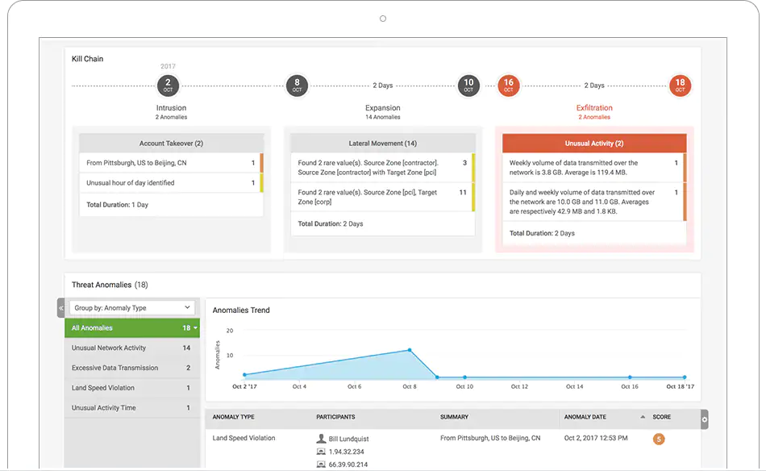

<figure class="figure figure--right">
    
</figure>

Monitoring [distributed systems](https://www.splunk.com/en_us/data-insider/what-are-distributed-systems.html) is a complex undertaking. A modern cloud-native architecture contains many moving pieces, and you must observe them all to truly assess a system’s health. For that, you need all the information you can get. As a result, launching an application today without the proper amount of monitoring simply isn’t an option.

Luckily, there are a plethora of monitoring tools available on the market, covering every possible use case. These products have evolved a lot to provide developers the tools they need to handle all this complexity. They make monitoring accessible and convenient.

In this post, I want to talk about different types of monitoring tools. I’ll use Splunk’s offerings to show how they help you monitor a system. I believe that a dedicated SaaS monitoring solution is the right choice for many organizations. Therefore, in this post, I’ll give you an idea of the benefits of using one.

## A Sample Application to Monitor

First, let’s consider a sample scenario. I’m thinking of an application setup that’s familiar enough for many people. My goal is to make the different elements easier to picture. This diagram is a good starting point:

<figure class="figure">
    
</figure>

These are the components involved:

* A [single-page application](https://en.wikipedia.org/wiki/Single-page_application) serving the front end. This means that a significant part of the interactions are happening in the user’s browser.
* A [containerized](https://www.splunk.com/en_us/data-insider/what-is-a-container.html) back end, providing an API for the front end. If you’re using [microservices](https://www.splunk.com/en_us/data-insider/what-are-microservices.html), it’s going to be a multitude of different services communicating with each other.
* A [Kubernetes](https://kubernetes.io/) cluster running the backend workload. Again, in practice, there’ll be multiple clusters. There are development and production environments to consider. If the system is available globally, there’ll be clusters in multiple regions as well. All that running in the context of a cloud provider, such as [AWS](https://aws.amazon.com/). Apart from hosting the components mentioned above, other things are likely to be part of the setup: networking, such as virtual networks, gateways, and load balancers; datastores, both SQL and NoSQL; event stream processors; lambda functions.

I could go on, but I think you get the point. There are quite a few things to keep in mind! Now let’s see what kind of monitoring is out there for each piece.

## A Very Quick Introduction to Monitoring

Before I talk about monitoring tools, it’s worth setting the stage talking about monitoring basics.

At its core, monitoring is about collecting and analyzing information about a running system. The system emits metrics over time that the monitoring solution aggregates. There are many aspects relevant for metrics collection:

* **Pull vs. push**: The monitoring system can either fetch the metrics actively or wait for the monitored systems to push the metrics to it.
* **Native metrics vs. injected agents**: The monitoring system reads metrics that are native to the system. Alternatively, it injects a software agent that runs alongside the monitored system, producing these metrics so that they can reach the central monitoring system.
* **Sampling**: How often is the monitoring collecting metrics? The more metrics, the more accurate picture you build. However, it also means more data to store and to move through the system.
* **Tagging**: Usually, you represent monitoring data as a time series with readings distributed over time. Tags are extra information attached to the data. An example is knowing which server produced a reading.
* **Cardinality**: Tags are powerful, but if you have many distinct tags with a multitude of possible values, the explosion of combinations makes it hard to store and handle.

I won’t belabor these points too much. Suffice it to say, the metrics are there. The next step is to use a monitoring system to ingest them.

That’s enough introduction for now. Let’s talk tools.

## Application Performance Monitoring

This is what Wikipedia has to say about Application Performance Monitoring ([APM](https://en.wikipedia.org/wiki/Application_performance_management)):

The monitoring and management of performance and availability of [software](https://en.wikipedia.org/wiki/Software) applications.

In other words, understanding how an application is behaving in real-time. This type of monitoring applies to the backend API from the example. An APM tool monitors three main metrics:

* **Rate:** How many requests has the application received?
* **Errors:** What kind of errors happened?
* **Duration:** How long do the requests take?

For each metric, you want both depth and breadth. You should be able to dig into one request and analyze it thoroughly. You also need an aggregated view of all the requests to understand how the application is behaving. Remember to avoid focusing only on averages, as they can be [misleading](https://dzone.com/articles/3-performance-testing-metrics-every-tester-should).

<figure class="figure">
    
  <figcaption class="figure__caption">
  Source: <a href="https://www.splunk.com/en_us/devops/application-performance-monitoring.html">www.splunk.com/en_us/devops/application-performance-monitoring.html</a>
  </figcaption>
</figure>

It’s worth mentioning that Splunk’s APM supports [OpenTelemetry](https://www.splunk.com/en_us/data-insider/what-is-opentelemetry.html), a framework from the Cloud Native Computing Foundation ([CNCF](https://www.cncf.io/)) aimed at standardizing the collection of telemetry in software. If you’re worried about vendor lock-in, this is an excellent way of reaping the benefits of a product like this while staying flexible.

## Real User Monitoring

Monitoring tools didn’t always reach the client. Before, the chain ended when the back end sent a response back to the client. What happened in the browser was none of your business. However, times have changed. The prevalence of single-page applications has rendered that approach obsolete. The amount of logic contained in the frontend is too high to remain unmonitored.

Real user monitoring ([RUM](https://www.splunk.com/en_us/data-insider/what-is-real-user-monitoring.html)) covers just that. It’s embedded in the JavaScript run by the browser and helps you understand how the user interacts with your application.

<figure class="figure">
    
  <figcaption class="figure__caption">
  Source: <a href="https://www.splunk.com/en_us/software/real-user-monitoring.html">www.splunk.com/en_us/software/real-user-monitoring.html</a>
  </figcaption>
</figure>

The building block here is the user session. You can follow all user sessions and their click path, which lets you understand how your users are interacting with your software. Given that this part of the application doesn’t run on your servers, you need extra information, such as:

* Which browser is used? 
* Where are the users located geographically? 
* Which operating system do they use?

Similar to APM, you want both single high-fidelity requests and aggregations.

## Synthetic Monitoring

Developers worry about how a system is working from the inside. Your users won’t see that, though. From their perspective, your application is a black box that either works or doesn’t. 

[Synthetic monitoring](https://en.wikipedia.org/wiki/Synthetic_monitoring) simulates the interactions of real users with an application. Synthetics are like high-level tests that run from multiple data centers across the world. They say a lot more about the application’s state than a test executed from a developer’s machine, or even from a [CI/CD](https://www.splunk.com/en_us/data-insider/what-is-ci-cd-pipeline.html) agent.

Keep in mind that a synthetic is a [black-box test](https://en.wikipedia.org/wiki/Black-box_testing). It can’t tell you what’s wrong exactly, but it can detect if your users are having trouble reaching your application.

<figure class="figure">
    
  <figcaption class="figure__caption">
  Source: <a href="https://www.splunk.com/en_us/software/synthetic-monitoring.html">www.splunk.com/en_us/software/synthetic-monitoring.html</a>
  </figcaption>
</figure>

This kind of monitoring is the first line of defense when trying to ensure that your system is available at all times. I see it as continuous end-to-end testing. It applies to both the frontend and the backend components. It depends on what you want to monitor.

Another aspect of synthetic tests is performance. You can see these tests as a baseline of the expected performance of the system. The historical data allows you to understand the evolution of the performance of the system. If you have the data, you’re able to apply performance improvements and measure their impact effectively.

Once you have a suite of synthetic tests, it’s natural to see them as an early warning system. If there are issues, the alerts should notify your engineers, as we’ll see when we get to notifications.

## Infrastructure Monitoring

More and more workloads run on the cloud these days. If you practice [Infrastructure as Code](https://infrastructure-as-code.com/), you treat your infrastructure as another artifact managed through code. In that case, monitoring as code is a logical evolution. Even if you provision infrastructure manually, it requires monitoring. 

Infrastructure is a big topic. At a lower level of abstraction, you have things like storage ([S3](https://aws.amazon.com/s3/)), load balancing ([ALB](https://aws.amazon.com/elasticloadbalancing/application-load-balancer/)), or computing instances ([EC2](https://aws.amazon.com/ec2/)). While the cloud provider is responsible for providing and operating this infrastructure, you’re still interested in monitoring what’s running there, as it’s part of your stack. You can do just that with the help of infrastructure monitoring.

What if you’re running some container orchestration software? I’m thinking, of course, about Kubernetes. Is there an organization out there that doesn’t use Kubernetes right now? Doesn’t seem like it. However, Kubernetes is a complex beast. It’s definitely worth getting a closer look at it through rich monitoring. This doesn’t only mean monitoring the applications running in a cluster. Kubernetes consists of different resource types, such as [Deployments](https://kubernetes.io/docs/concepts/workloads/controllers/deployment/) or [Services](https://kubernetes.io/docs/concepts/services-networking/service/), running on top of [Nodes](https://kubernetes.io/docs/concepts/architecture/nodes/). You need to monitor all of them if you want to get the full picture.

<figure class="figure">
    
  <figcaption class="figure__caption">
  Source: <a href="https://www.splunk.com/en_us/devops/kubernetes-monitoring.html">www.splunk.com/en_us/devops/kubernetes-monitoring.html</a>
  </figcaption>
</figure>

What about other infrastructure components? Splunk’s got you covered! Let’s say you have a couple of serverless functions (like [AWS Lambda](https://aws.amazon.com/lambda/)) that you want to observe. Serverless functions execute on-demand and disappear right after completion. That makes them very flexible, but also harder to monitor. An integrated monitoring system takes that burden out of your hands. Similar to APM, you’re interested in rate, errors, and duration.

<figure class="figure">
    
  <figcaption class="figure__caption">
  Source: <a href="https://www.splunk.com/en_us/devops/serverless-monitoring.html">www.splunk.com/en_us/devops/serverless-monitoring.html</a>
  </figcaption>
</figure>

I’ve been involved in projects where we migrated big, existing applications to the cloud. That’s a process that takes months, if not years. If you have one monitoring tool to observe both domains, that makes your job a little bit easier.

With a comprehensive view of all layers throughout the stack, establishing a mindset of [You Build it, You Run It](https://www.stevesmith.tech/blog/you-build-it-you-run-it/) becomes much more attainable.

## From Observation to Notification

Monitoring allows you to understand the situation of your system. But it requires you to have somebody checking it. Highly available systems can’t afford to wait for somebody to check if everything looks good. That’s too slow in case of an incident. You want the responsible people to know that something is wrong immediately.

What to do, then? You translate your monitors into detectors, making use of what we know as well as using AI/ML techniques to identify things that we might not know yet. Whenever a metric reaches a certain threshold, the detector triggers an alert which immediately and notifies whoever is responsible without delay. That person then jumps in and, thanks to the comprehensive set of monitoring tools outlined throughout this post, fixes the issue and saves the day. Neat.

### Beware of Misconfigured Alerts

It’s not as easy as it sounds, though. In fact, it’s pretty common to overwhelm engineers by creating a ton of alerts that trigger at any point in time. Or the opposite problem, alerts that sit unacknowledged despite the system being on fire.

Another problem comes when you try to adjust the thresholds for the alerts. This is a bit of an art. With an incorrect value, an alert either triggers too frequently or never at all. That's not what you want. The alerts should trigger just often enough to be meaningful.

Alert fatigue is a real risk when operating an application. If your developers become desensitized to alerts due to false positives, they’ll slowly start paying less attention to the pager. That’s a recipe for disaster.

If you’ve been in an on-Call rotation before, you probably know the pain of using a substandard tool. [This quote](https://www.splunk.com/en_us/software/splunk-on-call.html) from Splunk’s On-Call sums it up better than I ever could:

> “Make On-Call Suck Less”

<figure class="figure">
    
  <figcaption class="figure__caption">
  Source: <a href="https://www.splunk.com/en_us/software/splunk-on-call.html">www.splunk.com/en_us/software/splunk-on-call.html</a>
  </figcaption>
</figure>

A good on-call tool centralizes schedules, reduces unnecessary noise, and ensures that the right person is alerted at the right moment. In a more complex setup, assigning the right person to the correct group of alerts isn’t trivial. Essentially, it’s like a giant calendar where you want to ensure that there’s coverage for any day. Of course, you don’t want to manage that calendar yourself. Instead, you let the tool help you. The organizational help from the tooling makes it much more manageable.

## Let’s Not Forget Security

If you run any software, and that software has at least one user, security is your problem. As countless data leaks remind us all too often, security is a concern that many organizations still don’t take seriously enough. Practices such as [DevSecOps](https://www.splunk.com/en_us/data-insider/what-is-devsecops.html) encourage thinking about security right from the start. Security starts with using best practices while developing applications. However, it doesn’t end there. You need constant monitoring to remain one step ahead of adversarial parties.

One piece of the puzzle is security information and event management ([SIEM](https://www.splunk.com/en_us/data-insider/what-is-siem.html)). You want to identify threats based on all the data that you collect. These threats translate to alerts based on risk. Much like with on-call, alert fatigue is a thing. A tool needs to ensure that unnecessary alerts aren’t reaching your operators.

<figure class="figure">
    
  <figcaption class="figure__caption">
  Source: <a href="https://www.splunk.com/en_us/software/enterprise-security.html">www.splunk.com/en_us/software/enterprise-security.html</a>
  </figcaption>
</figure>

Another part of security is monitoring suspicious behavior. For that, there’s user behavior analytics ([UBA](https://en.wikipedia.org/wiki/User_behavior_analytics)). Such a system looks for malicious patterns across many users, applying machine learning methodologies so that you catch these threats as early as possible.

<figure class="figure">
    
  <figcaption class="figure__caption">
  Source: <a href="https://www.splunk.com/en_us/software/user-behavior-analytics.html">www.splunk.com/en_us/software/user-behavior-analytics.html</a>
  </figcaption>
</figure>

Even if your security hygiene is top-notch, there’s always the chance of a security breach. If this happens, it’s fundamental to preserve evidence. This is the kind of information that you don’t use daily, but you’ll be extremely grateful to have if you ever need it:

* What did the attacker do? Are you able to trace their steps back?
* What information was accessed? This will have legal ramifications.

<figure class="figure">
    
  <figcaption class="figure__caption">
  Source: <a href="https://www.splunk.com/en_us/cyber-security/forensics-and-investigation.html">www.splunk.com/en_us/cyber-security/forensics-and-investigation.html</a>
  </figcaption>
</figure>

As you see, there are a few tools here that will let you sleep better at night. Don’t get complacent, though. Tools don’t replace good security practices—they only enhance them.

## Monitoring as a Platform

I wasn’t lying when I said there are many aspects of monitoring to talk about! I’ve presented a whole bunch of monitoring tools here. Each one brings its flavor of monitoring to the table. Even so, there are more tools that I didn’t get to. They’re all very solid products on their own. But your application isn’t a collection of discrete chunks. All these parts are interconnected. A warning in one place might indicate a problem in a completely different spot.

That’s where the value of an integrated platform like [Splunk](https://www.splunk.com/en_us/observability.html) becomes readily apparent. Monitoring isn’t a checkbox that you mark for individual components. The capability to correlate different metrics, and easily jump between different layers is invaluable if you want to provide a truly reliable service. Give your engineers the right tools, and they’ll feel omniscient.

Can you build this yourself? Yes, of course. With enough effort, you can replicate the integration. What’s the effort, though? I’m confident in saying that it’s more than you think. I’ve seen more than one organization severely underestimate this undertaking and regret it later. You owe it to yourself to at least consider an existing solution before going that route. As you’ve seen, Splunk covers many if not most monitoring requirements. All the tools I’ve presented in this article are deeply connected. You can jump from a RUM trace to APM with one click. Or easily convert any metric into an alert in On-Call. I can’t stress this point enough: This level of integration is hard to achieve.

## Log Observer

Is log aggregation part of monitoring? When you want to understand everything that happens in a system, the line starts to blur. If you’re observing a certain metric, checking associated logs adds a richer signal. That can only help, right?

<figure class="figure">
    
  <figcaption class="figure__caption">
  Source: <a href="https://www.splunk.com/en_us/software/log-observer.html">www.splunk.com/en_us/software/log-observer.html</a>
  </figcaption>
</figure>

As I mentioned, the correlation aspect is a welcome benefit of using an integrated platform. If you’re observing an event caught through a metric or trace, a clear tie-in to a log event is going to save you a lot of effort. It’s especially true if you don’t need to spend a lot of effort building this connection because it comes for free as part of an observability platform. That’s convenient.

## What Did We Learn?

Monitoring is not a monolithic concept. As architectures evolve, different domains require a slightly different approach. Cloud-native architectures are a clear example of this. There are many specialized moving parts. They greatly benefit from tools built purposely to monitor them.

You can build bespoke monitoring for everything you run. But that takes your engineers' focus away from delivering business value. In my experience, getting a dedicated tool with the full support of the company behind it is generally more cost-efficient than building it yourself. 

There's another benefit that’s important to mention. An integrated approach enables correlation between signals that come from different sources. Difficult problems rarely stay within boundaries. If your tooling lets you jump from one area to another, it’s going to increase visibility significantly. Breaking silos is a big part of adopting a [DevOps](https://www.splunk.com/en_us/data-insider/what-is-devops-and-why-is-it-important.html) mindset throughout an organization.

*This post was published initially in [Splunk](https://www.splunk.com/en_us/blog/devops/monitoring-tools-6-to-cover-all-your-needs.html).*
